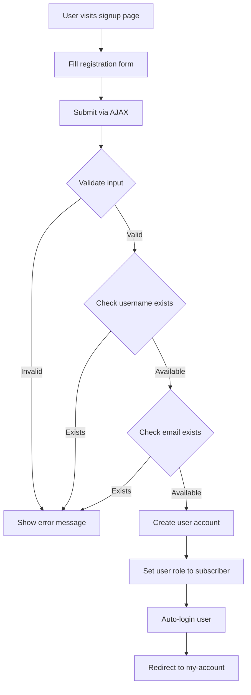
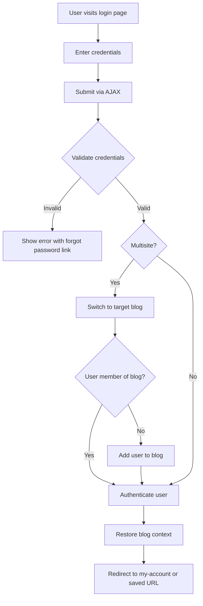
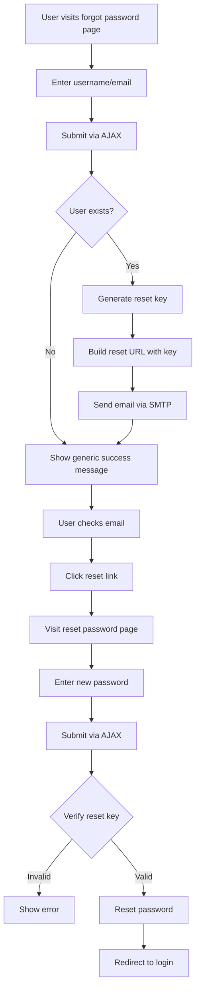
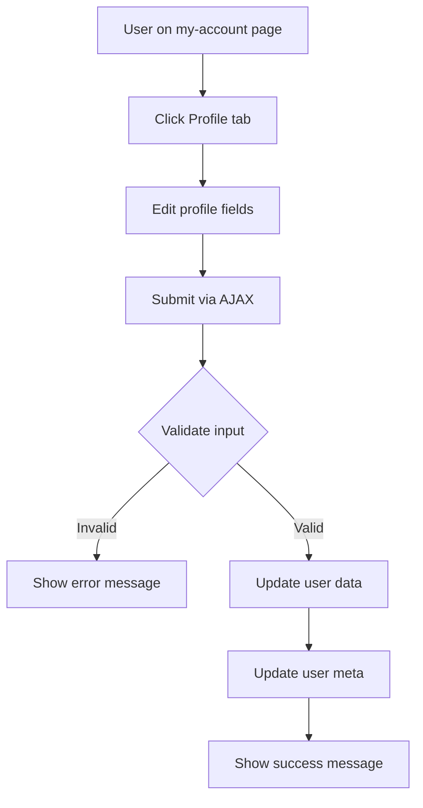
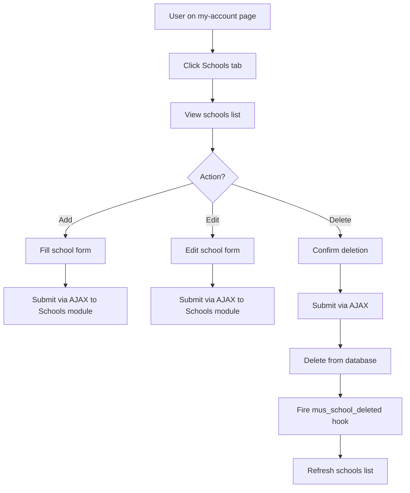

# Authentication Module - Complete Technical Guide

> **Module ID:** `authentication`  
> **Version:** 1.0.0  
> **Status:** Required Core Module  
> **Dependencies:** None (Base module for user management)

---

## Table of Contents

1. [Overview](#overview)
2. [File Structure](#file-structure)
3. [Core Components](#core-components)
4. [Database Schema](#database-schema)
5. [AJAX Actions](#ajax-actions)
6. [Shortcodes](#shortcodes)
7. [Templates](#templates)
8. [Email System](#email-system)
9. [Workflow & Processes](#workflow--processes)
10. [Module Dependencies](#module-dependencies)
11. [Assets](#assets)
12. [Future Considerations](#future-considerations)

---

## Overview

The **Authentication Module** provides complete user authentication and account management functionality for the Organization Core plugin. It handles:

- User login/logout
- User registration
- Password reset/recovery
- User profile management
- My Account dashboard
- School management
- Booking management
- Quote management
- Email notifications (SMTP)

### Key Features

✅ **Multisite Compatible** - Works across WordPress multisite networks  
✅ **AJAX-Driven** - Modern, seamless user experience without page reloads  
✅ **Template Override Support** - Themes can override module templates  
✅ **SMTP Email Integration** - Gmail SMTP for reliable email delivery  
✅ **Session Management** - Handles redirect URLs and user state  
✅ **Security** - Nonce verification, sanitization, and validation

---

## File Structure

```
authentication/
├── class-authentication.php          # Main module class
├── config.php                         # Module configuration
├── activator.php                      # Activation logic (user roles)
├── deactivator.php                    # Deactivation logic
├── crud.php                           # Database operations (CRUD)
├── ajax.php                           # AJAX request handlers
├── test-email.php                     # Email testing utility
│
├── admin/
│   └── class-authentication-admin.php # Admin interface (future)
│
├── public/
│   └── class-authentication-public.php # Public-facing functionality
│
├── includes/
│   ├── class-authentication-email-smtp.php    # SMTP configuration
│   └── class-authentication-email-settings.php # Email settings (future)
│
├── templates/
│   ├── admin/
│   │   └── settings-page.php         # Admin settings page
│   ├── emails/
│   │   └── password-reset.php        # Password reset email template
│   └── public/
│       ├── login.php                  # Login form
│       ├── signup.php                 # Registration form
│       ├── forgot-password.php        # Forgot password form
│       ├── reset-password.php         # Reset password form
│       └── my-account.php             # User dashboard
│
└── assets/
    ├── css/
    │   └── authentication.css         # Module styles
    └── js/
        ├── authentication.js          # Base JS functionality
        ├── signup.js                  # Registration form handler
        ├── forgot-password.js         # Forgot password handler
        ├── reset-password.js          # Reset password handler
        └── my-account.js              # My Account dashboard handler
```

---

## Core Components

### 1. `class-authentication.php`

**Purpose:** Main module class that extends `OC_Abstract_Module`

**Key Methods:**
- `__construct()` - Initializes module with config
- `init()` - Entry point, validates dependencies and loads components
- `load_dependencies()` - Loads CRUD, AJAX, SMTP, and public classes
- `init_admin()` - Initializes admin interface (placeholder)
- `init_public()` - Initializes public-facing components
- `init_ajax()` - Initializes AJAX handlers
- `get_module_id()` - Returns module ID (`authentication`)
- `get_config()` - Loads module configuration
- `dependency_notice()` - Shows admin notice if dependencies missing

**Workflow:**
1. Module is registered via `organization_core_register_modules` hook
2. `init()` checks if module is enabled for current site
3. Validates dependencies (none for authentication)
4. Loads appropriate components based on context (admin/public/AJAX)
5. SMTP configuration is loaded globally via hooks

---

### 2. `config.php`

**Purpose:** Module configuration and metadata

**Configuration Array:**
```php
return array(
    'id'                => 'authentication',
    'name'              => 'Authentication System',
    'description'       => 'User authentication, registration, and password management',
    'version'           => '1.0.0',
    'author'            => 'Your Organization',
    'default_enabled'   => true,   // Enabled by default
    'network_only'      => false,  // Can be enabled per site
    'required'          => true,   // Required for core functionality
    'dependencies'      => array(), // No dependencies
    'supports'          => array(
        'templates',     // Has overridable templates
        'ajax',          // Uses AJAX functionality
        'shortcodes'     // Provides shortcodes
    ),
    'template_paths'    => array(
        'public' => 'public/templates/',
    ),
    'assets'            => array(
        'public_css'  => array('assets/css/authentication.css'),
        'public_js'   => array('assets/js/authentication.js'),
    ),
    'class'             => 'class-authentication.php'
);
```

---

### 3. `activator.php`

**Purpose:** Runs on module activation

**Class:** `OC_Authentication_Activator`

**Activation Tasks:**
- Registers custom user roles:
  - **Subscriber** - Basic user with read capability
  - **Customer** - User with read capability (for bookings/quotes)

**Note:** Does NOT create database tables (uses existing WordPress tables + module tables created by other modules)

---

### 4. `crud.php`

**Purpose:** All database operations for authentication module

**Class:** `OC_Authentication_CRUD`

**Methods Overview:**

#### User Profile Operations
- `get_user_profile($user_id)` - Get user profile data
- `get_user_additional_meta($user_id)` - Get additional user meta (prefix, phone, etc.)
- `update_user_profile($user_id, $data)` - Update user profile
- `update_user_additional_meta($user_id, $data)` - Update additional meta

#### Quote Operations (Depends on Quotes Module)
- `get_user_quotes_limited($user_id, $limit)` - Get limited quotes for dashboard
- `get_user_quotes_count($user_id)` - Get total quote count
- `count_user_quotes_by_status($user_id, $blog_id)` - Count quotes by status

#### Booking Operations (Depends on Bookings Module)
- `get_user_bookings($user_id, $blog_id, $args)` - Get user bookings with filters
- `get_user_bookings_limited($user_id, $limit)` - Get limited bookings for dashboard
- `get_user_bookings_count($user_id)` - Get total booking count
- `get_user_booking($booking_id, $user_id, $blog_id)` - Get single booking
- `count_user_bookings_by_status($user_id, $blog_id)` - Count bookings by status
- `cancel_user_booking($booking_id, $user_id, $blog_id)` - Cancel a booking

#### School Operations (Depends on Schools Module)
- `get_user_schools($user_id, $blog_id)` - Get all user schools
- `get_user_schools_for_display($user_id, $blog_id)` - Get schools formatted for display
- `get_dashboard_schools($user_id, $limit, $blog_id)` - Get limited schools for dashboard
- `get_user_schools_count($user_id, $blog_id)` - Get total school count
- `get_user_school($school_id, $user_id)` - Get single school
- `save_user_school($user_id, $school_data, $blog_id)` - Create new school
- `update_user_school($school_id, $user_id, $school_data)` - Update school
- `delete_user_school($school_id, $user_id)` - Delete school (hard delete)

---

### 5. `ajax.php`

**Purpose:** Handle all AJAX requests

**Class:** `OC_Authentication_Ajax`

**Registered Actions:** See [AJAX Actions](#ajax-actions) section

---

### 6. `public/class-authentication-public.php`

**Purpose:** Public-facing functionality

**Class:** `OC_Authentication_Public`

**Key Methods:**
- `init()` - Register hooks, shortcodes, and assets
- `start_session()` - Initialize PHP sessions for redirect handling
- `enqueue_styles()` - Load CSS
- `enqueue_scripts()` - Load JavaScript (conditional based on shortcodes)
- `register_shortcodes()` - Register all shortcodes
- `render_login_form()` - Render login form
- `render_registration_form()` - Render signup form
- `render_restore_password_form()` - Render forgot password form
- `render_reset_password_form()` - Render reset password form
- `render_my_account()` - Render my account dashboard
- `load_template($template_name, $args)` - Load template with theme override support

**Localized JavaScript Variables:**
```javascript
mus_params = {
    ajax_url: '/wp-admin/admin-ajax.php',
    home_url: 'https://example.com',
    redirect_url: 'https://example.com/redirect-target',
    nonce: 'wp_nonce_value'
}
```

---

## Database Schema

### Tables Used

The authentication module **does not create its own tables**. It uses:

1. **WordPress Core Tables:**
   - `wp_users` - User accounts
   - `wp_usermeta` - User metadata

2. **Module Tables (Created by other modules):**
   - `wp_quotes` - Created by Quotes module
   - `wp_bookings` - Created by Bookings module
   - `wp_schools` - Created by Schools module

### User Meta Fields

The module stores additional user metadata in `wp_usermeta`:

| Meta Key | Description | Type |
|----------|-------------|------|
| `user_prefix` | User title (Mr., Mrs., Dr., etc.) | string |
| `phone_number` | Primary phone number | string |
| `cell_number` | Cell phone number | string |
| `best_time_contact` | Best time to contact | string |
| `redirect_url_blog_{$blog_id}` | Stored redirect URL per blog | string |

### External Table Schemas

#### `wp_quotes` Table
```sql
-- Created by Quotes module
-- Fields: id, user_id, status, created_at, etc.
```

#### `wp_bookings` Table
```sql
-- Created by Bookings module
-- Fields: id, user_id, school_name, location_name, status, 
--         booking_data (JSON), parks_selection (JSON), 
--         park_meal_options (JSON), created_at, modified_at, etc.
```

#### `wp_schools` Table
```sql
-- Created by Schools module
-- Fields: id, blog_id, user_id, school_name, school_address, 
--         school_city, school_state, school_zip, school_country,
--         school_phone, school_website, school_enrollment,
--         director_*, principal_*, status, created_at, modified_at
```

---

## AJAX Actions

### Public Actions (No Login Required)

| Action | Handler | Purpose |
|--------|---------|---------|
| `wp_ajax_nopriv_mus_process_login` | `handle_login()` | Process user login |
| `wp_ajax_nopriv_mus_process_registration` | `handle_register()` | Process user registration |
| `wp_ajax_nopriv_mus_process_password_reset` | `handle_forgot_password()` | Send password reset email |
| `wp_ajax_nopriv_mus_process_new_password` | `handle_reset_password()` | Process password reset |

### Private Actions (Login Required)

| Action | Handler | Purpose |
|--------|---------|---------|
| `wp_ajax_mus_process_new_password` | `handle_reset_password()` | Process password reset (logged in) |
| `wp_ajax_mus_update_profile` | `handle_update_profile()` | Update user profile |
| `wp_ajax_mus_schools_delete` | `handle_delete_schools()` | Delete user school |
| `wp_ajax_mus_cancel_booking` | `handle_cancel_booking()` | Cancel user booking |
| `wp_ajax_mus_process_logout` | `handle_logout()` | Process user logout |

### Public Fallbacks (Also available without login)

| Action | Handler | Purpose |
|--------|---------|---------|
| `wp_ajax_nopriv_mus_schools_delete` | `handle_delete_schools()` | Delete school (public fallback) |
| `wp_ajax_nopriv_mus_cancel_booking` | `handle_cancel_booking()` | Cancel booking (public fallback) |
| `wp_ajax_nopriv_mus_process_logout` | `handle_logout()` | Logout (public fallback) |

### Test Actions

| Action | Handler | Purpose |
|--------|---------|---------|
| `wp_ajax_test_smtp_email` | `handle_test_email()` | Send test SMTP email |

---

## AJAX Action Details

### 1. `mus_process_login`

**Purpose:** Authenticate user and log them in

**Request Parameters:**
```javascript
{
    username: string,      // Username or email
    password: string,      // User password
    remember: boolean,     // Remember me checkbox
    blog_id: int,         // Blog ID (multisite)
    nonce: string         // Security nonce
}
```

**Success Response:**
```javascript
{
    success: true,
    data: {
        message: "Login successful!",
        redirect_url: "/my-account",
        user_id: 123
    }
}
```

**Error Response:**
```javascript
{
    success: false,
    data: {
        message: "Invalid username or password"
    }
}
```

**Workflow:**
1. Validate username and password
2. Switch to target blog (multisite)
3. Attempt login with `wp_signon()`
4. Add user to blog if not already a member
5. Return success with redirect URL

---

### 2. `mus_process_registration`

**Purpose:** Register new user account

**Request Parameters:**
```javascript
{
    username: string,
    email: string,
    password: string,
    confirm_password: string,
    nonce: string
}
```

**Success Response:**
```javascript
{
    success: true,
    data: {
        message: "Account created successfully!",
        redirect_url: "/my-account",
        user_id: 123
    }
}
```

**Validation:**
- All fields required
- Passwords must match
- Password minimum 6 characters
- Username must be unique
- Email must be unique and valid

**Workflow:**
1. Validate input
2. Check username/email availability
3. Create user with `wp_create_user()`
4. Auto-login user
5. Redirect to my-account

---

### 3. `mus_process_password_reset`

**Purpose:** Send password reset email

**Request Parameters:**
```javascript
{
    user_login: string,  // Username or email
    nonce: string
}
```

**Success Response:**
```javascript
{
    success: true,
    data: {
        message: "If your account exists, check your email for reset instructions"
    }
}
```

**Workflow:**
1. Find user by username or email
2. Generate reset key with `get_password_reset_key()`
3. Build reset URL with key and login
4. Send email using `OC_Email_Handler::send_with_template()`
5. Return generic success message (security)

**Security Note:** Always returns same message whether user exists or not

---

### 4. `mus_process_new_password`

**Purpose:** Reset password with reset key

**Request Parameters:**
```javascript
{
    key: string,
    login: string,
    password: string,
    confirm_password: string,
    nonce: string
}
```

**Success Response:**
```javascript
{
    success: true,
    data: {
        message: "Password reset successfully! Redirecting to login...",
        redirect_url: "/login"
    }
}
```

**Workflow:**
1. Validate passwords match
2. Verify reset key with `check_password_reset_key()`
3. Reset password with `reset_password()`
4. Redirect to login page

---

### 5. `mus_update_profile`

**Purpose:** Update user profile information

**Request Parameters:**
```javascript
{
    first_name: string,
    last_name: string,
    user_email: string,
    user_prefix: string,
    phone_number: string,
    cell_number: string,
    best_time_contact: string,
    nonce: string
}
```

**Success Response:**
```javascript
{
    success: true,
    data: {
        message: "Profile updated successfully!",
        user_id: 123,
        updated_at: "2024-01-01 12:00:00"
    }
}
```

**Workflow:**
1. Verify user is logged in
2. Validate required fields
3. Update user with `wp_update_user()`
4. Update additional meta with CRUD class
5. Return success

---

### 6. `mus_schools_delete`

**Purpose:** Delete user school

**Request Parameters:**
```javascript
{
    school_id: int,
    nonce: string
}
```

**Success Response:**
```javascript
{
    success: true,
    data: {
        message: "School deleted successfully",
        school_id: 123
    }
}
```

**Workflow:**
1. Verify user is logged in
2. Verify school belongs to user
3. Hard delete from database
4. Fire `mus_school_deleted` action hook

---

### 7. `mus_cancel_booking`

**Purpose:** Cancel user booking

**Request Parameters:**
```javascript
{
    booking_id: int,
    nonce: string
}
```

**Success Response:**
```javascript
{
    success: true,
    data: {
        message: "Booking cancelled successfully",
        booking_id: 123
    }
}
```

**Workflow:**
1. Verify user is logged in
2. Verify booking belongs to user
3. Check booking status is 'pending'
4. Update status to 'cancelled'

---

### 8. `mus_process_logout`

**Purpose:** Log out current user

**Request Parameters:**
```javascript
{
    nonce: string
}
```

**Success Response:**
```javascript
{
    success: true,
    data: {
        message: "Logged out successfully!",
        redirect_url: "/login"
    }
}
```

**Workflow:**
1. Verify user is logged in
2. Call `wp_logout()`
3. Return success with redirect

---

## Shortcodes

### 1. `[mus_login_form]`

**Purpose:** Display login form

**Usage:**
```
[mus_login_form]
```

**Template:** `templates/public/login.php`

**Features:**
- Username/email field
- Password field
- Remember me checkbox
- Forgot password link
- Sign up link
- AJAX form submission

**Behavior:**
- Shows message if user already logged in
- Redirects to my-account on success

---

### 2. `[mus_registration_form]`

**Purpose:** Display registration form

**Usage:**
```
[mus_registration_form]
```

**Template:** `templates/public/signup.php`

**Features:**
- Username field
- Email field
- Password field
- Confirm password field
- AJAX form submission

**Behavior:**
- Shows message if user already registered
- Auto-login after registration
- Redirects to my-account

---

### 3. `[mus_restore_password]`

**Purpose:** Display forgot password form

**Usage:**
```
[mus_restore_password]
```

**Template:** `templates/public/forgot-password.php`

**Features:**
- Username/email field
- AJAX form submission
- Email sending

---

### 4. `[mus_reset_password_form]`

**Purpose:** Display reset password form

**Usage:**
```
[mus_reset_password_form]
```

**Template:** `templates/public/reset-password.php`

**Features:**
- New password field
- Confirm password field
- Hidden key and login fields
- AJAX form submission

**URL Parameters:**
- `key` - Reset key
- `login` - Username

---

### 5. `[mus_my_account]`

**Purpose:** Display user account dashboard

**Usage:**
```
[mus_my_account]
```

**Template:** `templates/public/my-account.php`

**Features:**
- Profile information display/edit
- Dashboard with stats
- Recent quotes (limited to 3)
- Recent bookings (all)
- Schools management
- Logout button

**Behavior:**
- Shows login form if not logged in
- Loads data from CRUD class

**Template Variables:**
```php
$args = array(
    'user_profile' => array(...),      // User profile data
    'dashboard_quotes' => array(...),  // Recent quotes (3)
    'total_quotes' => int,             // Total quote count
    'quote_counts' => array(...),      // Quotes by status
    'user_schools' => array(...),      // All schools
    'total_schools' => int,            // Total school count
    'dashboard_schools' => array(...), // Recent schools (2)
    'dashboard_bookings' => array(...),// All bookings
    'user_id' => int,
    'blog_id' => int,
);
```

---

## Templates

### Template Override System

Templates can be overridden by themes in the following locations:

1. `{theme}/organization-core/authentication/public/{template-name}.php`
2. `{theme}/travel/organization-core/authentication/public/{template-name}.php`
3. Fallback: `{plugin}/modules/authentication/templates/public/{template-name}.php`

### Public Templates

#### `login.php`
- Login form with username/password
- Remember me checkbox
- Links to forgot password and signup
- AJAX submission

#### `signup.php`
- Registration form
- Username, email, password, confirm password
- Link to login
- AJAX submission

#### `forgot-password.php`
- Forgot password form
- Username/email field
- Link to login
- AJAX submission

#### `reset-password.php`
- Reset password form
- New password and confirm fields
- Hidden key and login fields
- AJAX submission

#### `my-account.php`
- Complete user dashboard
- Tabbed interface:
  - Dashboard (overview)
  - Profile (edit profile)
  - Schools (manage schools)
  - Bookings (view/cancel bookings)
  - Quotes (view quotes)
- AJAX operations for updates

### Email Templates

#### `emails/password-reset.php`

**Purpose:** Password reset email

**Variables:**
- `$user_name` - User display name
- `$site_name` - Site name
- `$reset_url` - Password reset URL
- `$expires_in` - Expiration time (24 hours)

**Features:**
- Responsive HTML email
- Styled button and link
- Warning box for expiration
- Professional layout

---

## Email System

### SMTP Configuration

**Class:** `Authentication_Email_SMTP`

**File:** `includes/class-authentication-email-smtp.php`

**Purpose:** Configure Gmail SMTP for all emails

**WordPress Options:**
- `mus_gmail_username` - Gmail address
- `mus_gmail_password` - Gmail app password
- `mus_from_email` - From email address
- `mus_from_name` - From name

**SMTP Settings:**
```php
Host: smtp.gmail.com
Port: 587
Encryption: TLS
Authentication: Yes
```

**Hooks:**
- `phpmailer_init` - Configure SMTP before sending
- `wp_mail_from` - Set from email
- `wp_mail_from_name` - Set from name
- `wp_mail_failed` - Log email errors

**Debug Mode:**
- SMTP Debug Level: 2
- Logs all SMTP communication to error log

---

### Email Handler Integration

The module uses the core `OC_Email_Handler` class for sending emails.

**Usage Example:**
```php
OC_Email_Handler::send_with_template(
    $to_email,
    $subject,
    'password-reset.php',  // Template file
    'authentication',       // Module ID
    $template_data         // Variables for template
);
```

**Template Data:**
```php
$template_data = array(
    'user_data' => $user,
    'reset_url' => $reset_url,
    'site_name' => $site_name,
    'expires_in' => '24 hours'
);
```

---

### Current Email Notifications

| Event | Template | Trigger | Recipients |
|-------|----------|---------|------------|
| Password Reset Request | `password-reset.php` | User requests password reset | User email |

---

### Future Email Notifications

The following email notifications should be implemented:

1. **Welcome Email** - Sent on new user registration
2. **Profile Update Confirmation** - Sent when profile is updated
3. **Password Changed** - Sent when password is changed
4. **Account Deletion** - Sent when account is deleted
5. **Login Notification** - Sent on new device login (optional)
6. **Booking Confirmation** - Sent when booking is created (integrate with Bookings module)
7. **Quote Status Update** - Sent when quote status changes (integrate with Quotes module)

---

## Workflow & Processes

### User Registration Flow



---

### Login Flow



---

### Password Reset Flow



---

### Profile Update Flow



---

### School Management Flow



---

## Module Dependencies

### Dependencies ON Other Modules

The authentication module **depends on** the following modules for full functionality:

#### 1. Quotes Module
**Tables Used:** `wp_quotes`

**CRUD Methods:**
- `get_user_quotes_limited()`
- `get_user_quotes_count()`
- `count_user_quotes_by_status()`

**Use Case:** Display user quotes on my-account dashboard

**Impact if Missing:** My-account page will show empty quotes section

---

#### 2. Bookings Module
**Tables Used:** `wp_bookings`

**CRUD Methods:**
- `get_user_bookings()`
- `get_user_bookings_limited()`
- `get_user_bookings_count()`
- `get_user_booking()`
- `count_user_bookings_by_status()`
- `cancel_user_booking()`

**Use Case:** Display and manage user bookings on my-account dashboard

**Impact if Missing:** My-account page will show empty bookings section, cancel booking will fail

---

#### 3. Schools Module
**Tables Used:** `wp_schools`

**CRUD Methods:**
- `get_user_schools()`
- `get_user_schools_for_display()`
- `get_dashboard_schools()`
- `get_user_schools_count()`
- `get_user_school()`
- `save_user_school()`
- `update_user_school()`
- `delete_user_school()`

**Use Case:** Manage user schools on my-account dashboard

**Impact if Missing:** My-account page will show empty schools section, school management will fail

---

### Modules That Depend ON Authentication

The following modules **depend on** the authentication module:

1. **Quotes Module** - Uses authentication for user identification
2. **Bookings Module** - Uses authentication for user identification
3. **Schools Module** - Uses authentication for user identification
4. **Hotels Module** - May use authentication for user-specific features
5. **Rooming List Module** - Uses authentication for access control
6. **Shareables Module** - May use authentication for access control

---

### Core Plugin Dependencies

**Required Core Classes:**
- `OC_Abstract_Module` - Base module class
- `OC_Module_Validator` - Module validation
- `OC_Module_Registry` - Module registration
- `OC_Template_Loader` - Template loading
- `OC_Email_Handler` - Email sending

---

## Assets

### CSS Files

#### `assets/css/authentication.css`

**Purpose:** Styles for all authentication forms and my-account page

**Key Styles:**
- Form layouts
- Input fields
- Buttons
- Error/success messages
- My-account dashboard
- Tabs
- Tables
- Responsive design

**Enqueued:** On all public pages

---

### JavaScript Files

#### `assets/js/authentication.js`

**Purpose:** Base authentication functionality

**Features:**
- AJAX helper functions
- Nonce handling
- Error/success message display
- Form validation helpers

**Enqueued:** On all public pages

**Dependencies:** jQuery

---

#### `assets/js/signup.js`

**Purpose:** Registration form handler

**Features:**
- Form validation
- Password matching
- AJAX submission
- Success redirect

**Enqueued:** Only on pages with `[mus_registration_form]` shortcode

**Dependencies:** jQuery, authentication.js

---

#### `assets/js/forgot-password.js`

**Purpose:** Forgot password form handler

**Features:**
- Form validation
- AJAX submission
- Success message display

**Enqueued:** Only on pages with `[mus_restore_password]` shortcode

**Dependencies:** jQuery, authentication.js

---

#### `assets/js/reset-password.js`

**Purpose:** Reset password form handler

**Features:**
- Form validation
- Password matching
- AJAX submission
- Success redirect

**Enqueued:** Only on pages with `[mus_reset_password_form]` shortcode

**Dependencies:** jQuery, authentication.js

---

#### `assets/js/my-account.js`

**Purpose:** My-account dashboard functionality

**Features:**
- Tab switching
- Profile form submission
- School management (add/edit/delete)
- Booking cancellation
- AJAX operations
- Dynamic content updates

**Enqueued:** Only on pages with `[mus_my_account]` shortcode

**Dependencies:** jQuery, authentication.js

---

## Rewrite Rules

**Status:** ❌ No custom rewrite rules

The authentication module does **NOT** register any custom rewrite rules. It relies on WordPress pages with shortcodes.

**Recommended Page Structure:**
- `/login` - Page with `[mus_login_form]`
- `/signup` - Page with `[mus_registration_form]`
- `/forgot-password` - Page with `[mus_restore_password]`
- `/reset-password` - Page with `[mus_reset_password_form]`
- `/my-account` - Page with `[mus_my_account]`

---

## Future Considerations

### 1. Email Notifications

**Priority:** High

**Tasks:**
- [ ] Add welcome email on registration
- [ ] Add profile update confirmation email
- [ ] Add password changed notification email
- [ ] Add login from new device notification
- [ ] Create email template system for all notifications
- [ ] Add email preferences in user profile

---

### 2. Admin Interface

**Priority:** Medium

**Tasks:**
- [ ] Implement admin settings page
- [ ] Add SMTP configuration UI
- [ ] Add user management interface
- [ ] Add email template customization
- [ ] Add email log/history

**File:** `admin/class-authentication-admin.php` (placeholder exists)

---

### 3. Security Enhancements

**Priority:** High

**Tasks:**
- [ ] Add rate limiting for login attempts
- [ ] Add CAPTCHA for registration/login
- [ ] Add two-factor authentication (2FA)
- [ ] Add password strength requirements
- [ ] Add session management (force logout from all devices)
- [ ] Add login history tracking

---

### 4. Social Login

**Priority:** Low

**Tasks:**
- [ ] Add Google OAuth login
- [ ] Add Facebook login
- [ ] Add LinkedIn login
- [ ] Add social account linking

---

### 5. User Roles & Permissions

**Priority:** Medium

**Tasks:**
- [ ] Add more granular user roles
- [ ] Add capability management
- [ ] Add role-based dashboard customization
- [ ] Add permission checks for AJAX actions

---

### 6. Multisite Improvements

**Priority:** Medium

**Tasks:**
- [ ] Add network-wide user sync
- [ ] Add cross-site login
- [ ] Add centralized user management
- [ ] Add site-specific user roles

---

### 7. Template System

**Priority:** Low

**Tasks:**
- [ ] Add template builder for emails
- [ ] Add customizable form fields
- [ ] Add drag-and-drop dashboard builder
- [ ] Add widget system for my-account

---

### 8. API Integration

**Priority:** Low

**Tasks:**
- [ ] Add REST API endpoints for authentication
- [ ] Add OAuth2 server functionality
- [ ] Add API key management
- [ ] Add webhook support for user events

---

### 9. Analytics & Reporting

**Priority:** Low

**Tasks:**
- [ ] Add user registration analytics
- [ ] Add login/logout tracking
- [ ] Add user activity dashboard
- [ ] Add export functionality for user data

---

### 10. Accessibility

**Priority:** Medium

**Tasks:**
- [ ] Add ARIA labels to all forms
- [ ] Add keyboard navigation support
- [ ] Add screen reader support
- [ ] Add high contrast mode
- [ ] Test with accessibility tools

---

## Testing Checklist

### Manual Testing

- [ ] User registration flow
- [ ] User login flow
- [ ] Password reset flow
- [ ] Profile update
- [ ] School management (add/edit/delete)
- [ ] Booking cancellation
- [ ] Logout
- [ ] Email delivery (SMTP)
- [ ] Template overrides
- [ ] Multisite functionality
- [ ] AJAX error handling
- [ ] Form validation
- [ ] Redirect handling

### Security Testing

- [ ] SQL injection prevention
- [ ] XSS prevention
- [ ] CSRF protection (nonce verification)
- [ ] Password hashing
- [ ] Session security
- [ ] Input sanitization
- [ ] Output escaping

---

## Troubleshooting

### Common Issues

#### 1. Emails Not Sending

**Symptoms:** Password reset emails not received

**Solutions:**
- Check SMTP credentials in WordPress options
- Verify Gmail app password is correct
- Check error logs for SMTP errors
- Test email with `test-email.php`
- Verify firewall allows port 587

---

#### 2. AJAX Actions Not Working

**Symptoms:** Forms submit but nothing happens

**Solutions:**
- Check browser console for JavaScript errors
- Verify nonce is being passed correctly
- Check AJAX URL is correct
- Verify AJAX handler is registered
- Check error logs for PHP errors

---

#### 3. Login Redirect Issues

**Symptoms:** User redirected to wrong page after login

**Solutions:**
- Check redirect URL in session
- Verify `redirect_to` parameter
- Check multisite blog switching
- Clear browser cookies

---

#### 4. My-Account Data Not Loading

**Symptoms:** Empty sections on my-account page

**Solutions:**
- Verify dependent modules are active (Quotes, Bookings, Schools)
- Check database tables exist
- Verify user has data in tables
- Check CRUD class is loaded
- Check error logs

---

## Hooks & Filters

### Action Hooks

| Hook | Location | Purpose |
|------|----------|---------|
| `organization_core_register_modules` | `class-authentication.php` | Register module |
| `phpmailer_init` | `class-authentication-email-smtp.php` | Configure SMTP |
| `wp_mail_failed` | `class-authentication-email-smtp.php` | Log email errors |
| `mus_school_deleted` | `crud.php` | Fired after school deletion |

### Filter Hooks

| Hook | Location | Purpose |
|------|----------|---------|
| `wp_mail_from` | `class-authentication-email-smtp.php` | Set from email |
| `wp_mail_from_name` | `class-authentication-email-smtp.php` | Set from name |

---

## Code Examples

### Example 1: Get User Profile

```php
// Get user profile data
$user_id = get_current_user_id();
$profile = OC_Authentication_CRUD::get_user_profile($user_id);

echo $profile['first_name'];
echo $profile['last_name'];
echo $profile['email'];
```

---

### Example 2: Get User Bookings

```php
// Get user bookings with filters
$user_id = get_current_user_id();
$blog_id = get_current_blog_id();

$bookings = OC_Authentication_CRUD::get_user_bookings($user_id, $blog_id, array(
    'number' => 10,
    'offset' => 0,
    'orderby' => 'created_at',
    'order' => 'DESC',
    'status' => 'pending'
));

foreach ($bookings as $booking) {
    echo $booking['school_name'];
    echo $booking['status'];
}
```

---

### Example 3: Send Custom Email

```php
// Send custom email using template
if (!class_exists('OC_Email_Handler')) {
    require_once ORGANIZATION_CORE_PLUGIN_DIR . 'includes/email/class-email-handler.php';
}

$sent = OC_Email_Handler::send_with_template(
    'user@example.com',
    'Welcome to Our Site',
    'welcome-email.php',  // Create this template
    'authentication',
    array(
        'user_name' => 'John Doe',
        'site_name' => get_bloginfo('name')
    )
);
```

---

### Example 4: Add Custom User Meta

```php
// Add custom user meta on registration
add_action('user_register', function($user_id) {
    update_user_meta($user_id, 'registration_source', 'website');
    update_user_meta($user_id, 'registration_date', current_time('mysql'));
});
```

---

## Conclusion

The **Authentication Module** is a core component of the Organization Core plugin, providing essential user management functionality. It integrates seamlessly with other modules (Quotes, Bookings, Schools) to provide a complete user experience.

**Key Strengths:**
- ✅ Comprehensive authentication features
- ✅ AJAX-driven for modern UX
- ✅ Multisite compatible
- ✅ Template override support
- ✅ SMTP email integration
- ✅ Secure and validated

**Areas for Improvement:**
- 🔄 Add more email notifications
- 🔄 Implement admin interface
- 🔄 Add security enhancements (2FA, rate limiting)
- 🔄 Add social login options
- 🔄 Improve accessibility

---

**Last Updated:** 2024-12-09  
**Module Version:** 1.0.0  
**Documentation Version:** 1.0.0
