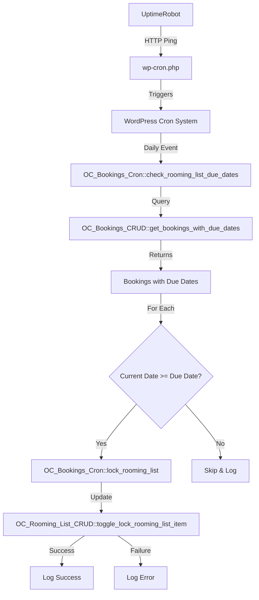
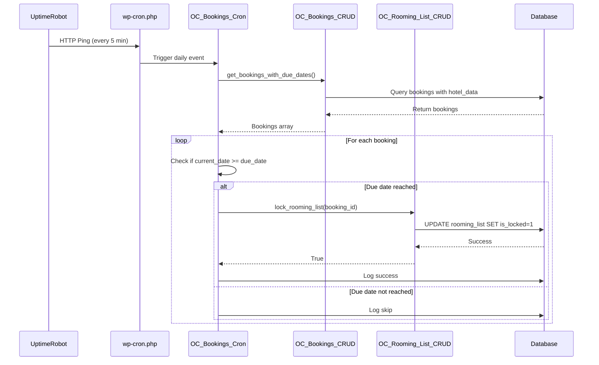
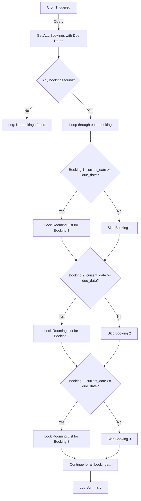

# WP-Cron Technical Documentation: Rooming List Auto-Lock System

This document provides technical details about the WordPress cron-based rooming list auto-lock system, including architecture, implementation details, and extensibility guidelines.

---

## Table of Contents

1. [System Architecture](#system-architecture)
2. [File Structure](#file-structure)
3. [Core Components](#core-components)
4. [Due Date Logic](#due-date-logic)
5. [Database Schema](#database-schema)
6. [Cron Workflow](#cron-workflow)
7. [API Reference](#api-reference)
8. [Extensibility](#extensibility)
9. [Security Considerations](#security-considerations)
10. [Performance Optimization](#performance-optimization)

---

## System Architecture

### High-Level Overview



### Component Interaction



---

## File Structure

```
modules/bookings/
├── class-bookings-cron.php          # Cron handler (NEW)
├── class-bookings.php                # Module orchestrator (MODIFIED)
├── activator.php                     # Plugin activation (MODIFIED)
├── deactivator.php                   # Plugin deactivation (MODIFIED)
├── crud.php                          # Database operations (MODIFIED)
├── CRON_SETUP_GUIDE.md              # User-facing setup guide (NEW)
└── CRON_LOGIC_DOCUMENTATION.md      # This file (NEW)

modules/rooming-list/
└── crud.php                          # Rooming list operations (EXISTING)
```

---

## Core Components

### 1. OC_Bookings_Cron Class

**File**: `class-bookings-cron.php`

**Purpose**: Handles all scheduled tasks for the Bookings module.

**Key Methods**:

| Method | Description | Visibility |
|--------|-------------|------------|
| `init()` | Initialize cron handler and register hooks | `public static` |
| `register_cron_schedules()` | Register custom cron intervals | `public static` |
| `schedule_events()` | Schedule cron events on activation | `public static` |
| `unschedule_events()` | Unschedule cron events on deactivation | `public static` |
| `check_rooming_list_due_dates()` | Main cron job logic | `public static` |
| `lock_rooming_list()` | Lock all items in a rooming list | `public static` |
| `log_cron_activity()` | Log cron execution for debugging | `public static` |
| `get_cron_logs()` | Retrieve cron logs | `public static` |
| `clear_cron_logs()` | Clear cron logs | `public static` |
| `get_next_run_time()` | Get next scheduled run time | `public static` |
| `manual_trigger()` | Manually trigger cron (admin only) | `public static` |

**Constants**:
```php
const CRON_HOOK_CHECK_DUE_DATES = 'oc_check_rooming_list_due_dates';
```

### 2. OC_Bookings_CRUD Class

**File**: `crud.php`

**New Method**: `get_bookings_with_due_dates()`

**Purpose**: Fetch bookings that have hotel data with due dates set.

**Returns**: Array of bookings with extracted due date information.

**Query Logic**:
```sql
SELECT id, blog_id, hotel_data, status, created_at 
FROM wp_bookings 
WHERE hotel_data IS NOT NULL 
AND hotel_data != '' 
AND hotel_data != 'null'
AND status NOT IN ('cancelled', 'completed')
ORDER BY created_at DESC
```

**Post-Processing**:
- Decodes `hotel_data` JSON
- Filters bookings with valid `due_date` field
- Extracts relevant fields for cron processing

### 3. OC_Rooming_List_CRUD Class

**File**: `modules/rooming-list/crud.php`

**Existing Method**: `toggle_lock_rooming_list_item($item_id, $is_locked)`

**Purpose**: Lock or unlock a specific rooming list item.

**Used By**: `OC_Bookings_Cron::lock_rooming_list()`

**Existing Method**: `update_rooming_list($booking_id, $rooming_list)`

**Purpose**: Save/update the entire rooming list for a booking (used by cron for save + lock operation)

---

## Save & Lock Logic

### What the Cron Does

The cron's `lock_rooming_list()` method **mimics the "Save & Lock List" button** behavior:

1. **Fetches** current rooming list data from database
2. **Sets** all items to locked state (`is_locked = 1`)
3. **Saves** the updated data back to database

This is **identical** to what happens when a user clicks "Save & Lock List" in the admin interface.

### Code Flow Comparison

**Manual "Save & Lock List" Button**:
```javascript
// admin-rooming-list.js
function handleSaveAndLockList() {
    scrapeDOM();  // Get current data from form
    
    // Set all items to locked
    state.list.forEach(function(item) {
        item.is_locked = 1;
    });
    
    // Save to database
    $.post(ajaxurl, {
        action: 'save_rooming_list',
        booking_id: state.bookingId,
        rooming_list: state.list
    });
}
```

**Automated Cron Lock**:
```php
// class-bookings-cron.php
public static function lock_rooming_list($booking_id) {
    // Get current data from database
    $rooming_list = OC_Rooming_List_CRUD::get_rooming_list($booking_id);
    
    // Set all items to locked
    foreach ($rooming_list as $item) {
        $updated_list[] = array(
            'id' => $item['id'],
            'room_number' => $item['room_number'],
            'occupant_name' => $item['occupant_name'],
            'occupant_type' => $item['occupant_type'],
            'is_locked' => 1  // Force lock
        );
    }
    
    // Save to database
    OC_Rooming_List_CRUD::update_rooming_list($booking_id, $updated_list);
}
```

### Key Difference

> [!IMPORTANT]
> The cron **does NOT scrape DOM** (no browser interface). It fetches the current state from the database, locks all items, and saves back. This ensures any data already in the database is preserved and locked.

---

## Multiple Bookings on Same Due Date

### How It Handles Multiple Bookings

The cron is designed to handle **multiple bookings with the same due date** efficiently and reliably.

### Processing Flow



### Example Scenario

**Scenario**: 5 bookings all have due date = `2025-12-13`

**Cron Execution on 2025-12-13 00:00:00**:

```
[00:00:05] Starting due date check...
[00:00:06] Found 5 bookings with due dates
[00:00:07] Booking #101: Due 2025-12-13, Current 2025-12-13 → LOCK
[00:00:08] Locked 15 items for Booking #101
[00:00:09] Booking #102: Due 2025-12-13, Current 2025-12-13 → LOCK
[00:00:10] Locked 20 items for Booking #102
[00:00:11] Booking #103: Due 2025-12-13, Current 2025-12-13 → LOCK
[00:00:12] Locked 18 items for Booking #103
[00:00:13] Booking #104: Due 2025-12-13, Current 2025-12-13 → LOCK
[00:00:14] Locked 22 items for Booking #104
[00:00:15] Booking #105: Due 2025-12-13, Current 2025-12-13 → LOCK
[00:00:16] Locked 19 items for Booking #105
[00:00:17] Due date check completed. Total: 5, Locked: 5, Skipped: 0, Errors: 0
```

### Performance Considerations

**Sequential Processing**: Each booking is processed one at a time to avoid database locking issues.

**Estimated Time**:
- ~1-2 seconds per booking
- 100 bookings = ~2-3 minutes total
- Well within PHP execution limits (typically 30-60 seconds, but cron can extend this)

**Database Load**:
- Each booking requires:
  - 1 SELECT query (get rooming list)
  - 1 UPDATE query (save locked list)
  - 1 UPDATE query (update booking metadata)
- Total: 3 queries per booking

**Optimization for Large Datasets**:
```php
// If you have 500+ bookings with same due date, consider batch processing
set_time_limit(300); // Extend PHP execution time to 5 minutes
```

### Failure Handling

If one booking fails to lock, **the cron continues** processing the rest:

```php
try {
    $result = self::lock_rooming_list($booking_id);
    if ($result) {
        $locked_count++;
    } else {
        $error_count++;
    }
} catch (Exception $e) {
    $error_count++;
    self::log_cron_activity('ERROR: ' . $e->getMessage(), 'error');
    // Continue to next booking
}
```

**Example with Errors**:
```
[00:00:05] Starting due date check...
[00:00:06] Found 5 bookings with due dates
[00:00:07] Booking #101: Locked successfully
[00:00:08] Booking #102: ERROR - Database connection lost
[00:00:09] Booking #103: Locked successfully
[00:00:10] Booking #104: Locked successfully
[00:00:11] Booking #105: ERROR - Rooming list not found
[00:00:12] Due date check completed. Total: 5, Locked: 3, Skipped: 0, Errors: 2
```

---

## Failure Scenarios & Recovery

### When Cron Might NOT Execute

| Scenario | Impact | Solution |
|----------|--------|----------|
| **UptimeRobot down** | wp-cron.php not triggered | UptimeRobot has 99.9% uptime; use backup monitor |
| **Site down** | wp-cron.php returns error | Fix site issues; cron will retry next day |
| **WordPress error** | Cron hook not fired | Check WordPress debug log; fix errors |
| **PHP timeout** | Cron stops mid-execution | Increase `max_execution_time` in php.ini |
| **Database error** | Lock operations fail | Check database connection; review error logs |
| **Plugin deactivated** | Cron unscheduled | Reactivate plugin to reschedule |

### What Happens If Cron Fails?

**Scenario 1: Cron Doesn't Run on Due Date**

- **Impact**: Rooming lists remain unlocked
- **Recovery**: Cron will run the **next day** and lock any lists where `current_date >= due_date`
- **Example**:
  ```
  Due date: 2025-12-13
  Cron fails on: 2025-12-13 (site was down)
  Cron runs on: 2025-12-14
  Result: Rooming list is locked on 2025-12-14 (1 day late)
  ```

**Scenario 2: Partial Failure (Some Bookings Locked, Some Failed)**

- **Impact**: Some rooming lists locked, others remain unlocked
- **Recovery**: Failed bookings will be retried the **next day**
- **Example**:
  ```
  5 bookings with due date 2025-12-13
  Cron on 2025-12-13: Locked 3, Failed 2
  Cron on 2025-12-14: Retries the 2 failed bookings
  Result: All 5 bookings eventually locked
  ```

**Scenario 3: Database Corruption**

- **Impact**: Rooming list data may be lost or corrupted
- **Recovery**: Restore from database backup
- **Prevention**: Regular database backups (daily recommended)

### Manual Recovery Options

**Option 1: Manual Cron Trigger**
```bash
wp cron event run oc_check_rooming_list_due_dates
```

**Option 2: Manual Lock via Admin**
- Go to booking's rooming list page
- Click "Save & Lock List" button

**Option 3: Direct Database Update**
```sql
-- Lock all items for a specific booking
UPDATE wp_rooming_list 
SET is_locked = 1 
WHERE booking_id = 123;
```

### Monitoring & Alerts

**Recommended Monitoring**:

1. **UptimeRobot Alerts**:
   - Email notification if site is down
   - SMS notification (paid plan) for critical issues

2. **Cron Log Monitoring**:
   - Check logs daily for errors
   - Set up automated log parsing to email errors

3. **Database Monitoring**:
   - Monitor database size and performance
   - Set up alerts for connection errors

**Example Alert Script**:
```php
// Add to functions.php or custom plugin
add_action('oc_cron_error', function($error_message, $booking_id) {
    $admin_email = get_option('admin_email');
    $subject = 'ALERT: Cron Error for Booking #' . $booking_id;
    wp_mail($admin_email, $subject, $error_message);
}, 10, 2);
```

---

## UptimeRobot Configuration

### Why UptimeRobot is Required

WordPress cron (`wp-cron.php`) is **NOT a true cron job**. It only runs when:
1. Someone visits your website
2. An HTTP request is made to `wp-cron.php`

**Problem**: If no one visits your site, cron jobs don't run.

**Solution**: UptimeRobot pings `wp-cron.php` every 5 minutes, ensuring cron jobs run reliably.

### Free Tier Specifications

| Feature | Free Tier | Paid Tier |
|---------|-----------|-----------|
| **Monitors** | 50 | Unlimited |
| **Interval** | 5 minutes | 1 minute |
| **Alerts** | Email | Email, SMS, Slack, etc. |
| **Logs** | 2 months | Unlimited |
| **SSL Monitoring** | ✅ Yes | ✅ Yes |
| **Keyword Monitoring** | ✅ Yes | ✅ Yes |

### Step-by-Step Setup

**1. Create Account**:
- Go to [https://uptimerobot.com](https://uptimerobot.com)
- Click "Sign Up Free"
- Enter email and password
- Verify email address

**2. Add Monitor**:
- Click "+ Add New Monitor"
- **Monitor Type**: HTTP(s)
- **Friendly Name**: `WordPress Cron - YourSiteName`
- **URL**: `https://your-site.com/wp-cron.php`
- **Monitoring Interval**: 5 minutes
- Click "Create Monitor"

**3. Verify Monitor**:
- Wait 5-10 minutes
- Check monitor status (should show "Up")
- View response time graph
- Verify pings are happening every 5 minutes

### What UptimeRobot Monitors

**URL**: `https://your-site.com/wp-cron.php`

**What It Does**:
- Sends HTTP GET request to `wp-cron.php`
- Checks for HTTP 200 response
- Measures response time
- Logs uptime/downtime

**What It Triggers**:
- WordPress cron system
- All scheduled events (including our rooming list check)
- Any other cron jobs registered by plugins

### Advanced Configuration

**Keyword Monitoring** (Optional):
- Monitor for specific text in response
- Example: Monitor for "success" keyword
- Alert if keyword is missing (indicates error)

**Alert Contacts** (Optional):
- Add multiple email addresses
- Set up SMS alerts (paid plan)
- Integrate with Slack/Discord (paid plan)

**Maintenance Windows** (Optional):
- Schedule maintenance windows
- Disable alerts during maintenance
- Useful for planned downtime

### Alternative to UptimeRobot

If you prefer not to use UptimeRobot, alternatives include:

1. **Server Cron Job** (requires server access):
   ```bash
   # Add to crontab
   */5 * * * * wget -q -O - https://your-site.com/wp-cron.php >/dev/null 2>&1
   ```

2. **Pingdom** (paid service, similar to UptimeRobot)

3. **StatusCake** (free tier available, similar to UptimeRobot)

4. **Custom Script** (run on another server):
   ```php
   // ping-cron.php (run every 5 minutes)
   file_get_contents('https://your-site.com/wp-cron.php');
   ```

### UptimeRobot Best Practices

1. **Use descriptive monitor names**: "WordPress Cron - Production Site"
2. **Set up email alerts**: Get notified if site goes down
3. **Monitor response time**: Slow responses may indicate issues
4. **Check logs regularly**: Review uptime history monthly
5. **Test monitor**: Manually pause/resume to verify alerts work

---

## Due Date Logic

### Data Storage

Due dates are stored in the `hotel_data` JSON field of the `wp_bookings` table:

```json
{
  "hotel_id": 123,
  "hotel_name": "Grand Hotel",
  "hotel_address": "123 Main St",
  "count_per_room": 4,
  "rooms_allotted": 10,
  "checkin_date": "2025-12-20",
  "checkout_date": "2025-12-22",
  "due_date": "2025-12-13"
}
```

### Comparison Logic

The cron job uses a simple date comparison:

```php
$current_date = current_time('Y-m-d'); // WordPress current date (respects timezone)
$due_date = $booking['due_date'];     // From hotel_data JSON

if ($current_date >= $due_date) {
    // Lock the rooming list
    self::lock_rooming_list($booking_id);
}
```

### Timezone Considerations

> [!IMPORTANT]
> The system uses `current_time('Y-m-d')` which respects the WordPress timezone setting.

**WordPress Timezone Setting**:
- Go to **Settings** → **General** → **Timezone**
- Ensure this matches your server/business timezone

**Example**:
- WordPress timezone: `America/New_York (UTC-5)`
- Server time: `2025-12-13 03:00:00 UTC`
- `current_time('Y-m-d')` returns: `2025-12-12` (still Dec 12 in NY)
- Due date: `2025-12-13`
- Result: **Not locked yet** (correct behavior)

### Date Format

All dates must be in `Y-m-d` format (e.g., `2025-12-13`):
- ✅ Correct: `2025-12-13`
- ❌ Incorrect: `12/13/2025`, `13-12-2025`, `2025-12-13 00:00:00`

---

## Database Schema

### wp_bookings Table

**Relevant Columns**:

| Column | Type | Description |
|--------|------|-------------|
| `id` | BIGINT(20) | Primary key |
| `blog_id` | BIGINT(20) | Multisite blog ID |
| `hotel_data` | LONGTEXT | JSON containing hotel assignment data |
| `status` | VARCHAR(20) | Booking status (pending, confirmed, cancelled, completed) |
| `created_at` | DATETIME | Booking creation timestamp |
| `modified_at` | DATETIME | Last modification timestamp |

**Indexes**:
```sql
KEY `blog_id` (`blog_id`),
KEY `status` (`status`),
KEY `created_at` (`created_at`)
```

### wp_rooming_list Table

**Relevant Columns**:

| Column | Type | Description |
|--------|------|-------------|
| `id` | BIGINT(20) | Primary key |
| `booking_id` | BIGINT(20) | Foreign key to wp_bookings |
| `room_number` | VARCHAR(50) | Room number |
| `occupant_name` | VARCHAR(255) | Occupant name |
| `occupant_type` | VARCHAR(50) | Student or Chaperone |
| `is_locked` | TINYINT(1) | Lock status (0 = unlocked, 1 = locked) |
| `created_at` | DATETIME | Creation timestamp |
| `modified_at` | DATETIME | Last modification timestamp |

**Indexes**:
```sql
KEY `booking_id` (`booking_id`)
```

### wp_options Table (Cron Logs)

**Option Name**: `oc_bookings_cron_log`

**Structure**:
```php
array(
    array(
        'timestamp' => '2025-12-13 00:00:15',
        'level'     => 'info',
        'message'   => 'Starting due date check...'
    ),
    array(
        'timestamp' => '2025-12-13 00:00:16',
        'level'     => 'info',
        'message'   => 'Locked rooming list for Booking #123'
    ),
    // ... up to 100 entries
)
```

---

## Cron Workflow

### 1. Initialization (Plugin Activation)

```php
// activator.php
OC_Bookings_Activator::activate()
  └─> OC_Bookings_Activator::schedule_cron_events()
        └─> OC_Bookings_Cron::schedule_events()
              └─> wp_schedule_event(
                    strtotime('tomorrow midnight'),
                    'daily',
                    'oc_check_rooming_list_due_dates'
                  )
```

### 2. Cron Execution (Daily at Midnight)

```php
// Triggered by wp-cron.php (via UptimeRobot ping)
do_action('oc_check_rooming_list_due_dates')
  └─> OC_Bookings_Cron::check_rooming_list_due_dates()
        ├─> OC_Bookings_CRUD::get_bookings_with_due_dates()
        │     └─> Returns array of bookings with due dates
        │
        ├─> foreach ($bookings as $booking)
        │     ├─> if ($current_date >= $due_date)
        │     │     └─> OC_Bookings_Cron::lock_rooming_list($booking_id)
        │     │           ├─> OC_Rooming_List_CRUD::get_rooming_list($booking_id)
        │     │           ├─> foreach ($items as $item)
        │     │           │     └─> OC_Rooming_List_CRUD::toggle_lock_rooming_list_item($item['id'], true)
        │     │           └─> OC_Bookings_CRUD::update_booking() // Add auto_locked_at metadata
        │     │
        │     └─> OC_Bookings_Cron::log_cron_activity()
        │
        └─> Log summary
```

### 3. Deactivation (Plugin Deactivation)

```php
// deactivator.php
OC_Bookings_Deactivator::deactivate()
  └─> OC_Bookings_Deactivator::unschedule_cron_events()
        └─> OC_Bookings_Cron::unschedule_events()
              └─> wp_clear_scheduled_hook('oc_check_rooming_list_due_dates')
```

---

## API Reference

### OC_Bookings_Cron::check_rooming_list_due_dates()

**Description**: Main cron job that checks due dates and locks rooming lists.

**Parameters**: None

**Returns**: void

**Hooks**: `oc_check_rooming_list_due_dates`

**Example**:
```php
// Manually trigger
do_action('oc_check_rooming_list_due_dates');

// Or use the method directly
OC_Bookings_Cron::check_rooming_list_due_dates();
```

### OC_Bookings_Cron::lock_rooming_list($booking_id)

**Description**: Locks all items in a rooming list for a specific booking.

**Parameters**:
- `$booking_id` (int): The booking ID

**Returns**: bool - True on success, false on failure

**Example**:
```php
$result = OC_Bookings_Cron::lock_rooming_list(123);
if ($result) {
    echo "Rooming list locked successfully";
}
```

### OC_Bookings_Cron::log_cron_activity($message, $level)

**Description**: Logs cron activity for debugging and audit trail.

**Parameters**:
- `$message` (string): Log message
- `$level` (string): Log level ('info', 'warning', 'error')

**Returns**: void

**Example**:
```php
OC_Bookings_Cron::log_cron_activity('Custom log message', 'info');
```

### OC_Bookings_Cron::get_cron_logs($limit)

**Description**: Retrieves cron execution logs.

**Parameters**:
- `$limit` (int): Number of logs to retrieve (default: 50)

**Returns**: array - Array of log entries

**Example**:
```php
$logs = OC_Bookings_Cron::get_cron_logs(20);
foreach ($logs as $log) {
    echo sprintf(
        '[%s] [%s] %s',
        $log['timestamp'],
        $log['level'],
        $log['message']
    );
}
```

### OC_Bookings_CRUD::get_bookings_with_due_dates()

**Description**: Fetches bookings that have hotel data with due dates set.

**Parameters**: None

**Returns**: array - Array of bookings with due date information

**Example**:
```php
$bookings = OC_Bookings_CRUD::get_bookings_with_due_dates();
foreach ($bookings as $booking) {
    echo sprintf(
        'Booking #%d - Due: %s',
        $booking['id'],
        $booking['due_date']
    );
}
```

---

## Extensibility

### Adding Custom Cron Tasks

To add a new cron task to the Bookings module:

1. **Define a new hook constant**:
```php
// In class-bookings-cron.php
const CRON_HOOK_SEND_REMINDERS = 'oc_send_booking_reminders';
```

2. **Register the hook**:
```php
// In OC_Bookings_Cron::init()
add_action(self::CRON_HOOK_SEND_REMINDERS, array(__CLASS__, 'send_booking_reminders'));
```

3. **Schedule the event**:
```php
// In OC_Bookings_Cron::schedule_events()
if (!wp_next_scheduled(self::CRON_HOOK_SEND_REMINDERS)) {
    wp_schedule_event(time(), 'twicedaily', self::CRON_HOOK_SEND_REMINDERS);
}
```

4. **Implement the method**:
```php
public static function send_booking_reminders()
{
    // Your logic here
    self::log_cron_activity('Sending booking reminders...');
}
```

5. **Unschedule on deactivation**:
```php
// In OC_Bookings_Cron::unschedule_events()
wp_clear_scheduled_hook(self::CRON_HOOK_SEND_REMINDERS);
```

### Custom Cron Schedules

To add a custom cron interval:

```php
// In OC_Bookings_Cron::register_cron_schedules()
public static function register_cron_schedules($schedules)
{
    // Every 2 hours
    $schedules['every_two_hours'] = array(
        'interval' => 2 * HOUR_IN_SECONDS,
        'display'  => __('Every 2 Hours', 'organization-core')
    );

    // Every 30 minutes
    $schedules['every_thirty_minutes'] = array(
        'interval' => 30 * MINUTE_IN_SECONDS,
        'display'  => __('Every 30 Minutes', 'organization-core')
    );

    return $schedules;
}
```

### Hooks and Filters

**Available Hooks**:

```php
// Before checking due dates
do_action('oc_before_check_due_dates');

// After locking a rooming list
do_action('oc_after_lock_rooming_list', $booking_id, $locked_items);

// On cron error
do_action('oc_cron_error', $error_message, $booking_id);
```

**Example Usage**:
```php
// Send email notification when rooming list is locked
add_action('oc_after_lock_rooming_list', function($booking_id, $locked_items) {
    $admin_email = get_option('admin_email');
    $subject = sprintf('Rooming List Locked for Booking #%d', $booking_id);
    $message = sprintf('%d items were locked.', $locked_items);
    wp_mail($admin_email, $subject, $message);
}, 10, 2);
```

---

## Security Considerations

### 1. Access Control

The `manual_trigger()` method is protected:

```php
public static function manual_trigger()
{
    if (!current_user_can('manage_options')) {
        return new WP_Error('forbidden', 'You do not have permission to trigger cron jobs.');
    }
    // ... rest of the code
}
```

### 2. Data Validation

All inputs are validated before processing:

```php
// Booking ID validation
$booking_id = absint($booking['id']);

// Date validation
if (empty($hotel_data['due_date']) || !preg_match('/^\d{4}-\d{2}-\d{2}$/', $hotel_data['due_date'])) {
    // Skip invalid date
    continue;
}
```

### 3. SQL Injection Prevention

All database queries use prepared statements:

```php
$wpdb->get_results($wpdb->prepare(
    "SELECT * FROM $table_name WHERE id = %d AND blog_id = %d",
    $booking_id,
    $blog_id
), ARRAY_A);
```

### 4. Logging Sensitive Data

Avoid logging sensitive information:

```php
// ✅ Good
self::log_cron_activity(sprintf('Locked rooming list for Booking #%d', $booking_id));

// ❌ Bad
self::log_cron_activity(sprintf('Locked rooming list for %s', $user_email));
```

---

## Performance Optimization

### 1. Query Optimization

The `get_bookings_with_due_dates()` method is optimized:

- **Selective columns**: Only fetches necessary columns
- **Indexed filtering**: Uses indexed columns (`status`, `created_at`)
- **Post-processing**: Filters in PHP to avoid complex SQL

### 2. Batch Processing

For large datasets, consider batch processing:

```php
public static function check_rooming_list_due_dates()
{
    $batch_size = 50;
    $offset = 0;

    do {
        $bookings = OC_Bookings_CRUD::get_bookings_with_due_dates($batch_size, $offset);
        
        foreach ($bookings as $booking) {
            // Process booking
        }

        $offset += $batch_size;
    } while (count($bookings) === $batch_size);
}
```

### 3. Caching

Cache frequently accessed data:

```php
// Cache hotel names to avoid repeated queries
$hotel_cache = array();

foreach ($bookings as $booking) {
    if (!isset($hotel_cache[$booking['hotel_id']])) {
        $hotel_cache[$booking['hotel_id']] = get_hotel_name($booking['hotel_id']);
    }
    $hotel_name = $hotel_cache[$booking['hotel_id']];
}
```

### 4. Log Rotation

Logs are automatically limited to 100 entries:

```php
if (count($logs) >= 100) {
    $logs = array_slice($logs, -99);
}
```

---

## Debugging

### Enable WordPress Debug Mode

```php
// wp-config.php
define('WP_DEBUG', true);
define('WP_DEBUG_LOG', true);
define('WP_DEBUG_DISPLAY', false);
```

### View Debug Log

```bash
tail -f wp-content/debug.log
```

### Test Cron Locally

```bash
# List all cron events
wp cron event list

# Run specific event
wp cron event run oc_check_rooming_list_due_dates

# Test cron execution
wp cron test
```

### Database Queries

```sql
-- View all bookings with due dates
SELECT id, hotel_data, status 
FROM wp_bookings 
WHERE hotel_data LIKE '%due_date%';

-- View cron logs
SELECT option_value 
FROM wp_options 
WHERE option_name = 'oc_bookings_cron_log';

-- View locked rooming lists
SELECT * 
FROM wp_rooming_list 
WHERE is_locked = 1;
```

---

## Best Practices

1. **Always test on staging** before deploying to production
2. **Monitor cron logs** regularly for errors
3. **Set realistic due dates** (at least 7 days before check-in)
4. **Use UptimeRobot** or similar service for reliable cron triggering
5. **Enable WordPress debugging** in production (log only, not display)
6. **Backup database** before major cron changes
7. **Document custom modifications** for future reference

---

## Future Enhancements

Potential improvements to the system:

1. **Email Notifications**: Send emails when rooming lists are locked
2. **Slack/Discord Webhooks**: Notify team via messaging platforms
3. **Grace Period**: Add configurable grace period before locking
4. **Reminder Emails**: Send reminders X days before due date
5. **Dashboard Widget**: Show upcoming due dates in WordPress admin
6. **Undo Functionality**: Allow unlocking within X hours of auto-lock
7. **Audit Trail**: Detailed history of all auto-lock actions
8. **Custom Lock Conditions**: Allow custom logic for locking (e.g., only if 80% full)

---

## Changelog

| Version | Date | Changes |
|---------|------|---------|
| 1.0 | Dec 2025 | Initial implementation |

---

**Maintained By**: Organization Core Development Team  
**Last Updated**: December 2025
