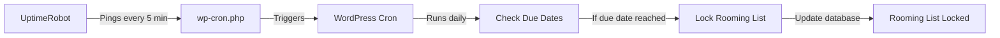

# WP-Cron Setup Guide: UptimeRobot Integration for Auto-Lock

This guide will walk you through setting up **UptimeRobot** to trigger WordPress cron jobs automatically, enabling the rooming list auto-lock feature based on due dates.

---

## Table of Contents

1. [Prerequisites](#prerequisites)
2. [Understanding the System](#understanding-the-system)
3. [UptimeRobot Setup](#uptimerobot-setup)
4. [Enabling Auto-Lock Logic](#enabling-auto-lock-logic)
5. [Configuring Due Dates](#configuring-due-dates)
6. [Testing the System](#testing-the-system)
7. [Monitoring & Debugging](#monitoring--debugging)
8. [Troubleshooting](#troubleshooting)

---

## Prerequisites

Before you begin, ensure you have:

- ✅ **Live Server**: Your WordPress site must be deployed on a live server (not localhost)
- ✅ **Public URL**: The site must be accessible via a public URL
- ✅ **Plugin Activated**: The organization-core-new plugin is activated
- ✅ **Admin Access**: You have WordPress admin access
- ✅ **Email Account**: For UptimeRobot registration (free)

---

## Understanding the System

### How It Works



### Why UptimeRobot?

WordPress cron (`wp-cron.php`) only runs when someone visits your site. For time-sensitive tasks like auto-locking rooming lists, this is unreliable. **UptimeRobot** solves this by:

- Pinging your site every 5 minutes (free tier)
- Ensuring `wp-cron.php` runs regularly
- Providing 50 free monitors (more than enough)
- No complex server configuration required

---

## UptimeRobot Setup

### Step 1: Create a Free Account

1. Go to [https://uptimerobot.com](https://uptimerobot.com)
2. Click **"Sign Up Free"**
3. Enter your email and create a password
4. Verify your email address

### Step 2: Add a New Monitor

1. Log in to your UptimeRobot dashboard
2. Click **"+ Add New Monitor"**
3. Configure the monitor:

   | Field | Value |
   |-------|-------|
   | **Monitor Type** | HTTP(s) |
   | **Friendly Name** | `WordPress Cron - Your Site Name` |
   | **URL (or IP)** | `https://your-site.com/wp-cron.php` |
   | **Monitoring Interval** | 5 minutes |

   > **Important**: Replace `https://your-site.com` with your actual site URL

4. Click **"Create Monitor"**

### Step 3: Verify Monitor is Active

1. Wait 5-10 minutes
2. Check the monitor status in your UptimeRobot dashboard
3. You should see a **green "Up"** status
4. Click on the monitor to view ping history

> [!TIP]
> If the monitor shows "Down", verify your site URL is correct and publicly accessible.

---

## Enabling Auto-Lock Logic

The auto-lock logic is **currently disabled** in the code for safety. Follow these steps to enable it:

### Step 1: Locate the Cron Handler File

Navigate to:
```
wp-content/plugins/organization-core-new/modules/bookings/class-bookings-cron.php
```

### Step 2: Find the Auto-Lock Code Block

Search for this comment (around line 115):
```php
// ============================================================
// AUTO-LOCK LOGIC - CURRENTLY DISABLED FOR TESTING
// ============================================================
```

### Step 3: Uncomment the Code

Remove the `/*` and `*/` comment markers around the auto-lock logic block:

**Before (Disabled)**:
```php
/*
// ============================================================
// AUTO-LOCK LOGIC - CURRENTLY DISABLED FOR TESTING
// ============================================================
// Uncomment this entire block to enable automatic locking

// Check if current date is >= due date
if ($current_date >= $due_date) {
    // Lock the rooming list
    $result = self::lock_rooming_list($booking_id);
    // ... rest of the code
}
// ============================================================
*/
```

**After (Enabled)**:
```php
// ============================================================
// AUTO-LOCK LOGIC - NOW ENABLED
// ============================================================

// Check if current date is >= due date
if ($current_date >= $due_date) {
    // Lock the rooming list
    $result = self::lock_rooming_list($booking_id);
    // ... rest of the code
}
// ============================================================
```

### Step 4: Remove Testing Log

Find and **delete or comment out** this line (around line 175):
```php
// TEMPORARY: Log for testing (remove when auto-lock is enabled)
self::log_cron_activity(sprintf(
    'TESTING MODE: Would check Booking #%d ...',
    $booking_id,
    // ...
));
```

### Step 5: Save the File

Save the file and upload it to your server if editing locally.

---

## Configuring Due Dates

### Where to Set Due Dates

Due dates are set in the **Booking Edit Page** under the **"Hotel Assigned"** metabox:

1. Go to **WordPress Admin** → **Bookings** → **Edit Booking**
2. Scroll to the **"Hotel Assigned"** section
3. Fill in:
   - Hotel selection
   - Check-in date
   - Check-out date
   - **Due date** ← This is critical!

### Due Date Best Practices

> [!IMPORTANT]
> The due date determines when the rooming list will be automatically locked.

**Recommended Settings**:
- **7 days before check-in**: `due_date = checkin_date - 7 days`
- **14 days before check-in**: `due_date = checkin_date - 14 days`
- **Custom**: Set based on your hotel's requirements

**Example**:
- Check-in date: `2025-12-20`
- Due date: `2025-12-13` (7 days before)
- Auto-lock will occur on: `2025-12-13` (when cron runs)

### How the System Checks

The cron job runs **daily at midnight** (server time) and checks:
```php
if (current_date >= due_date) {
    // Lock the rooming list
}
```

---

## Testing the System

### Test 1: Verify Cron is Scheduled

1. Install **WP-CLI** (if available) or use a plugin like **WP Crontrol**
2. Run this command:
   ```bash
   wp cron event list
   ```
3. Look for: `oc_check_rooming_list_due_dates`
4. Verify it's scheduled to run daily

### Test 2: Manual Cron Trigger

**Option A: Using WP-CLI**
```bash
wp cron event run oc_check_rooming_list_due_dates
```

**Option B: Using Browser**
Visit this URL in your browser:
```
https://your-site.com/wp-cron.php?doing_wp_cron
```

**Option C: Using WP Crontrol Plugin**
1. Install **WP Crontrol** plugin
2. Go to **Tools** → **Cron Events**
3. Find `oc_check_rooming_list_due_dates`
4. Click **"Run Now"**

### Test 3: Create a Test Booking

1. Create a test booking with hotel data
2. Set the **due date to today's date**
3. Create a rooming list with some entries
4. Manually trigger the cron (see Test 2)
5. Verify the rooming list is locked

### Test 4: Check Cron Logs

View the cron execution logs:

**Option A: WordPress Debug Log**
1. Enable WordPress debugging in `wp-config.php`:
   ```php
   define('WP_DEBUG', true);
   define('WP_DEBUG_LOG', true);
   ```
2. Check `/wp-content/debug.log` for entries like:
   ```
   [OC Bookings Cron] [INFO] Starting due date check...
   [OC Bookings Cron] [INFO] Locked rooming list for Booking #123
   ```

**Option B: Database Logs**
Run this SQL query in phpMyAdmin:
```sql
SELECT * FROM wp_options WHERE option_name = 'oc_bookings_cron_log';
```

---

## Monitoring & Debugging

### View Cron Logs

The system stores the last 100 cron execution logs in the database. To view them:

**Method 1: Add a Custom Admin Page** (Optional)
Create a simple admin page to display logs:
```php
// In your admin area
$logs = OC_Bookings_Cron::get_cron_logs(50);
foreach ($logs as $log) {
    echo sprintf(
        '[%s] [%s] %s<br>',
        $log['timestamp'],
        strtoupper($log['level']),
        $log['message']
    );
}
```

**Method 2: Database Query**
```sql
SELECT option_value FROM wp_options WHERE option_name = 'oc_bookings_cron_log';
```

### Check Next Scheduled Run

```php
$next_run = OC_Bookings_Cron::get_next_run_time();
echo "Next cron run: " . $next_run;
```

### UptimeRobot Monitoring

1. Log in to UptimeRobot dashboard
2. View your monitor's **Response Time Graph**
3. Verify pings are happening every 5 minutes
4. Check for any downtime alerts

---

## Troubleshooting

### Issue: Cron Not Running

**Symptoms**: Rooming lists not locking automatically

**Solutions**:
1. Verify UptimeRobot monitor is active and pinging
2. Check if cron event is scheduled: `wp cron event list`
3. Manually trigger cron to test: `wp cron event run oc_check_rooming_list_due_dates`
4. Check WordPress debug log for errors

### Issue: Rooming List Not Locking

**Symptoms**: Cron runs but lists don't lock

**Solutions**:
1. Verify auto-lock code is **uncommented** (see [Enabling Auto-Lock Logic](#enabling-auto-lock-logic))
2. Check if due date is set correctly in booking's hotel data
3. Verify current date >= due date
4. Check cron logs for errors
5. Ensure rooming list exists for the booking

### Issue: UptimeRobot Shows "Down"

**Symptoms**: Monitor status is red/down

**Solutions**:
1. Verify site URL is correct and publicly accessible
2. Check if site has any firewall/security blocking UptimeRobot
3. Test URL manually in browser: `https://your-site.com/wp-cron.php`
4. Whitelist UptimeRobot IPs if using a firewall

### Issue: Cron Runs Multiple Times

**Symptoms**: Duplicate log entries

**Solutions**:
1. Check if multiple cron events are scheduled: `wp cron event list`
2. Unschedule duplicates: `wp cron event delete oc_check_rooming_list_due_dates`
3. Reactivate plugin to reschedule properly

---

## Advanced Configuration

### Change Cron Frequency

By default, the cron runs **daily at midnight**. To change this:

1. Edit `class-bookings-cron.php`
2. Find the `schedule_events()` method
3. Modify the schedule:

```php
// Current: Daily at midnight
wp_schedule_event(strtotime('tomorrow midnight'), 'daily', self::CRON_HOOK_CHECK_DUE_DATES);

// Change to: Every 6 hours
wp_schedule_event(time(), 'every_six_hours', self::CRON_HOOK_CHECK_DUE_DATES);

// Change to: Twice daily
wp_schedule_event(time(), 'twicedaily', self::CRON_HOOK_CHECK_DUE_DATES);
```

### Email Notifications (Future Enhancement)

To add email notifications when a rooming list is auto-locked:

1. Edit `class-bookings-cron.php`
2. Find the `lock_rooming_list()` method
3. Add email logic after successful lock:

```php
if ($locked_items > 0) {
    // Send email notification
    $admin_email = get_option('admin_email');
    $subject = sprintf('Rooming List Auto-Locked for Booking #%d', $booking_id);
    $message = sprintf(
        'The rooming list for Booking #%d has been automatically locked due to the due date being reached.',
        $booking_id
    );
    wp_mail($admin_email, $subject, $message);
}
```

---

## Summary Checklist

Before going live, ensure:

- [ ] UptimeRobot account created
- [ ] Monitor added for `wp-cron.php`
- [ ] Monitor is active and pinging every 5 minutes
- [ ] Auto-lock code is **uncommented** in `class-bookings-cron.php`
- [ ] Testing log code is **removed/commented**
- [ ] Test booking created with due date = today
- [ ] Manual cron trigger successful
- [ ] Rooming list auto-locked as expected
- [ ] Cron logs reviewed for errors
- [ ] WordPress debug mode enabled (for production monitoring)

---

## Support

For issues or questions:
1. Check the [CRON_LOGIC_DOCUMENTATION.md](./CRON_LOGIC_DOCUMENTATION.md) for technical details
2. Review WordPress debug logs
3. Check UptimeRobot monitor status
4. Verify cron event is scheduled: `wp cron event list`

---

**Last Updated**: December 2025  
**Version**: 1.0
