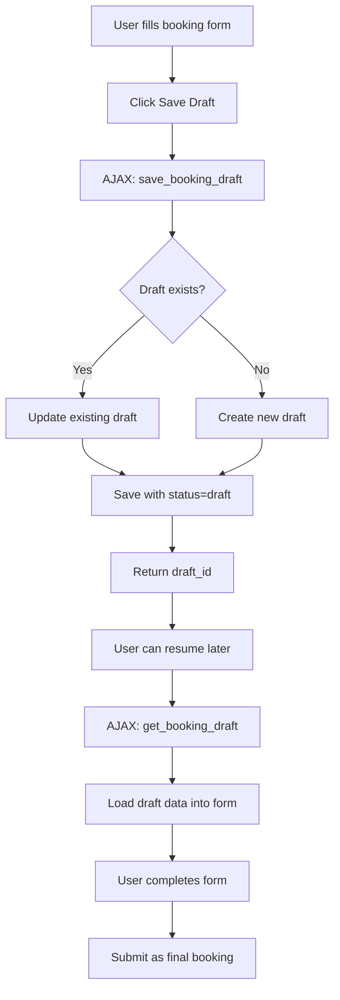
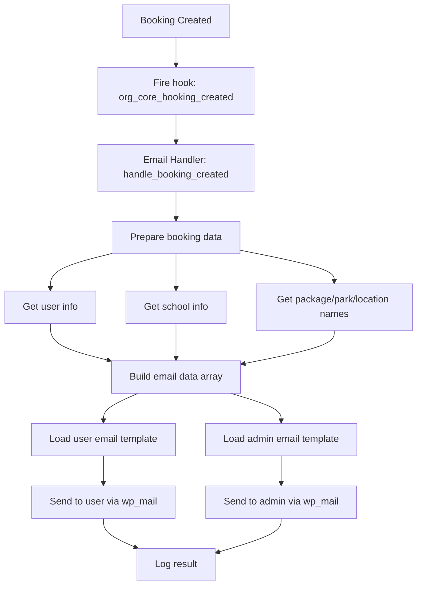
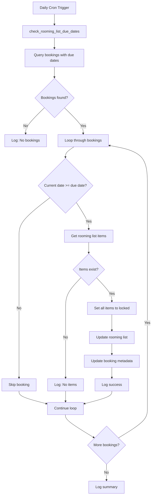

# Bookings Module - Complete Technical Guide

> **Module ID:** `bookings`  
> **Version:** 1.0.0  
> **Status:** Optional Module  
> **Dependencies:** None (but integrates with Schools, Hotels, Rooming List modules)

---

## Table of Contents

1. [Overview](#overview)
2. [File Structure](#file-structure)
3. [Core Components](#core-components)
4. [Database Schema](#database-schema)
5. [AJAX Actions](#ajax-actions)
6. [Email & Notification System](#email--notification-system)
7. [Cron System](#cron-system)
8. [Rewrite Rules](#rewrite-rules)
9. [Workflow & Processes](#workflow--processes)
10. [Module Dependencies](#module-dependencies)
11. [Future Considerations](#future-considerations)

---

## Overview

The **Bookings Module** is the most comprehensive module in the Organization Core plugin, providing complete booking management functionality with public booking forms, admin management, email notifications, and automated cron tasks.

### Key Features

✅ **Multi-Step Booking Form** - 7-step wizard for booking creation  
✅ **Draft System** - Save and resume bookings  
✅ **Email Notifications** - User + Admin confirmation emails  
✅ **Cron Automation** - Auto-lock rooming lists based on due dates  
✅ **Admin Management** - WP_List_Table with advanced features  
✅ **Public Interface** - Book-now pages and booking lists  
✅ **AJAX-Driven** - 17 AJAX endpoints for seamless UX  
✅ **Rewrite Rules** - Custom URLs (`/book-now/{id}`)  
✅ **Integration Ready** - Works with Hotels, Schools, Rooming List modules

---

## File Structure

```
bookings/
├── class-bookings.php                 # Main module orchestrator
├── config.php                         # Module configuration
├── activator.php                      # Activation (table, rewrite, cron)
├── deactivator.php                    # Deactivation (unschedule cron)
├── crud.php                           # Database operations (23 methods)
├── ajax.php                           # AJAX handlers (17 endpoints)
├── api.php                            # API endpoints (future)
├── metaboxes.php                      # Admin metaboxes
├── class-bookings-email.php           # Email handler
├── class-bookings-cron.php            # Cron handler (auto-lock)
│
├── admin/
│   └── class-bookings-admin.php       # Admin interface
│
├── public/
│   └── class-bookings-public.php      # Public interface
│
├── templates/
│   ├── admin/
│   │   ├── booking-table.php          # Bookings list (WP_List_Table)
│   │   └── booking-single.php         # Single booking view
│   ├── emails/
│   │   ├── booking-confirmation-user.php    # User email template
│   │   └── booking-confirmation-admin.php   # Admin email template
│   └── public/
│       ├── page-book-now.php          # Booking form page
│       ├── page-bookings-list.php     # User bookings list
│       ├── steps/                     # 7 booking form steps
│       │   ├── step-date.php
│       │   ├── step-ensemble.php
│       │   ├── step-location.php
│       │   ├── step-meals.php
│       │   ├── step-parks.php
│       │   ├── step-school.php
│       │   └── step-additional-details.php
│       └── modals/
│           ├── confirmation-modal.php
│           └── success-modal.php
│
├── assets/
│   ├── css/
│   │   ├── bookings-admin.css
│   │   ├── bookings-public.css
│   │   ├── page.css
│   │   ├── sw.css
│   │   └── extra.css
│   └── js/
│       ├── bookings-admin.js
│       ├── bookings-public.js
│       ├── booking-main.js
│       └── booking-location-handler.js
│
└── Documentation/
    ├── CRON_LOGIC_DOCUMENTATION.md
    ├── CRON_SETUP_GUIDE.md
    ├── PRODUCTION_DEPLOYMENT_GUIDE.md
    ├── ajax.md
    └── improvements.md
```

**Total Files:** 53 files

---

## Core Components

### 1. `class-bookings.php`

**Purpose:** Main module orchestrator

**Key Methods:**
- `init()` - Initialize module components
- `load_dependencies()` - Load all module files
- `init_email_handler()` - Initialize email system early
- `init_admin()` - Initialize admin interface
- `init_public()` - Initialize public interface
- `init_ajax()` - Initialize AJAX handlers

**Initialization Order:**
1. Validate module enabled
2. Load dependencies (CRUD, API, Email, Cron)
3. Initialize email handler (hooks must register early)
4. Initialize context-specific components (admin/public/AJAX)

---

### 2. `config.php`

**Configuration:**
```php
return array(
    'id'                => 'bookings',
    'name'              => 'Bookings Management',
    'description'       => 'Comprehensive booking system with calendar integration',
    'version'           => '1.0.0',
    'author'            => 'OwlthTech',
    'default_enabled'   => false,  // Optional module
    'network_only'      => false,
    'required'          => false,
    'dependencies'      => array(),
    'supports'          => array(
        'templates',     // Template overrides
        'ajax',          // AJAX functionality
        'cpt',           // Custom post types
        'shortcodes'     // Shortcodes
    ),
    'template_paths'    => array(
        'admin'  => 'templates/admin/',
        'public' => 'templates/public/',
    ),
    'class'             => 'class-bookings.php'
);
```

---

### 3. `activator.php`

**Activation Tasks:**
1. Create `wp_bookings` table
2. Register rewrite rules
3. Schedule cron events
4. Flush rewrite rules

**Important:** Rewrite rules are registered on EVERY page load via `init` hook (line 174)

---

## Database Schema

### `wp_bookings` Table

**Table Name:** `{$wpdb->base_prefix}bookings`

**Schema:**
```sql
CREATE TABLE wp_bookings (
    id BIGINT(20) NOT NULL AUTO_INCREMENT,
    blog_id BIGINT(20) NOT NULL,
    user_id BIGINT(20) NOT NULL DEFAULT 0,
    package_id BIGINT(20) DEFAULT NULL,
    booking_data JSON NOT NULL,
    school_id VARCHAR(255) DEFAULT NULL,
    location_id BIGINT(20) DEFAULT NULL,
    date_selection DATE DEFAULT NULL,
    parks_selection TEXT DEFAULT NULL,
    other_park_name VARCHAR(255) DEFAULT NULL,
    total_students INT(11) DEFAULT 0,
    total_chaperones INT(11) DEFAULT 0,
    meal_vouchers TINYINT(1) DEFAULT 0,
    meals_per_day INT(2) DEFAULT 0,
    park_meal_options TEXT DEFAULT NULL,
    transportation VARCHAR(50) DEFAULT 'own',
    lodging_dates VARCHAR(255) DEFAULT NULL,
    special_notes TEXT DEFAULT NULL,
    ensembles JSON DEFAULT NULL,
    hotel_data LONGTEXT NULL,
    status VARCHAR(20) NOT NULL DEFAULT 'pending',
    total_amount DECIMAL(10,2) DEFAULT 0.00,
    created_at DATETIME NOT NULL DEFAULT CURRENT_TIMESTAMP,
    modified_at DATETIME NOT NULL DEFAULT CURRENT_TIMESTAMP ON UPDATE CURRENT_TIMESTAMP,
    PRIMARY KEY (id),
    KEY blog_id (blog_id),
    KEY user_id (user_id),
    KEY package_id (package_id),
    KEY school_id (school_id),
    KEY location_id (location_id),
    KEY status (status),
    KEY date_selection (date_selection),
    KEY created_at (created_at)
) ENGINE=InnoDB DEFAULT CHARSET=utf8mb4;
```

**Column Details:**

| Column | Type | Description |
|--------|------|-------------|
| `id` | BIGINT(20) | Primary key |
| `blog_id` | BIGINT(20) | Site ID (multisite) |
| `user_id` | BIGINT(20) | User who created booking |
| `package_id` | BIGINT(20) | Package post ID |
| `booking_data` | JSON | Complete booking form data |
| `school_id` | VARCHAR(255) | School ID from wp_schools |
| `location_id` | BIGINT(20) | Location term ID |
| `date_selection` | DATE | Festival date |
| `parks_selection` | TEXT | Selected parks (JSON) |
| `other_park_name` | VARCHAR(255) | Custom park name |
| `total_students` | INT(11) | Number of students |
| `total_chaperones` | INT(11) | Number of chaperones |
| `meal_vouchers` | TINYINT(1) | Include meals (0/1) |
| `meals_per_day` | INT(2) | Meals per day (1-3) |
| `park_meal_options` | TEXT | Meal options per park (JSON) |
| `transportation` | VARCHAR(50) | 'own' or 'quote' |
| `lodging_dates` | VARCHAR(255) | Lodging date range |
| `special_notes` | TEXT | Special requests |
| `ensembles` | JSON | Ensemble details |
| `hotel_data` | LONGTEXT | Hotel/rooming list data (JSON) |
| `status` | VARCHAR(20) | pending/confirmed/cancelled/completed/draft |
| `total_amount` | DECIMAL(10,2) | Total booking amount |
| `created_at` | DATETIME | Creation timestamp |
| `modified_at` | DATETIME | Last modified timestamp |

**Indexes:** 8 indexes for optimized queries

---

## AJAX Actions

### Public Actions (No Login Required)

| Action | Handler | Purpose |
|--------|---------|---------|
| `create_booking` | `handle_create_booking()` | Create new booking |
| `get_package_data` | `handle_get_package_data()` | Get package details |

### Private Actions (Login Required)

| Action | Handler | Purpose |
|--------|---------|---------|
| `get_bookings` | `handle_get_bookings()` | Get user bookings |
| `cancel_booking` | `handle_cancel_booking()` | Cancel booking |
| `save_user_school` | `handle_save_school()` | Save school |
| `load_user_schools` | `handle_get_schools_of_current_user()` | Load user schools |
| `delete_user_school` | `handle_delete_school()` | Delete school |
| `update_user_school` | `handle_update_school()` | Update school |
| `get_user_schools` | `handle_get_schools()` | Get schools |
| `save_booking_draft` | `handle_save_booking_draft()` | Save draft |
| `get_booking_draft` | `handle_get_booking_draft()` | Get draft |
| `save_booking_price` | `save_booking_price()` | Update booking price (admin) |
| `send_booking_email` | `handle_send_booking_email()` | Resend emails (admin) |
| `update_booking_status` | `ajax_update_booking_status()` | Update status (admin) |
| `delete_booking` | `ajax_delete_booking()` | Delete booking (admin) |

**Total:** 17 AJAX endpoints

---

## Email & Notification System

### Email Handler: `class-bookings-email.php`

**Purpose:** Send booking confirmation emails

**Hook:** `org_core_booking_created`  
**Triggered By:** `ajax.php` after successful booking creation

**Email Types:**

#### 1. User Confirmation Email

**Template:** `templates/emails/booking-confirmation-user.php`

**Recipient:** User who created booking

**Subject:** `Booking Confirmation #{booking_id} - FORUM Music Festivals`

**Content Includes:**
- Booking reference number
- Package type
- Selected parks
- Meal options
- Transportation choice
- Festival location and date
- Lodging dates
- Director contact information
- School information
- Group details (students/chaperones)
- Special requests/notes

**Design:** Professional HTML email with:
- Logo header
- Bordered table layout
- Section titles
- Footer with contact info

---

#### 2. Admin Notification Email

**Template:** `templates/emails/booking-confirmation-admin.php`

**Recipient:** Site admin email

**Subject:** `New Booking Received #{booking_id} - FORUM Music Festivals`

**Content:** Same as user email plus:
- User email address
- Timestamp
- Admin action links (future)

---

### Email Data Preparation

**Method:** `prepare_booking_data($booking_id, $booking_data, $user)`

**Data Extracted:**
- User information (name, email, phone)
- Package details
- Park names (from taxonomy)
- Location name (from taxonomy)
- School details (from wp_schools table)
- Formatted dates
- Meal and transportation options

---

### Email Sending

**Method:** `send_email($to, $subject, $message)`

**Features:**
- HTML email support
- Error logging
- Uses WordPress `wp_mail()` function
- SMTP configuration from Authentication module

---

### Current Email Notifications

| Event | Template | Trigger | Recipients |
|-------|----------|---------|------------|
| Booking Created | `booking-confirmation-user.php` | After booking submission | User |
| Booking Created | `booking-confirmation-admin.php` | After booking submission | Admin |

---

### Future Email Notifications

**Priority: High**

1. **Booking Status Changed**
   - Trigger: Admin changes status to confirmed/cancelled
   - Recipients: User
   - Template: `booking-status-changed.php` (to be created)

2. **Booking Reminder**
   - Trigger: 7 days before festival date
   - Recipients: User
   - Template: `booking-reminder.php` (to be created)

3. **Rooming List Due Date Reminder**
   - Trigger: 3 days before due date
   - Recipients: User
   - Template: `rooming-list-reminder.php` (to be created)

4. **Rooming List Auto-Locked**
   - Trigger: Cron auto-locks rooming list
   - Recipients: User + Admin
   - Template: `rooming-list-locked.php` (to be created)

5. **Payment Received**
   - Trigger: Admin marks payment received
   - Recipients: User
   - Template: `payment-received.php` (to be created)

6. **Booking Updated**
   - Trigger: User or admin updates booking
   - Recipients: User + Admin
   - Template: `booking-updated.php` (to be created)

**Priority: Medium**

7. **Draft Expiring Soon**
   - Trigger: Draft older than 5 days
   - Recipients: User
   - Template: `draft-expiring.php` (to be created)

8. **Booking Cancelled**
   - Trigger: User or admin cancels booking
   - Recipients: User + Admin
   - Template: `booking-cancelled.php` (to be created)

9. **Admin Notes Added**
   - Trigger: Admin adds internal notes
   - Recipients: Admin only
   - Template: `admin-notes-added.php` (to be created)

**Priority: Low**

10. **Booking Anniversary**
    - Trigger: 1 year after booking
    - Recipients: User
    - Template: `booking-anniversary.php` (to be created)

---

### Email Configuration

**SMTP Settings:** Inherited from Authentication module

**From Email:** Configured in `wp_options`:
- `mus_from_email`
- `mus_from_name`

**Logging:** All email sends are logged to error_log

---

## Cron System

### Cron Handler: `class-bookings-cron.php`

**Purpose:** Automated tasks for bookings module

### Cron Events

#### 1. Auto-Lock Rooming Lists

**Hook:** `oc_check_rooming_list_due_dates`

**Schedule:** Daily at midnight

**Purpose:** Automatically lock rooming lists when due date is reached

**Workflow:**
1. Query bookings with `hotel_data` containing `due_date`
2. Compare current date with due date
3. If current date >= due date, lock all rooming list items
4. Update booking metadata with auto-lock timestamp
5. Log all actions

**Current Status:** ⚠️ **DISABLED** for production deployment

**To Enable:** Uncomment lines 118-154 in `class-bookings-cron.php`

---

### Cron Methods

| Method | Purpose |
|--------|---------|
| `init()` | Register cron hooks and schedules |
| `register_cron_schedules($schedules)` | Add custom schedules (every 6 hours) |
| `schedule_events()` | Schedule cron events on activation |
| `unschedule_events()` | Unschedule events on deactivation |
| `check_rooming_list_due_dates()` | Main cron job - check and lock |
| `lock_rooming_list($booking_id)` | Lock all items in rooming list |
| `log_cron_activity($message, $level)` | Log cron actions |
| `get_cron_logs($limit)` | Retrieve cron logs |
| `clear_cron_logs()` | Clear cron logs |
| `get_next_run_time()` | Get next scheduled run |
| `manual_trigger()` | Manually trigger cron (admin only) |

---

### Cron Logging

**Storage:** WordPress option `oc_bookings_cron_log`

**Retention:** Last 100 log entries

**Log Format:**
```php
array(
    'timestamp' => '2024-01-01 12:00:00',
    'level'     => 'info|warning|error',
    'message'   => 'Log message'
)
```

**Access:** Admin can view logs via `get_cron_logs()` method

---

### Multisite Cron Control

**Site-Specific Control:** Use `wp-config.php` to enable cron only on specific sites:

```php
define('OC_ENABLE_ROOMING_LIST_CRON', array(1, 3, 5));
```

This enables cron only on sites with blog_id 1, 3, and 5.

---

## Rewrite Rules

### Custom URLs

**Registered Rules:**

1. **Book Now Page**
   - Pattern: `^book-now/([0-9]+)/?$`
   - Rewrite: `index.php?booking_page_type=book-now&booking_package_id=$matches[1]`
   - Example: `/book-now/123` → Package ID 123

2. **My Account Bookings**
   - Pattern: `^my-account/bookings/?$`
   - Rewrite: `index.php?account_page=bookings`
   - Example: `/my-account/bookings`

**Registration:** Rules are registered on EVERY page load via `init` hook (activator.php line 174)

**Flush:** Run `flush_rewrite_rules()` after activation or when rules change

---

## Workflow & Processes

### Booking Creation Flow

```mermaid
graph TD
    A[User visits /book-now/{package_id}] --> B[Load booking form]
    B --> C[Step 1: Select Date]
    C --> D[Step 2: Select Location]
    D --> E[Step 3: Select Parks]
    E --> F[Step 4: Select Meals]
    F --> G[Step 5: Select School/Add New]
    G --> H[Step 6: Add Ensembles]
    H --> I[Step 7: Additional Details]
    I --> J[Review & Confirm]
    J --> K[Submit via AJAX: create_booking]
    K --> L{Validation}
    L -->|Invalid| M[Show errors]
    L -->|Valid| N[Save to database]
    N --> O[Fire hook: org_core_booking_created]
    O --> P[Email Handler: send_user_confirmation]
    O --> Q[Email Handler: send_admin_notification]
    P --> R[Success response]
    Q --> R
    R --> S[Show success modal]
    S --> T[Redirect to my-account/bookings]
```

---

### Draft System Flow



---

### Email Notification Flow



---

### Cron Auto-Lock Flow



---

## Module Dependencies

### Dependencies ON Other Modules

**Soft Dependencies** (module works without them, but integrates when available):

#### 1. Schools Module
**Table Used:** `wp_schools`

**Integration Points:**
- Booking form step 5 (select school)
- Email templates (school information)
- CRUD methods for school management

**Impact if Missing:** Users cannot select schools, must enter manually

---

#### 2. Hotels Module
**Table Used:** `wp_hotels`

**Integration Points:**
- Rooming list assignment
- Hotel data in `booking_data` JSON

**Impact if Missing:** No hotel/rooming list functionality

---

#### 3. Rooming List Module
**Table Used:** `wp_rooming_list`

**Integration Points:**
- Cron auto-lock functionality
- Hotel data management
- Due date tracking

**Impact if Missing:** Cron auto-lock will fail

---

### Modules That Depend ON Bookings

1. **Rooming List Module** - Requires bookings for room assignments
2. **Hotels Module** - May reference bookings for occupancy

---

## CRUD Operations

### Key Methods

**Create:**
- `create_booking($blog_id, $booking_data)` - Create new booking
- `save_booking_draft($user_id, $package_id, $booking_data, $draft_id)` - Save draft

**Read:**
- `get_booking($id, $blog_id)` - Get single booking
- `get_bookings($blog_id, $args)` - Get bookings with filters
- `get_user_draft($user_id, $package_id)` - Get user's draft
- `get_bookings_with_due_dates()` - Get bookings for cron processing
- `get_statistics($blog_id)` - Get booking statistics
- `count_bookings($blog_id)` - Count total bookings

**Update:**
- `update_booking($id, $blog_id, $booking_data, $status)` - Update booking
- `confirm_booking_draft($draft_id, $user_id, $final_data)` - Convert draft to pending

**Delete:**
- `delete_booking($id, $blog_id)` - Delete booking
- `clean_old_drafts($days)` - Clean old drafts (cron)

**Schools:**
- `get_user_schools($user_id, $blog_id)` - Get user schools
- `get_school($school_id, $blog_id)` - Get single school
- `add_school($user_id, $blog_id, $school_data)` - Add school
- `update_school($school_id, $blog_id, $school_data)` - Update school
- `delete_school($school_id, $blog_id)` - Delete school (soft)

**Utilities:**
- `get_location_name($location_id)` - Get location name
- `get_park_names($parks, $other_park_name)` - Get park names

**Total:** 23 CRUD methods

---

## Future Considerations

### 1. Email Notifications (HIGH PRIORITY)

**Tasks:**
- [ ] Add booking status changed email
- [ ] Add booking reminder email (7 days before)
- [ ] Add rooming list due date reminder (3 days before)
- [ ] Add rooming list auto-locked notification
- [ ] Add payment received confirmation
- [ ] Add booking updated notification
- [ ] Create email template builder
- [ ] Add email preferences for users
- [ ] Add email queue system for bulk sends

---

### 2. Cron Enhancements (HIGH PRIORITY)

**Tasks:**
- [ ] Enable auto-lock in production (currently disabled)
- [ ] Add email notifications for auto-lock
- [ ] Add cron dashboard in admin
- [ ] Add manual cron trigger button
- [ ] Add cron log viewer in admin
- [ ] Add cron health monitoring
- [ ] Add UptimeRobot integration guide
- [ ] Add cron failure alerts

---

### 3. Payment Integration (HIGH PRIORITY)

**Tasks:**
- [ ] Add payment gateway integration (Stripe/PayPal)
- [ ] Add payment status tracking
- [ ] Add payment history
- [ ] Add refund functionality
- [ ] Add invoice generation
- [ ] Add payment reminder emails
- [ ] Add partial payment support

---

### 4. Booking Management (MEDIUM PRIORITY)

**Tasks:**
- [ ] Add booking duplication
- [ ] Add booking templates
- [ ] Add bulk booking actions
- [ ] Add booking export (CSV/PDF)
- [ ] Add booking import
- [ ] Add booking notes/comments
- [ ] Add booking attachments
- [ ] Add booking timeline/history

---

### 5. Reporting & Analytics (MEDIUM PRIORITY)

**Tasks:**
- [ ] Add booking statistics dashboard
- [ ] Add revenue reports
- [ ] Add occupancy reports
- [ ] Add user booking history
- [ ] Add export to Excel/PDF
- [ ] Add charts and graphs
- [ ] Add date range filters

---

### 6. User Experience (MEDIUM PRIORITY)

**Tasks:**
- [ ] Add booking form progress save (auto-save)
- [ ] Add form validation improvements
- [ ] Add mobile-responsive design
- [ ] Add accessibility improvements
- [ ] Add multi-language support
- [ ] Add booking calendar view
- [ ] Add booking search/filter

---

### 7. Admin Features (LOW PRIORITY)

**Tasks:**
- [ ] Add booking approval workflow
- [ ] Add booking assignment to staff
- [ ] Add internal notes system
- [ ] Add booking tags/categories
- [ ] Add custom fields support
- [ ] Add booking templates
- [ ] Add quick edit functionality

---

### 8. Integration (LOW PRIORITY)

**Tasks:**
- [ ] Add Google Calendar sync
- [ ] Add iCal export
- [ ] Add Zapier integration
- [ ] Add REST API endpoints
- [ ] Add webhook support
- [ ] Add third-party booking platforms

---

### 9. Notifications Beyond Email (LOW PRIORITY)

**Tasks:**
- [ ] Add SMS notifications (Twilio)
- [ ] Add push notifications
- [ ] Add in-app notifications
- [ ] Add Slack notifications (admin)
- [ ] Add notification preferences
- [ ] Add notification history

---

### 10. Security & Performance (ONGOING)

**Tasks:**
- [ ] Add rate limiting for booking submissions
- [ ] Add CAPTCHA for public forms
- [ ] Add booking spam detection
- [ ] Add database query optimization
- [ ] Add caching for frequently accessed data
- [ ] Add CDN support for assets
- [ ] Add security audit logging

---

## Notification & Email Summary

### Current Implementation

**Email Templates:** 2
1. User confirmation (`booking-confirmation-user.php`)
2. Admin notification (`booking-confirmation-admin.php`)

**Email Trigger:** `org_core_booking_created` hook

**Email Handler:** `OC_Bookings_Email` class

**Email Method:** WordPress `wp_mail()` with HTML support

**SMTP:** Configured via Authentication module

---

### Required Notifications (Not Yet Implemented)

**Critical (Implement First):**
1. Booking status changed → User
2. Rooming list auto-locked → User + Admin
3. Payment received → User

**Important (Implement Soon):**
4. Booking reminder (7 days before) → User
5. Rooming list due date reminder (3 days before) → User
6. Booking updated → User + Admin

**Nice to Have:**
7. Draft expiring soon → User
8. Booking cancelled → User + Admin
9. Admin notes added → Admin

---

### Email Template Variables

All email templates receive `$email_data` array with:

```php
$email_data = array(
    'booking_id'          => int,
    'user_email'          => string,
    'director_name'       => string,
    'director_phone'      => string,
    'director_cellphone'  => string,
    'package_title'       => string,
    'parks'               => string (HTML),
    'include_meals'       => 'Yes'|'No',
    'meals_per_day'       => int,
    'transportation'      => string,
    'festival_location'   => string,
    'festival_date'       => string (formatted),
    'festival_date_day'   => string (day name),
    'lodging_dates'       => string,
    'school_name'         => string,
    'school_address_1'    => string,
    'school_address_2'    => string,
    'school_city'         => string,
    'school_state'        => string,
    'school_zip'          => string,
    'school_phone'        => string,
    'total_students'      => int,
    'total_chaperones'    => int,
    'notes'               => string
);
```

---

### Email Best Practices

1. **Always use HTML emails** with plain text fallback
2. **Include booking reference number** in subject and body
3. **Use responsive email templates** for mobile
4. **Include unsubscribe link** (future)
5. **Log all email sends** for debugging
6. **Use transactional email service** for reliability (future)
7. **Test emails** before deployment
8. **Include contact information** in footer
9. **Use branded templates** with logo
10. **Provide clear call-to-action** buttons

---

## Conclusion

The **Bookings Module** is the most feature-rich module in the Organization Core plugin, providing:

- ✅ Complete booking lifecycle management
- ✅ Multi-step booking form with draft system
- ✅ Email notifications (user + admin)
- ✅ Automated cron tasks (rooming list auto-lock)
- ✅ Admin management with WP_List_Table
- ✅ Public interface with custom URLs
- ✅ 17 AJAX endpoints for seamless UX
- ✅ Integration with Schools, Hotels, Rooming List modules

**Key Strengths:**
- Comprehensive feature set
- Well-documented codebase
- Production-ready email system
- Automated cron system (ready to enable)
- Extensive CRUD operations
- Multisite compatible

**Areas for Improvement:**
- Add more email notifications
- Enable cron auto-lock in production
- Add payment integration
- Add reporting and analytics
- Improve mobile responsiveness
- Add more admin features

---

**Last Updated:** 2024-12-10  
**Module Version:** 1.0.0  
**Documentation Version:** 1.0.0
