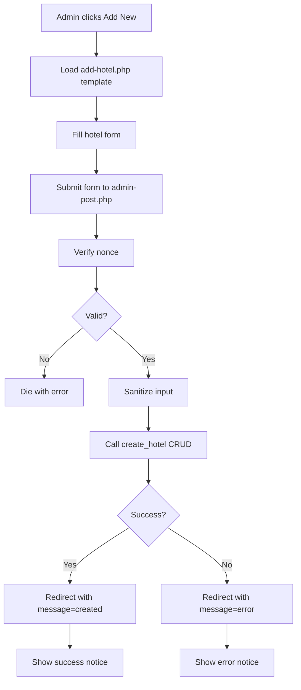
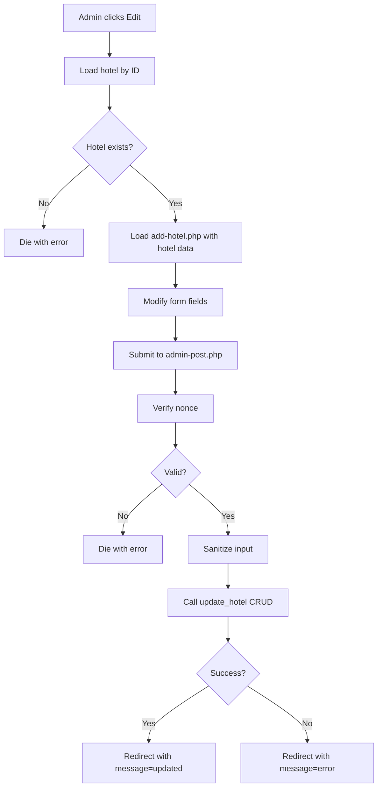
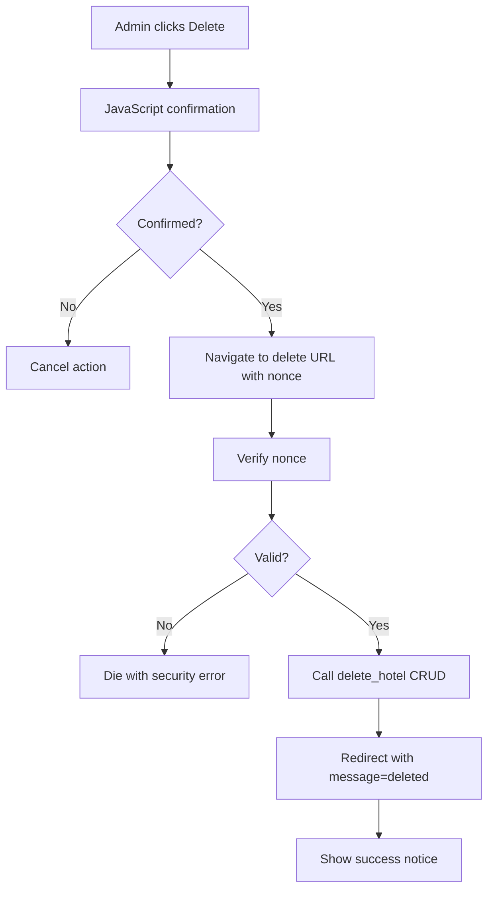
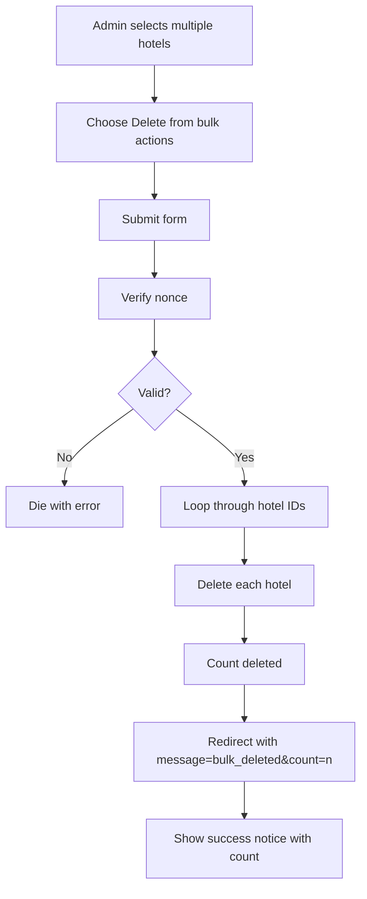
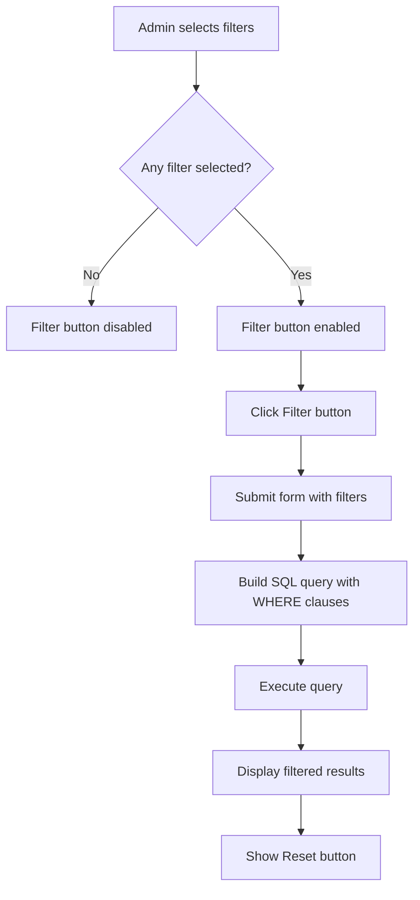

# Hotels Module - Complete Technical Guide

> **Module ID:** `hotels`  
> **Version:** 1.0.0  
> **Status:** Optional Module  
> **Dependencies:** None

---

## Table of Contents

1. [Overview](#overview)
2. [File Structure](#file-structure)
3. [Core Components](#core-components)
4. [Database Schema](#database-schema)
5. [Admin Interface](#admin-interface)
6. [CRUD Operations](#crud-operations)
7. [Workflow & Processes](#workflow--processes)
8. [Module Dependencies](#module-dependencies)
9. [Future Considerations](#future-considerations)

---

## Overview

The **Hotels Module** provides hotel management functionality for the Organization Core plugin. It is an **admin-only module** with no public-facing components.

### Key Features

✅ **Admin-Only Interface** - Hotels management in WordPress admin  
✅ **WP_List_Table Integration** - Native WordPress table UI  
✅ **CRUD Operations** - Create, Read, Update, Delete hotels  
✅ **Advanced Filtering** - Filter by rooms and capacity  
✅ **Search Functionality** - Search hotels by name  
✅ **Bulk Actions** - Bulk delete multiple hotels  
✅ **Screen Options** - Customizable columns and per-page display  
✅ **Help Tabs** - Built-in contextual help  
✅ **Pagination** - Efficient handling of large datasets

### Module Characteristics

- **No AJAX** - Uses traditional WordPress admin-post handlers
- **No Public Templates** - Admin-only functionality
- **No Assets** - Uses WordPress core styles
- **Simple Architecture** - Focused on hotel data management

---

## File Structure

```
hotels/
├── class-hotels.php                   # Main module class
├── config.php                         # Module configuration
├── activator.php                      # Activation logic (creates table)
├── deactivator.php                    # Deactivation logic
├── crud.php                           # Database operations (CRUD)
│
├── admin/
│   └── class-hotels-admin.php         # Admin interface controller
│
└── templates/
    └── admin/
        ├── hotel-table.php            # Hotels list table (WP_List_Table)
        └── add-hotel.php              # Add/Edit hotel form
```

**Total Files:** 11 (7 PHP files, 2 directories, 2 templates)

---

## Core Components

### 1. `class-hotels.php`

**Purpose:** Main module class that extends `OC_Abstract_Module`

**Key Methods:**
- `__construct()` - Initializes module with config
- `load_dependencies()` - Loads CRUD, admin, activator, deactivator
- `init()` - Entry point, validates and initializes admin interface
- `get_module_id()` - Returns module ID (`hotels`)
- `get_config()` - Loads module configuration

**Workflow:**
1. Module is registered via `organization_core_register_modules` hook
2. `init()` checks if module is enabled for current site
3. Loads admin interface if in admin context
4. No public or AJAX components

**Activation Hooks:**
```php
register_activation_hook(__FILE__, array('OC_Hotels_Activator', 'activate'));
register_deactivation_hook(__FILE__, array('OC_Hotels_Deactivator', 'deactivate'));
```

---

### 2. `config.php`

**Purpose:** Module configuration and metadata

**Configuration Array:**
```php
return array(
    'id'                => 'hotels',
    'name'              => 'Hotels System',
    'description'       => 'Hotels management system',
    'version'           => '1.0.0',
    'author'            => 'OwlthTech',
    'default_enabled'   => false,  // Disabled by default
    'network_only'      => false,  // Can be enabled per site
    'required'          => false,  // Not required
    'dependencies'      => array(), // No dependencies
    'supports'          => array('templates'),
    'class'             => 'class-hotels.php'
);
```

**Key Differences from Authentication:**
- `default_enabled` is `false` (optional module)
- `required` is `false` (not essential)
- No AJAX or shortcode support

---

### 3. `activator.php`

**Purpose:** Runs on module activation

**Class:** `OC_Hotels_Activator`

**Activation Tasks:**
- Creates `wp_hotels` table

**Table Creation:**
```php
public static function create_hotels_table() {
    global $wpdb;
    $table_name = $wpdb->base_prefix . 'hotels';
    
    $sql = "CREATE TABLE IF NOT EXISTS $table_name (
        id BIGINT(20) NOT NULL AUTO_INCREMENT,
        name VARCHAR(255) NOT NULL,
        address TEXT DEFAULT NULL,
        number_of_person INT(11) DEFAULT 0,
        number_of_rooms INT(11) DEFAULT 0,
        created_at DATETIME NOT NULL DEFAULT CURRENT_TIMESTAMP,
        modified_at DATETIME NOT NULL DEFAULT CURRENT_TIMESTAMP ON UPDATE CURRENT_TIMESTAMP,
        PRIMARY KEY (id)
    ) $charset_collate;";
    
    dbDelta($sql);
}
```

---

### 4. `crud.php`

**Purpose:** All database operations for hotels module

**Class:** `OC_Hotels_CRUD`

**Methods Overview:**

#### Create Operations
- `create_hotel($data)` - Create new hotel, returns insert ID

#### Read Operations
- `get_hotel_by_id($id)` - Get single hotel by ID
- `get_hotels($args)` - Get hotels with filters, search, pagination
- `get_total_hotels($args)` - Get total count for pagination

#### Update Operations
- `update_hotel($id, $data)` - Update hotel by ID

#### Delete Operations
- `delete_hotel($id)` - Hard delete hotel by ID

---

### 5. `admin/class-hotels-admin.php`

**Purpose:** Admin interface controller

**Class:** `OC_Hotels_Admin`

**Key Methods:**
- `init()` - Register admin hooks
- `add_admin_menu()` - Add admin menu pages
- `render_admin_page()` - Render hotels list table
- `render_form_page()` - Render add/edit form
- `save_hotel()` - Handle new hotel submission
- `update_hotel()` - Handle hotel update submission
- `handle_delete_action()` - Handle single delete
- `handle_bulk_delete_action()` - Handle bulk delete
- `register_screen_options()` - Add screen options and help tabs
- `set_screen_option($status, $option, $value)` - Save screen option

**Admin Menu Structure:**
```
Hotels (dashicons-building)
├── All Hotels (hotels)
└── Add New (hotels-add-new)
```

---

### 6. `templates/admin/hotel-table.php`

**Purpose:** Hotels list table using `WP_List_Table`

**Class:** `OC_Hotels_List_Table` (extends `WP_List_Table`)

**Features:**
- Checkbox column for bulk actions
- Sortable columns (name, created_at)
- Row actions (Edit, Delete)
- Search box
- Advanced filters (rooms, capacity)
- Pagination
- Screen options support
- Success/error messages

**Columns:**
- Checkbox (cb)
- Name (with row actions)
- Address
- Capacity (Persons)
- Rooms
- Date Created

**Filters:**
- Search by name
- Filter by number of rooms
- Filter by capacity (persons)
- Dynamic filter button (disabled when no selection)
- Reset button (shown when filters active)

---

### 7. `templates/admin/add-hotel.php`

**Purpose:** Add/Edit hotel form

**Features:**
- Dual-purpose form (add/edit)
- WordPress form table layout
- Nonce security
- Required field validation
- Back to hotels link

**Form Fields:**
- Hotel Name (text, required)
- Address (textarea)
- Capacity (Persons) (number)
- Number of Rooms (number)

**Form Actions:**
- Add: `admin-post.php?action=save_hotel`
- Edit: `admin-post.php?action=update_hotel`

---

## Database Schema

### `wp_hotels` Table

**Table Name:** `{$wpdb->base_prefix}hotels`

**Schema:**
```sql
CREATE TABLE wp_hotels (
    id BIGINT(20) NOT NULL AUTO_INCREMENT,
    name VARCHAR(255) NOT NULL,
    address TEXT DEFAULT NULL,
    number_of_person INT(11) DEFAULT 0,
    number_of_rooms INT(11) DEFAULT 0,
    created_at DATETIME NOT NULL DEFAULT CURRENT_TIMESTAMP,
    modified_at DATETIME NOT NULL DEFAULT CURRENT_TIMESTAMP ON UPDATE CURRENT_TIMESTAMP,
    PRIMARY KEY (id)
) ENGINE=InnoDB DEFAULT CHARSET=utf8mb4;
```

**Columns:**

| Column | Type | Null | Default | Description |
|--------|------|------|---------|-------------|
| `id` | BIGINT(20) | NO | AUTO_INCREMENT | Primary key |
| `name` | VARCHAR(255) | NO | - | Hotel name |
| `address` | TEXT | YES | NULL | Hotel address |
| `number_of_person` | INT(11) | YES | 0 | Maximum capacity (persons) |
| `number_of_rooms` | INT(11) | YES | 0 | Number of rooms |
| `created_at` | DATETIME | NO | CURRENT_TIMESTAMP | Creation timestamp |
| `modified_at` | DATETIME | NO | CURRENT_TIMESTAMP | Last modified timestamp |

**Indexes:**
- PRIMARY KEY on `id`

**Auto-Update:**
- `modified_at` automatically updates on row modification

---

## Admin Interface

### Admin Menu

**Location:** WordPress Admin Sidebar

**Menu Item:**
- **Title:** Hotels
- **Icon:** dashicons-building
- **Position:** 25
- **Capability:** `manage_options`

**Submenu Items:**
1. **All Hotels** - List all hotels
2. **Add New** - Add new hotel

---

### Hotels List Page

**URL:** `admin.php?page=hotels`

**Features:**

#### Search
- Search box in top right
- Searches hotel name
- Real-time filter

#### Filters
- **Rooms Filter** - Dropdown with unique room counts
- **Capacity Filter** - Dropdown with unique capacity values
- **Filter Button** - Disabled when no selection
- **Reset Button** - Shown when filters active

#### Table Columns
- Checkbox (bulk selection)
- Name (clickable, with row actions)
- Address
- Capacity (Persons)
- Rooms
- Date Created

#### Row Actions
- **Edit** - Edit hotel details
- **Delete** - Delete hotel (with confirmation)

#### Bulk Actions
- **Delete** - Delete multiple hotels

#### Pagination
- Configurable via screen options
- Default: 20 per page

#### Screen Options
- **Columns** - Show/hide columns
- **Per Page** - Hotels per page (default 20)

#### Help Tabs
1. **Overview** - General information
2. **Available Actions** - Edit, Delete, Filter
3. **Screen Content** - Columns, Per Page

---

### Add/Edit Hotel Page

**Add URL:** `admin.php?page=hotels-add-new`  
**Edit URL:** `admin.php?page=hotels&action=edit&hotel_id={id}`

**Form Fields:**
1. **Hotel Name** (required)
2. **Address** (optional)
3. **Capacity (Persons)** (number)
4. **Number of Rooms** (number)

**Buttons:**
- **Add Hotel** / **Update Hotel** - Submit button
- **← Back to Hotels** - Return to list

---

### Admin Messages

**Success Messages:**
- `message=created` - "Hotel added successfully."
- `message=updated` - "Hotel updated successfully."
- `message=deleted` - "Hotel deleted successfully."
- `message=bulk_deleted&count={n}` - "{n} hotel(s) deleted successfully."

**Error Messages:**
- `message=error` - "Error saving hotel. Please try again."

---

## CRUD Operations

### Create Hotel

**Method:** `OC_Hotels_CRUD::create_hotel($data)`

**Parameters:**
```php
$data = array(
    'name' => string,              // Required
    'address' => string,           // Optional
    'number_of_person' => int,     // Default 0
    'number_of_rooms' => int       // Default 0
);
```

**Returns:** `int|false` - Insert ID or false on failure

**Example:**
```php
$hotel_id = OC_Hotels_CRUD::create_hotel(array(
    'name' => 'Grand Hotel',
    'address' => '123 Main St, City',
    'number_of_person' => 200,
    'number_of_rooms' => 50
));
```

---

### Get Hotel by ID

**Method:** `OC_Hotels_CRUD::get_hotel_by_id($id)`

**Parameters:**
- `$id` (int) - Hotel ID

**Returns:** `object|null` - Hotel object or null

**Example:**
```php
$hotel = OC_Hotels_CRUD::get_hotel_by_id(123);
echo $hotel->name;
echo $hotel->address;
```

---

### Get Hotels

**Method:** `OC_Hotels_CRUD::get_hotels($args)`

**Parameters:**
```php
$args = array(
    'limit' => 20,                 // Results per page
    'offset' => 0,                 // Offset for pagination
    'orderby' => 'id',             // Order by column
    'order' => 'DESC',             // ASC or DESC
    'search' => '',                // Search term (name)
    'rooms_filter' => '',          // Filter by room count
    'capacity_filter' => ''        // Filter by capacity
);
```

**Returns:** `array` - Array of hotel objects

**Example:**
```php
$hotels = OC_Hotels_CRUD::get_hotels(array(
    'limit' => 10,
    'search' => 'Grand',
    'rooms_filter' => 50,
    'orderby' => 'name',
    'order' => 'ASC'
));

foreach ($hotels as $hotel) {
    echo $hotel->name;
}
```

---

### Get Total Hotels

**Method:** `OC_Hotels_CRUD::get_total_hotels($args)`

**Parameters:**
```php
$args = array(
    'search' => '',                // Search term
    'rooms_filter' => '',          // Filter by rooms
    'capacity_filter' => ''        // Filter by capacity
);
```

**Returns:** `int` - Total count

**Example:**
```php
$total = OC_Hotels_CRUD::get_total_hotels(array(
    'search' => 'Grand'
));
```

---

### Update Hotel

**Method:** `OC_Hotels_CRUD::update_hotel($id, $data)`

**Parameters:**
- `$id` (int) - Hotel ID
- `$data` (array) - Hotel data to update

**Returns:** `bool` - True on success, false on failure

**Example:**
```php
$result = OC_Hotels_CRUD::update_hotel(123, array(
    'name' => 'Updated Hotel Name',
    'number_of_rooms' => 60
));
```

---

### Delete Hotel

**Method:** `OC_Hotels_CRUD::delete_hotel($id)`

**Parameters:**
- `$id` (int) - Hotel ID

**Returns:** `bool` - True on success, false on failure

**Example:**
```php
$result = OC_Hotels_CRUD::delete_hotel(123);
```

---

## Workflow & Processes

### Add Hotel Flow



---

### Edit Hotel Flow



---

### Delete Hotel Flow



---

### Bulk Delete Flow



---

### Filter Hotels Flow



---

## Module Dependencies

### Dependencies ON Other Modules

**None** - The hotels module is completely independent.

---

### Modules That Depend ON Hotels

The following modules **may depend on** the hotels module:

1. **Bookings Module** - May reference hotels for booking accommodations
2. **Rooming List Module** - Uses hotels for room assignments

**Note:** These dependencies are not enforced at the module level but exist at the business logic level.

---

### Core Plugin Dependencies

**Required Core Classes:**
- `OC_Abstract_Module` - Base module class
- `OC_Module_Validator` - Module validation
- `OC_Module_Registry` - Module registration
- `OC_Template_Loader` - Template loading

**Required WordPress Classes:**
- `WP_List_Table` - List table functionality

---

## Admin Actions & Hooks

### Action Hooks

| Hook | Handler | Purpose |
|------|---------|---------|
| `organization_core_register_modules` | Anonymous function | Register module |
| `admin_menu` | `add_admin_menu()` | Add admin menu pages |
| `admin_post_save_hotel` | `save_hotel()` | Handle new hotel submission |
| `admin_post_update_hotel` | `update_hotel()` | Handle hotel update |
| `load-toplevel_page_hotels` | `register_screen_options()` | Add screen options |

### Filter Hooks

| Hook | Handler | Purpose |
|------|---------|---------|
| `set-screen-option` | `set_screen_option()` | Save screen option value |

---

## Security

### Nonce Verification

**Add Hotel:**
```php
check_admin_referer('save_hotel_action', 'save_hotel_nonce');
```

**Update Hotel:**
```php
check_admin_referer('update_hotel_action', 'update_hotel_nonce');
```

**Delete Hotel:**
```php
wp_verify_nonce($_GET['_wpnonce'], 'delete_hotel_' . $_GET['hotel_id']);
```

**Bulk Delete:**
```php
check_admin_referer('bulk-hotels');
```

### Capability Checks

All admin actions require `manage_options` capability:
```php
if (!current_user_can('manage_options')) {
    wp_die(__('You do not have sufficient permissions to access this page.'));
}
```

### Input Sanitization

- `sanitize_text_field()` - Hotel name
- `sanitize_textarea_field()` - Address
- `intval()` - Numeric values
- `esc_attr()` - Output escaping
- `esc_html()` - HTML escaping
- `esc_url()` - URL escaping

---

## Code Examples

### Example 1: Get All Hotels

```php
// Get all hotels
$hotels = OC_Hotels_CRUD::get_hotels(array(
    'limit' => -1,  // No limit
    'orderby' => 'name',
    'order' => 'ASC'
));

foreach ($hotels as $hotel) {
    echo $hotel->name . ' - ' . $hotel->number_of_rooms . ' rooms<br>';
}
```

---

### Example 2: Search Hotels

```php
// Search hotels by name
$search_term = 'Grand';
$hotels = OC_Hotels_CRUD::get_hotels(array(
    'search' => $search_term,
    'limit' => 10
));

echo 'Found ' . count($hotels) . ' hotels matching "' . $search_term . '"';
```

---

### Example 3: Filter by Capacity

```php
// Get hotels with capacity >= 100
$hotels = OC_Hotels_CRUD::get_hotels(array(
    'capacity_filter' => 100
));

foreach ($hotels as $hotel) {
    echo $hotel->name . ' - Capacity: ' . $hotel->number_of_person . '<br>';
}
```

---

### Example 4: Create Hotel Programmatically

```php
// Create a new hotel
$hotel_data = array(
    'name' => 'Seaside Resort',
    'address' => '456 Beach Blvd, Coastal City, CA 90210',
    'number_of_person' => 300,
    'number_of_rooms' => 75
);

$hotel_id = OC_Hotels_CRUD::create_hotel($hotel_data);

if ($hotel_id) {
    echo 'Hotel created with ID: ' . $hotel_id;
} else {
    echo 'Failed to create hotel';
}
```

---

## Future Considerations

### 1. Public-Facing Features

**Priority:** Medium

**Tasks:**
- [ ] Add public hotel listing page
- [ ] Add hotel detail page
- [ ] Add hotel search/filter for public
- [ ] Add hotel booking integration
- [ ] Create shortcodes for hotel display

---

### 2. Enhanced Hotel Data

**Priority:** High

**Tasks:**
- [ ] Add hotel images/gallery
- [ ] Add amenities (pool, wifi, parking, etc.)
- [ ] Add pricing information
- [ ] Add contact information (phone, email, website)
- [ ] Add location coordinates (lat/lng)
- [ ] Add star rating
- [ ] Add hotel categories/types

---

### 3. Integration with Bookings

**Priority:** High

**Tasks:**
- [ ] Link hotels to bookings
- [ ] Show hotel availability
- [ ] Add room types and pricing
- [ ] Add booking calendar
- [ ] Add reservation system

---

### 4. Advanced Admin Features

**Priority:** Medium

**Tasks:**
- [ ] Add hotel import/export (CSV)
- [ ] Add duplicate hotel functionality
- [ ] Add hotel status (active/inactive)
- [ ] Add hotel notes/comments
- [ ] Add custom fields support
- [ ] Add hotel categories/tags

---

### 5. Room Management

**Priority:** High

**Tasks:**
- [ ] Add room types (single, double, suite, etc.)
- [ ] Add room pricing
- [ ] Add room availability calendar
- [ ] Add room amenities
- [ ] Add room images
- [ ] Link rooms to rooming list module

---

### 6. Search & Filtering

**Priority:** Medium

**Tasks:**
- [ ] Add advanced search (address, amenities)
- [ ] Add date range filter
- [ ] Add price range filter
- [ ] Add location-based search
- [ ] Add saved searches

---

### 7. Reporting & Analytics

**Priority:** Low

**Tasks:**
- [ ] Add hotel occupancy reports
- [ ] Add revenue reports
- [ ] Add booking statistics
- [ ] Add export to PDF/Excel
- [ ] Add dashboard widgets

---

### 8. API Integration

**Priority:** Low

**Tasks:**
- [ ] Add REST API endpoints
- [ ] Add hotel booking APIs
- [ ] Add third-party integrations (Booking.com, Expedia)
- [ ] Add webhook support

---

### 9. Multisite Enhancements

**Priority:** Low

**Tasks:**
- [ ] Add network-wide hotel management
- [ ] Add hotel sharing across sites
- [ ] Add centralized hotel database
- [ ] Add site-specific pricing

---

### 10. User Experience

**Priority:** Medium

**Tasks:**
- [ ] Add AJAX for add/edit/delete (no page reload)
- [ ] Add inline editing
- [ ] Add drag-and-drop image upload
- [ ] Add auto-save functionality
- [ ] Add undo/redo functionality

---

## Comparison with Authentication Module

| Feature | Authentication | Hotels |
|---------|---------------|--------|
| **Public Interface** | ✅ Yes | ❌ No |
| **Admin Interface** | ⚠️ Minimal | ✅ Full |
| **AJAX Actions** | ✅ 14 endpoints | ❌ None |
| **Database Tables** | ❌ Uses existing | ✅ Creates wp_hotels |
| **Shortcodes** | ✅ 5 shortcodes | ❌ None |
| **Templates** | ✅ 8 templates | ✅ 2 templates (admin only) |
| **Assets** | ✅ CSS + 5 JS files | ❌ None |
| **Email System** | ✅ SMTP integration | ❌ None |
| **Dependencies** | ✅ Quotes, Bookings, Schools | ❌ None |
| **Required** | ✅ Yes | ❌ No |
| **Default Enabled** | ✅ Yes | ❌ No |

---

## Testing Checklist

### Manual Testing

- [ ] Add new hotel
- [ ] Edit existing hotel
- [ ] Delete single hotel
- [ ] Bulk delete hotels
- [ ] Search hotels by name
- [ ] Filter by room count
- [ ] Filter by capacity
- [ ] Combine search and filters
- [ ] Reset filters
- [ ] Change per-page display
- [ ] Navigate pagination
- [ ] Sort by name
- [ ] Sort by date
- [ ] View help tabs
- [ ] Check screen options

### Security Testing

- [ ] Nonce verification on all actions
- [ ] Capability checks (manage_options)
- [ ] Input sanitization
- [ ] Output escaping
- [ ] SQL injection prevention
- [ ] XSS prevention

---

## Troubleshooting

### Common Issues

#### 1. Hotels Table Not Created

**Symptoms:** Database error when accessing hotels page

**Solutions:**
- Deactivate and reactivate module
- Check database user permissions
- Manually run `OC_Hotels_Activator::create_hotels_table()`
- Check error logs for SQL errors

---

#### 2. Permission Denied

**Symptoms:** "You do not have sufficient permissions" error

**Solutions:**
- Verify user has `manage_options` capability
- Check user role (must be Administrator)
- Check multisite network admin permissions

---

#### 3. Hotels Not Saving

**Symptoms:** Form submits but hotel not created/updated

**Solutions:**
- Check nonce verification
- Check database connection
- Verify table exists
- Check error logs
- Verify required fields are filled


---

## Email & Notification Requirements

### Current State

**Status:** ❌ **NO EMAIL/NOTIFICATION SYSTEM IMPLEMENTED**

The hotels module currently has **no email or notification functionality**. All hotel operations (create, update, delete) happen silently without any notifications to users or administrators.

---

### Required Notifications (NOT YET IMPLEMENTED)

#### Critical (Implement First)

1. **Hotel Created** → Admin
   - **Trigger:** After successful hotel creation
   - **Recipients:** Site administrator
   - **Template:** `hotel-created-admin.php` (to be created)
   - **Content:**
     - Hotel name and details
     - Number of rooms and capacity
     - Creation timestamp
     - Link to view/edit hotel

2. **Hotel Updated** → Admin
   - **Trigger:** After successful hotel update
   - **Recipients:** Site administrator
   - **Template:** `hotel-updated-admin.php` (to be created)
   - **Content:**
     - Updated hotel details
     - Changed fields summary
     - Link to view hotel

3. **Hotel Deleted** → Admin
   - **Trigger:** After successful hotel deletion
   - **Recipients:** Site administrator
   - **Template:** `hotel-deleted-admin.php` (to be created)
   - **Content:**
     - Deleted hotel name
     - Deletion timestamp
     - Warning if hotel was used in bookings

---

#### Important (Implement Soon)

4. **Hotel Assigned to Booking** → Admin + User
   - **Trigger:** Hotel is assigned to a booking
   - **Recipients:** Admin and booking owner
   - **Template:** `hotel-assigned.php` (to be created)
   - **Content:**
     - Hotel details
     - Booking information
     - Room assignment details
     - Link to rooming list

5. **Hotel Capacity Warning** → Admin
   - **Trigger:** Hotel reaches 80% capacity
   - **Recipients:** Site administrator
   - **Template:** `hotel-capacity-warning.php` (to be created)
   - **Content:**
     - Hotel name
     - Current occupancy
     - Available rooms
     - Upcoming bookings

6. **Hotel Full** → Admin
   - **Trigger:** Hotel reaches 100% capacity
   - **Recipients:** Site administrator
   - **Template:** `hotel-full.php` (to be created)
   - **Content:**
     - Hotel name
     - Full capacity notification
     - Waitlist option
     - Alternative hotels suggestion

---

#### Nice to Have

7. **Bulk Hotels Imported** → Admin
   - **Trigger:** After bulk hotel import
   - **Recipients:** Site administrator
   - **Template:** `hotels-imported.php` (to be created)
   - **Content:**
     - Number of hotels imported
     - Success/failure summary
     - Link to view all hotels

8. **Hotel Availability Report** → Admin
   - **Trigger:** Weekly/Monthly scheduled report
   - **Recipients:** Site administrator
   - **Template:** `hotel-availability-report.php` (to be created)
   - **Content:**
     - Hotels list with availability
     - Occupancy statistics
     - Booking trends

9. **Hotel Maintenance Reminder** → Admin
   - **Trigger:** Hotel data is old (6 months+)
   - **Recipients:** Site administrator
   - **Template:** `hotel-maintenance.php` (to be created)
   - **Content:**
     - Request to verify hotel information
     - Link to update hotel details

---

### Implementation Plan

**Step 1: Create Email Handler Class**
```php
// File: class-hotels-email.php
class OC_Hotels_Email {
    public static function init() {
        add_action('oc_hotel_created', [__CLASS__, 'send_hotel_created'], 10, 2);
        add_action('oc_hotel_updated', [__CLASS__, 'send_hotel_updated'], 10, 2);
        add_action('oc_hotel_deleted', [__CLASS__, 'send_hotel_deleted'], 10, 2);
    }
    
    public static function send_hotel_created($hotel_id, $hotel_data) {
        // Send admin notification
    }
    
    public static function send_hotel_updated($hotel_id, $hotel_data) {
        // Send update notification
    }
    
    public static function send_hotel_deleted($hotel_id, $hotel_name) {
        // Send deletion notification
    }
}
```

**Step 2: Add Action Hooks to CRUD**
```php
// In crud.php - create_hotel()
do_action('oc_hotel_created', $hotel_id, $hotel_data);

// In crud.php - update_hotel()
do_action('oc_hotel_updated', $hotel_id, $hotel_data);

// In crud.php - delete_hotel()
do_action('oc_hotel_deleted', $hotel_id, $hotel_name);
```

**Step 3: Create Email Templates**
- Create `templates/emails/` directory
- Add email templates for each notification type
- Use same HTML structure as bookings module

**Step 4: Load Email Handler**
- Load `class-hotels-email.php` in `class-hotels.php`
- Initialize in `init()` method

**Step 5: SMTP Configuration**
- Use existing SMTP configuration from Authentication module
- No additional setup needed

---

### Email Template Variables

All email templates should receive `$email_data` array with:

```php
$email_data = array(
    'hotel_id'           => int,
    'hotel_name'         => string,
    'hotel_address'      => string,
    'number_of_rooms'    => int,
    'number_of_person'   => int,
    'created_at'         => string,
    'modified_at'        => string,
    'admin_email'        => string,
    'admin_name'         => string,
    'site_name'          => string
);
```

---

### Notification Best Practices

1. **Admin-focused** - Hotels module is admin-only, so notifications go to admins
2. **Include hotel details** - Always show hotel name and key info
3. **Provide action links** - Link to view/edit hotel in admin
4. **Track capacity** - Notify when hotels are filling up
5. **Log all sends** - Track email delivery
6. **Use branded templates** - Match bookings email design
7. **Mobile-friendly** - Responsive email templates
8. **Test thoroughly** - Verify all email triggers

---

### Integration Points

**With Bookings Module:**
- Notify when hotel is assigned to booking
- Notify when rooming list is created
- Notify when hotel capacity changes

**With Rooming List Module:**
- Notify when rooms are allocated
- Notify when rooming list is locked
- Notify when occupancy changes

---

### Current Hooks Status

**Status:** ❌ **NO ACTION HOOKS IN CRUD**

The hotels module CRUD operations currently do NOT fire any action hooks. To enable notifications:

1. Add `do_action()` calls to crud.php:
   - After `create_hotel()` success
   - After `update_hotel()` success
   - After `delete_hotel()` success

2. Create email handler class

3. Hook email methods to actions

4. Create email templates

---

## Conclusion

The **Hotels Module** is a simple, focused module for managing hotel data in the WordPress admin. It demonstrates best practices for:

- ✅ Using `WP_List_Table` for data display
- ✅ Implementing screen options and help tabs
- ✅ Traditional WordPress admin-post handlers
- ✅ Proper security (nonces, capabilities, sanitization)
- ✅ Clean CRUD architecture

**Key Strengths:**
- Simple and focused
- Native WordPress UI/UX
- No external dependencies
- Easy to extend

**Areas for Improvement:**
- Add public-facing features
- Integrate with bookings module
- Add room management
- Add AJAX for better UX
- Add more hotel metadata

---

**Last Updated:** 2024-12-09  
**Module Version:** 1.0.0  
**Documentation Version:** 1.0.0
