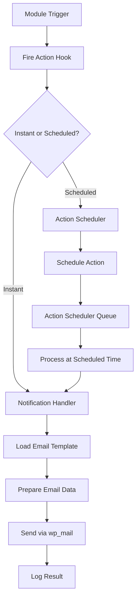

# Notifications Module - Implementation Guide

> **Recommended Approach:** Action Scheduler + Centralized Email Handler  
> **Development Time:** 4-6 weeks  
> **Complexity:** High

---

## Table of Contents

1. [Architecture Overview](#architecture-overview)
2. [Why Action Scheduler](#why-action-scheduler)
3. [File Structure](#file-structure)
4. [Step-by-Step Implementation](#step-by-step-implementation)
5. [Action Scheduler Integration](#action-scheduler-integration)
6. [Email Template System](#email-template-system)
7. [Hook Integration](#hook-integration)
8. [Testing Strategy](#testing-strategy)
9. [Deployment Plan](#deployment-plan)

---

## Architecture Overview

### System Components



---

### Core Architecture

**3-Layer System:**

1. **Trigger Layer** - Modules fire action hooks
2. **Handler Layer** - Notification handler processes hooks
3. **Delivery Layer** - Email templates + SMTP

**Key Principle:** **Centralized notification handler** that all modules use

---

## Why Action Scheduler

### WordPress Best Practice

**Action Scheduler** is the **recommended WordPress solution** for:
- ✅ Background processing
- ✅ Scheduled tasks
- ✅ Reliable queue system
- ✅ Built-in retry logic
- ✅ Admin UI for monitoring
- ✅ Used by WooCommerce (battle-tested)

### Advantages Over WP-Cron

| Feature | Action Scheduler | WP-Cron |
|---------|-----------------|---------|
| **Reliability** | ✅ Guaranteed execution | ❌ Requires site traffic |
| **Precision** | ✅ Exact timing | ❌ Approximate |
| **Retry Logic** | ✅ Built-in | ❌ Manual |
| **Admin UI** | ✅ Yes | ❌ No |
| **Logging** | ✅ Comprehensive | ❌ Limited |
| **Scalability** | ✅ High | ❌ Limited |

### Installation

```bash
composer require woocommerce/action-scheduler
```

Or include in plugin:
```php
require_once plugin_dir_path(__FILE__) . 'vendor/action-scheduler/action-scheduler.php';
```

---

## File Structure

### Recommended Structure

```
notifications/
├── class-notifications.php                 # Main module class
├── config.php                              # Module configuration
├── activator.php                           # Database tables
│
├── includes/
│   ├── class-notification-handler.php      # Central handler
│   ├── class-email-sender.php              # Email sending logic
│   ├── class-template-loader.php           # Template system
│   └── class-scheduler-integration.php     # Action Scheduler
│
├── handlers/
│   ├── class-authentication-notifications.php
│   ├── class-bookings-notifications.php
│   ├── class-schools-notifications.php
│   ├── class-hotels-notifications.php
│   ├── class-rooming-list-notifications.php
│   ├── class-quotes-notifications.php
│   └── class-shareables-notifications.php
│
├── templates/
│   ├── emails/
│   │   ├── base/
│   │   │   ├── header.php                  # Email header
│   │   │   ├── footer.php                  # Email footer
│   │   │   └── styles.php                  # Inline CSS
│   │   │
│   │   ├── authentication/
│   │   │   ├── password-reset.php          # ✅ EXISTS
│   │   │   ├── account-created.php
│   │   │   ├── login-success.php
│   │   │   └── ...
│   │   │
│   │   ├── bookings/
│   │   │   ├── booking-confirmation-user.php   # ✅ EXISTS
│   │   │   ├── booking-confirmation-admin.php  # ✅ EXISTS
│   │   │   ├── booking-status-changed.php
│   │   │   └── ...
│   │   │
│   │   ├── schools/
│   │   ├── hotels/
│   │   ├── rooming-list/
│   │   ├── quotes/
│   │   ├── shareables/
│   │   │
│   │   └── shared/
│   │       ├── status-changed.php          # Shared template
│   │       ├── item-created.php
│   │       ├── reminder.php
│   │       └── digest.php
│   │
│   └── admin/
│       ├── notifications-list.php          # Admin list page
│       ├── notification-settings.php       # Settings page
│       └── notification-logs.php           # Logs page
│
├── admin/
│   └── class-notifications-admin.php       # Admin interface
│
├── cron/
│   ├── class-daily-checks.php              # Daily scheduled checks
│   ├── class-weekly-checks.php             # Weekly checks
│   └── class-monthly-checks.php            # Monthly checks
│
└── logs/
    └── class-notification-logger.php       # Logging system
```

---

## Step-by-Step Implementation

### Phase 1: Foundation (Week 1)

#### Step 1.1: Install Action Scheduler

**File:** `composer.json` (plugin root)

```json
{
    "require": {
        "woocommerce/action-scheduler": "^3.6"
    }
}
```

**Run:**
```bash
composer install
```

**Load in plugin:**
```php
// File: organization-core.php
require_once plugin_dir_path(__FILE__) . 'vendor/autoload.php';
```

---

#### Step 1.2: Create Notification Handler

**File:** `includes/class-notification-handler.php`

```php
<?php
/**
 * Central Notification Handler
 * All modules use this to send notifications
 */
class OC_Notification_Handler {
    
    private static $instance = null;
    
    public static function get_instance() {
        if (null === self::$instance) {
            self::$instance = new self();
        }
        return self::$instance;
    }
    
    /**
     * Initialize notification hooks
     */
    public function init() {
        // Authentication hooks
        add_action('oc_password_reset_requested', [$this, 'send_password_reset'], 10, 2);
        add_action('oc_user_registered', [$this, 'send_account_created'], 10, 2);
        
        // Bookings hooks
        add_action('org_core_booking_created', [$this, 'send_booking_confirmation'], 10, 2);
        add_action('oc_booking_status_changed', [$this, 'send_booking_status_changed'], 10, 3);
        
        // Schools hooks
        add_action('mus_school_created', [$this, 'send_school_created'], 10, 2);
        add_action('mus_school_verified', [$this, 'send_school_verified'], 10, 2);
        
        // Hotels hooks
        add_action('oc_hotel_created', [$this, 'send_hotel_created'], 10, 2);
        
        // Rooming List hooks
        add_action('oc_rooming_list_created', [$this, 'send_rooming_list_created'], 10, 2);
        add_action('oc_rooming_list_locked', [$this, 'send_rooming_list_locked'], 10, 2);
        
        // Quotes hooks
        add_action('organization_core_quote_submitted', [$this, 'send_quote_submitted'], 10, 2);
        
        // Shareables hooks
        add_action('oc_shareable_published', [$this, 'send_shareable_published'], 10, 2);
        
        // Action Scheduler hooks (for scheduled notifications)
        add_action('oc_send_scheduled_notification', [$this, 'send_scheduled_notification'], 10, 3);
    }
    
    /**
     * Send notification (instant or scheduled)
     * 
     * @param string $notification_type Type of notification
     * @param array $data Notification data
     * @param int $delay Delay in seconds (0 = instant)
     */
    public function send_notification($notification_type, $data, $delay = 0) {
        if ($delay > 0) {
            // Schedule for later
            $this->schedule_notification($notification_type, $data, $delay);
        } else {
            // Send immediately
            $this->send_email($notification_type, $data);
        }
    }
    
    /**
     * Schedule notification using Action Scheduler
     */
    private function schedule_notification($notification_type, $data, $delay) {
        as_schedule_single_action(
            time() + $delay,
            'oc_send_scheduled_notification',
            array(
                'notification_type' => $notification_type,
                'data' => $data
            ),
            'organization-core-notifications'
        );
    }
    
    /**
     * Send email notification
     */
    private function send_email($notification_type, $data) {
        $email_sender = new OC_Email_Sender();
        $result = $email_sender->send($notification_type, $data);
        
        // Log result
        OC_Notification_Logger::log($notification_type, $data, $result);
        
        return $result;
    }
    
    /**
     * Handler for scheduled notifications
     */
    public function send_scheduled_notification($notification_type, $data) {
        $this->send_email($notification_type, $data);
    }
    
    // ========================================
    // Individual Notification Methods
    // ========================================
    
    public function send_password_reset($user_id, $reset_key) {
        $user = get_userdata($user_id);
        $data = array(
            'user_name' => $user->display_name,
            'user_email' => $user->user_email,
            'reset_url' => network_site_url("wp-login.php?action=rp&key=$reset_key&login=" . rawurlencode($user->user_login)),
            'expiration_time' => '24 hours',
            'site_name' => get_bloginfo('name')
        );
        
        $this->send_notification('password_reset', $data);
    }
    
    public function send_account_created($user_id, $user_data) {
        $data = array(
            'user_name' => $user_data['user_name'],
            'user_email' => $user_data['user_email'],
            'login_url' => wp_login_url(),
            'site_name' => get_bloginfo('name')
        );
        
        $this->send_notification('account_created', $data);
    }
    
    public function send_booking_confirmation($booking_id, $booking_data) {
        // Send to user
        $user_data = array_merge($booking_data, array('recipient_type' => 'user'));
        $this->send_notification('booking_confirmation_user', $user_data);
        
        // Send to admin
        $admin_data = array_merge($booking_data, array('recipient_type' => 'admin'));
        $this->send_notification('booking_confirmation_admin', $admin_data);
    }
    
    public function send_booking_status_changed($booking_id, $old_status, $new_status) {
        $booking = OC_Bookings_CRUD::get_booking($booking_id);
        $data = array(
            'booking_ref' => $booking->booking_reference,
            'old_status' => $old_status,
            'new_status' => $new_status,
            'user_email' => $booking->user_email,
            'user_name' => $booking->user_name
        );
        
        $this->send_notification('booking_status_changed', $data);
    }
    
    // ... Add methods for all other notifications
}
```

---

#### Step 1.3: Create Email Sender

**File:** `includes/class-email-sender.php`

```php
<?php
/**
 * Email Sender
 * Handles email template loading and sending
 */
class OC_Email_Sender {
    
    private $template_loader;
    
    public function __construct() {
        $this->template_loader = new OC_Template_Loader();
    }
    
    /**
     * Send email
     * 
     * @param string $notification_type Notification type
     * @param array $data Email data
     * @return bool Success
     */
    public function send($notification_type, $data) {
        // Get template path
        $template = $this->get_template_path($notification_type);
        
        if (!file_exists($template)) {
            error_log("Email template not found: $template");
            return false;
        }
        
        // Load template
        $email_content = $this->template_loader->load($template, $data);
        
        // Get recipient
        $to = $this->get_recipient($notification_type, $data);
        
        // Get subject
        $subject = $this->get_subject($notification_type, $data);
        
        // Email headers
        $headers = array(
            'Content-Type: text/html; charset=UTF-8',
            'From: ' . get_bloginfo('name') . ' <' . get_option('admin_email') . '>'
        );
        
        // Send email
        $result = wp_mail($to, $subject, $email_content, $headers);
        
        return $result;
    }
    
    /**
     * Get template path for notification type
     */
    private function get_template_path($notification_type) {
        $base_path = plugin_dir_path(__FILE__) . '../templates/emails/';
        
        // Map notification types to template paths
        $template_map = array(
            'password_reset' => 'authentication/password-reset.php',
            'account_created' => 'authentication/account-created.php',
            'booking_confirmation_user' => 'bookings/booking-confirmation-user.php',
            'booking_confirmation_admin' => 'bookings/booking-confirmation-admin.php',
            'booking_status_changed' => 'bookings/booking-status-changed.php',
            // ... add all notification types
        );
        
        if (isset($template_map[$notification_type])) {
            return $base_path . $template_map[$notification_type];
        }
        
        return '';
    }
    
    /**
     * Get recipient email
     */
    private function get_recipient($notification_type, $data) {
        // Admin notifications
        if (strpos($notification_type, '_admin') !== false) {
            return get_option('admin_email');
        }
        
        // User notifications
        if (isset($data['user_email'])) {
            return $data['user_email'];
        }
        
        return get_option('admin_email');
    }
    
    /**
     * Get email subject
     */
    private function get_subject($notification_type, $data) {
        $subjects = array(
            'password_reset' => 'Password Reset Request',
            'account_created' => 'Welcome to ' . get_bloginfo('name'),
            'booking_confirmation_user' => 'Booking Confirmation - ' . ($data['booking_ref'] ?? ''),
            'booking_confirmation_admin' => 'New Booking Received - ' . ($data['booking_ref'] ?? ''),
            // ... add all subjects
        );
        
        return $subjects[$notification_type] ?? 'Notification from ' . get_bloginfo('name');
    }
}
```

---

#### Step 1.4: Create Template Loader

**File:** `includes/class-template-loader.php`

```php
<?php
/**
 * Template Loader
 * Loads and renders email templates
 */
class OC_Template_Loader {
    
    /**
     * Load template with data
     * 
     * @param string $template_path Path to template
     * @param array $data Template variables
     * @return string Rendered HTML
     */
    public function load($template_path, $data = array()) {
        // Extract data to variables
        extract($data);
        
        // Start output buffering
        ob_start();
        
        // Include header
        include $this->get_header_template();
        
        // Include main template
        include $template_path;
        
        // Include footer
        include $this->get_footer_template();
        
        // Get content
        $content = ob_get_clean();
        
        return $content;
    }
    
    /**
     * Get header template
     */
    private function get_header_template() {
        return plugin_dir_path(__FILE__) . '../templates/emails/base/header.php';
    }
    
    /**
     * Get footer template
     */
    private function get_footer_template() {
        return plugin_dir_path(__FILE__) . '../templates/emails/base/footer.php';
    }
}
```

---

### Phase 2: Email Templates (Week 2)

#### Step 2.1: Create Base Templates

**File:** `templates/emails/base/header.php`

```php
<!DOCTYPE html>
<html>
<head>
    <meta charset="UTF-8">
    <meta name="viewport" content="width=device-width, initial-scale=1.0">
    <title><?php echo esc_html($subject ?? 'Notification'); ?></title>
    <?php include 'styles.php'; ?>
</head>
<body>
    <table class="email-wrapper" width="100%" cellpadding="0" cellspacing="0">
        <tr>
            <td align="center">
                <table class="email-content" width="600" cellpadding="0" cellspacing="0">
                    <tr>
                        <td class="email-header">
                            <h1><?php echo esc_html(get_bloginfo('name')); ?></h1>
                        </td>
                    </tr>
                    <tr>
                        <td class="email-body">
```

**File:** `templates/emails/base/footer.php`

```php
                        </td>
                    </tr>
                    <tr>
                        <td class="email-footer">
                            <p>&copy; <?php echo date('Y'); ?> <?php echo esc_html(get_bloginfo('name')); ?>. All rights reserved.</p>
                            <p><a href="<?php echo home_url(); ?>">Visit our website</a></p>
                        </td>
                    </tr>
                </table>
            </td>
        </tr>
    </table>
</body>
</html>
```

**File:** `templates/emails/base/styles.php`

```php
<style>
    body {
        margin: 0;
        padding: 0;
        font-family: Arial, sans-serif;
        background-color: #f4f4f4;
    }
    .email-wrapper {
        background-color: #f4f4f4;
        padding: 20px 0;
    }
    .email-content {
        background-color: #ffffff;
        border-radius: 8px;
        overflow: hidden;
        box-shadow: 0 2px 4px rgba(0,0,0,0.1);
    }
    .email-header {
        background-color: #0073aa;
        color: #ffffff;
        padding: 30px;
        text-align: center;
    }
    .email-header h1 {
        margin: 0;
        font-size: 24px;
    }
    .email-body {
        padding: 40px 30px;
        color: #333333;
        line-height: 1.6;
    }
    .email-body h2 {
        color: #0073aa;
        margin-top: 0;
    }
    .email-body p {
        margin: 15px 0;
    }
    .email-button {
        display: inline-block;
        padding: 12px 30px;
        background-color: #0073aa;
        color: #ffffff;
        text-decoration: none;
        border-radius: 4px;
        margin: 20px 0;
    }
    .email-footer {
        background-color: #f9f9f9;
        padding: 20px 30px;
        text-align: center;
        color: #666666;
        font-size: 12px;
    }
    .email-footer a {
        color: #0073aa;
        text-decoration: none;
    }
</style>
```

---

#### Step 2.2: Create Individual Templates

**Example:** `templates/emails/authentication/account-created.php`

```php
<h2>Welcome to <?php echo esc_html($site_name); ?>!</h2>

<p>Hi <?php echo esc_html($user_name); ?>,</p>

<p>Your account has been successfully created. You can now log in and start using our services.</p>

<p style="text-align: center;">
    <a href="<?php echo esc_url($login_url); ?>" class="email-button">Log In Now</a>
</p>

<p>If you have any questions, please don't hesitate to contact us.</p>

<p>Best regards,<br>
The <?php echo esc_html($site_name); ?> Team</p>
```

**Repeat for all 50+ templates...**

---

### Phase 3: Action Scheduler Integration (Week 3)

#### Step 3.1: Create Scheduler Integration Class

**File:** `includes/class-scheduler-integration.php`

```php
<?php
/**
 * Action Scheduler Integration
 * Handles all scheduled notifications
 */
class OC_Scheduler_Integration {
    
    public function init() {
        // Register daily checks
        add_action('init', [$this, 'register_daily_checks']);
        
        // Register weekly checks
        add_action('init', [$this, 'register_weekly_checks']);
        
        // Register monthly checks
        add_action('init', [$this, 'register_monthly_checks']);
    }
    
    /**
     * Register daily scheduled checks
     */
    public function register_daily_checks() {
        // Booking reminders (7 days before)
        if (!as_next_scheduled_action('oc_check_booking_reminders')) {
            as_schedule_recurring_action(
                strtotime('tomorrow 9:00am'),
                DAY_IN_SECONDS,
                'oc_check_booking_reminders',
                array(),
                'organization-core-notifications'
            );
        }
        
        // Rooming list due date reminders
        if (!as_next_scheduled_action('oc_check_rooming_list_due_dates')) {
            as_schedule_recurring_action(
                strtotime('tomorrow 10:00am'),
                DAY_IN_SECONDS,
                'oc_check_rooming_list_due_dates',
                array(),
                'organization-core-notifications'
            );
        }
        
        // Quote follow-ups
        if (!as_next_scheduled_action('oc_check_quote_followups')) {
            as_schedule_recurring_action(
                strtotime('tomorrow 11:00am'),
                DAY_IN_SECONDS,
                'oc_check_quote_followups',
                array(),
                'organization-core-notifications'
            );
        }
        
        // Shareable access digest
        if (!as_next_scheduled_action('oc_send_shareable_digest')) {
            as_schedule_recurring_action(
                strtotime('tomorrow 8:00pm'),
                DAY_IN_SECONDS,
                'oc_send_shareable_digest',
                array(),
                'organization-core-notifications'
            );
        }
    }
    
    /**
     * Register weekly checks
     */
    public function register_weekly_checks() {
        // Hotel availability report
        if (!as_next_scheduled_action('oc_send_hotel_availability_report')) {
            as_schedule_recurring_action(
                strtotime('next Monday 9:00am'),
                WEEK_IN_SECONDS,
                'oc_send_hotel_availability_report',
                array(),
                'organization-core-notifications'
            );
        }
    }
    
    /**
     * Register monthly checks
     */
    public function register_monthly_checks() {
        // School expiring check
        if (!as_next_scheduled_action('oc_check_school_expiring')) {
            as_schedule_recurring_action(
                strtotime('first day of next month 9:00am'),
                MONTH_IN_SECONDS,
                'oc_check_school_expiring',
                array(),
                'organization-core-notifications'
            );
        }
        
        // Account inactive check
        if (!as_next_scheduled_action('oc_check_account_inactive')) {
            as_schedule_recurring_action(
                strtotime('first day of next month 10:00am'),
                MONTH_IN_SECONDS,
                'oc_check_account_inactive',
                array(),
                'organization-core-notifications'
            );
        }
    }
}
```

---

#### Step 3.2: Create Daily Checks Handler

**File:** `cron/class-daily-checks.php`

```php
<?php
/**
 * Daily Scheduled Checks
 */
class OC_Daily_Checks {
    
    public function init() {
        add_action('oc_check_booking_reminders', [$this, 'check_booking_reminders']);
        add_action('oc_check_rooming_list_due_dates', [$this, 'check_rooming_list_due_dates']);
        add_action('oc_check_quote_followups', [$this, 'check_quote_followups']);
        add_action('oc_send_shareable_digest', [$this, 'send_shareable_digest']);
    }
    
    /**
     * Check for bookings 7 days away
     */
    public function check_booking_reminders() {
        global $wpdb;
        $table = $wpdb->prefix . 'bookings';
        
        // Get bookings with festival date in 7 days
        $target_date = date('Y-m-d', strtotime('+7 days'));
        
        $bookings = $wpdb->get_results($wpdb->prepare(
            "SELECT * FROM $table WHERE festival_date = %s AND status = 'confirmed'",
            $target_date
        ));
        
        foreach ($bookings as $booking) {
            // Send reminder
            $handler = OC_Notification_Handler::get_instance();
            $handler->send_notification('booking_reminder_7days', array(
                'booking_ref' => $booking->booking_reference,
                'user_email' => $booking->user_email,
                'user_name' => $booking->user_name,
                'festival_date' => $booking->festival_date,
                'days_until' => 7
            ));
        }
    }
    
    /**
     * Check rooming list due dates
     */
    public function check_rooming_list_due_dates() {
        global $wpdb;
        $table = $wpdb->prefix . 'bookings';
        
        // Get bookings with rooming list due in 3 days
        $target_date_3days = date('Y-m-d', strtotime('+3 days'));
        
        $bookings = $wpdb->get_results($wpdb->prepare(
            "SELECT * FROM $table WHERE rooming_list_due_date = %s",
            $target_date_3days
        ));
        
        foreach ($bookings as $booking) {
            // Send 3-day reminder
            $handler = OC_Notification_Handler::get_instance();
            $handler->send_notification('rooming_list_due_reminder', array(
                'booking_ref' => $booking->booking_reference,
                'user_email' => $booking->user_email,
                'due_date' => $booking->rooming_list_due_date,
                'days_until' => 3,
                'rooming_list_url' => home_url('/my-account/rooming-list/' . $booking->id)
            ));
        }
        
        // Check for incomplete lists 1 day before due date
        $target_date_1day = date('Y-m-d', strtotime('+1 day'));
        
        $bookings_1day = $wpdb->get_results($wpdb->prepare(
            "SELECT * FROM $table WHERE rooming_list_due_date = %s AND rooming_list_complete = 0",
            $target_date_1day
        ));
        
        foreach ($bookings_1day as $booking) {
            // Send incomplete warning
            $handler = OC_Notification_Handler::get_instance();
            $handler->send_notification('rooming_list_incomplete', array(
                'booking_ref' => $booking->booking_reference,
                'user_email' => $booking->user_email,
                'due_date' => $booking->rooming_list_due_date,
                'days_until' => 1
            ));
        }
        
        // Auto-lock lists on due date
        $today = date('Y-m-d');
        
        $bookings_due = $wpdb->get_results($wpdb->prepare(
            "SELECT * FROM $table WHERE rooming_list_due_date = %s AND rooming_list_locked = 0",
            $today
        ));
        
        foreach ($bookings_due as $booking) {
            // Lock rooming list
            $rooming_list = OC_Rooming_List_CRUD::get_rooming_list($booking->id);
            
            foreach ($rooming_list as $item) {
                OC_Rooming_List_CRUD::toggle_lock_rooming_list_item($item['id'], 1);
            }
            
            // Update booking
            $wpdb->update(
                $table,
                array('rooming_list_locked' => 1),
                array('id' => $booking->id)
            );
            
            // Send auto-lock notification
            $handler = OC_Notification_Handler::get_instance();
            $handler->send_notification('rooming_list_auto_locked', array(
                'booking_ref' => $booking->booking_reference,
                'user_email' => $booking->user_email,
                'admin_email' => get_option('admin_email'),
                'due_date' => $booking->rooming_list_due_date
            ));
        }
    }
    
    /**
     * Check quote follow-ups
     */
    public function check_quote_followups() {
        global $wpdb;
        $table = $wpdb->base_prefix . 'quotes';
        
        // Get quotes submitted 48 hours ago with no response
        $target_time = date('Y-m-d H:i:s', strtotime('-48 hours'));
        
        $quotes = $wpdb->get_results($wpdb->prepare(
            "SELECT * FROM $table WHERE created_at <= %s AND status = 'pending'",
            $target_time
        ));
        
        foreach ($quotes as $quote) {
            // Send follow-up
            $handler = OC_Notification_Handler::get_instance();
            $handler->send_notification('quote_followup', array(
                'quote_id' => $quote->id,
                'user_email' => $quote->email,
                'educator_name' => $quote->educator_name,
                'destination_name' => $quote->destination_name
            ));
        }
    }
    
    /**
     * Send daily shareable access digest
     */
    public function send_shareable_digest() {
        // Get today's shareable views
        // Compile digest
        // Send to admin
        
        $handler = OC_Notification_Handler::get_instance();
        $handler->send_notification('shareable_access_digest', array(
            'admin_email' => get_option('admin_email'),
            'date' => date('Y-m-d'),
            'total_views' => 0, // Calculate
            'unique_visitors' => 0, // Calculate
            'top_shareables' => array() // Get top 5
        ));
    }
}
```

---

### Phase 4: Module Integration (Week 4)

#### Step 4.1: Add Hooks to Modules

**Example: Bookings Module**

**File:** `modules/bookings/ajax.php` (modify existing)

```php
// After successful booking creation
$booking_id = OC_Bookings_CRUD::create_booking($booking_data);

if ($booking_id) {
    // Fire hook for notifications
    do_action('org_core_booking_created', $booking_id, $booking_data);
    
    wp_send_json_success(array(
        'message' => 'Booking created successfully',
        'booking_id' => $booking_id
    ));
}
```

**Example: Schools Module**

**File:** `modules/schools/crud.php` (modify existing)

```php
public static function create_school($data) {
    global $wpdb;
    $table_name = self::get_table_name();
    
    $result = $wpdb->insert($table_name, $data);
    
    if ($result) {
        $school_id = $wpdb->insert_id;
        
        // Fire hook for notifications
        do_action('mus_school_created', $school_id, $data);
        
        return $school_id;
    }
    
    return false;
}
```

**Repeat for all modules...**

---

### Phase 5: Admin Interface (Week 5)

#### Step 5.1: Create Admin Pages

**File:** `admin/class-notifications-admin.php`

```php
<?php
/**
 * Notifications Admin Interface
 */
class OC_Notifications_Admin {
    
    public function init() {
        add_action('admin_menu', [$this, 'add_admin_menu']);
    }
    
    public function add_admin_menu() {
        // Main menu
        add_menu_page(
            'Notifications',
            'Notifications',
            'manage_options',
            'oc-notifications',
            [$this, 'render_list_page'],
            'dashicons-email-alt',
            25
        );
        
        // Settings submenu
        add_submenu_page(
            'oc-notifications',
            'Notification Settings',
            'Settings',
            'manage_options',
            'oc-notifications-settings',
            [$this, 'render_settings_page']
        );
        
        // Logs submenu
        add_submenu_page(
            'oc-notifications',
            'Notification Logs',
            'Logs',
            'manage_options',
            'oc-notifications-logs',
            [$this, 'render_logs_page']
        );
        
        // Test email submenu
        add_submenu_page(
            'oc-notifications',
            'Test Email',
            'Test Email',
            'manage_options',
            'oc-notifications-test',
            [$this, 'render_test_page']
        );
    }
    
    public function render_list_page() {
        // Show Action Scheduler UI
        echo '<div class="wrap">';
        echo '<h1>Scheduled Notifications</h1>';
        
        // Link to Action Scheduler
        echo '<p><a href="' . admin_url('tools.php?page=action-scheduler') . '" class="button button-primary">View Action Scheduler</a></p>';
        
        echo '</div>';
    }
    
    public function render_settings_page() {
        // Notification settings
        include plugin_dir_path(__FILE__) . '../templates/admin/notification-settings.php';
    }
    
    public function render_logs_page() {
        // Notification logs
        include plugin_dir_path(__FILE__) . '../templates/admin/notification-logs.php';
    }
    
    public function render_test_page() {
        // Test email form
        include plugin_dir_path(__FILE__) . '../templates/admin/test-email.php';
    }
}
```

---

### Phase 6: Testing & Deployment (Week 6)

#### Step 6.1: Testing Strategy

**1. Unit Tests**
- Test each notification handler
- Test template loading
- Test Action Scheduler integration

**2. Integration Tests**
- Test module hooks
- Test email sending
- Test scheduled notifications

**3. Manual Tests**
- Send test emails for all 50+ templates
- Verify Action Scheduler queue
- Check email delivery

**4. Load Tests**
- Test with 100+ scheduled notifications
- Verify queue processing
- Check server load

---

#### Step 6.2: Deployment Checklist

- [ ] Install Action Scheduler
- [ ] Create all email templates
- [ ] Add hooks to all modules
- [ ] Configure SMTP
- [ ] Test all notification types
- [ ] Enable module in production
- [ ] Monitor Action Scheduler queue
- [ ] Check email logs

---

## Testing Strategy

### Test Email Functionality

**File:** `templates/admin/test-email.php`

```php
<div class="wrap">
    <h1>Test Email Notification</h1>
    
    <form method="post" action="">
        <?php wp_nonce_field('test_email_action', 'test_email_nonce'); ?>
        
        <table class="form-table">
            <tr>
                <th><label for="notification_type">Notification Type</label></th>
                <td>
                    <select name="notification_type" id="notification_type">
                        <option value="password_reset">Password Reset</option>
                        <option value="account_created">Account Created</option>
                        <option value="booking_confirmation_user">Booking Confirmation (User)</option>
                        <!-- Add all notification types -->
                    </select>
                </td>
            </tr>
            <tr>
                <th><label for="recipient_email">Recipient Email</label></th>
                <td>
                    <input type="email" name="recipient_email" id="recipient_email" class="regular-text" required>
                </td>
            </tr>
        </table>
        
        <p class="submit">
            <input type="submit" name="send_test_email" class="button button-primary" value="Send Test Email">
        </p>
    </form>
</div>

<?php
if (isset($_POST['send_test_email']) && check_admin_referer('test_email_action', 'test_email_nonce')) {
    $notification_type = sanitize_text_field($_POST['notification_type']);
    $recipient_email = sanitize_email($_POST['recipient_email']);
    
    // Prepare test data
    $test_data = array(
        'user_email' => $recipient_email,
        'user_name' => 'Test User',
        'site_name' => get_bloginfo('name'),
        // Add more test data as needed
    );
    
    // Send test email
    $handler = OC_Notification_Handler::get_instance();
    $result = $handler->send_notification($notification_type, $test_data);
    
    if ($result) {
        echo '<div class="notice notice-success"><p>Test email sent successfully!</p></div>';
    } else {
        echo '<div class="notice notice-error"><p>Failed to send test email.</p></div>';
    }
}
?>
```

---

## Deployment Plan

### Phase 1: Development (Weeks 1-6)
- Build all components
- Create all templates
- Integrate with modules
- Test thoroughly

### Phase 2: Staging (Week 7)
- Deploy to staging environment
- Test with real data
- Fix any issues
- Get user feedback

### Phase 3: Production (Week 8)
- Deploy to production
- Monitor closely
- Enable gradually (module by module)
- Collect metrics

---

## Monitoring & Maintenance

### Action Scheduler Dashboard

Access at: `wp-admin/tools.php?page=action-scheduler`

**Monitor:**
- Pending actions
- Completed actions
- Failed actions
- Processing time

### Email Logs

**Log all sent emails:**
- Timestamp
- Notification type
- Recipient
- Success/failure
- Error message (if failed)

### Performance Metrics

**Track:**
- Emails sent per day
- Delivery rate
- Bounce rate
- Open rate (if tracking enabled)
- Click rate (if tracking enabled)

---

## Conclusion

This implementation guide provides a **complete roadmap** for building a robust notification system using:

✅ **Action Scheduler** - Reliable WordPress scheduling  
✅ **Centralized Handler** - Single point of control  
✅ **Template System** - Flexible email templates  
✅ **Module Integration** - Clean hook-based architecture  
✅ **Admin Interface** - Easy management and testing  
✅ **Logging** - Comprehensive tracking  

**Estimated Timeline:** 6-8 weeks  
**Complexity:** High  
**Benefit:** Centralized, scalable notification system for all modules  

---

**Last Updated:** 2024-12-11  
**Recommended Approach:** Action Scheduler + Centralized Handler  
**Status:** Ready for Implementation
