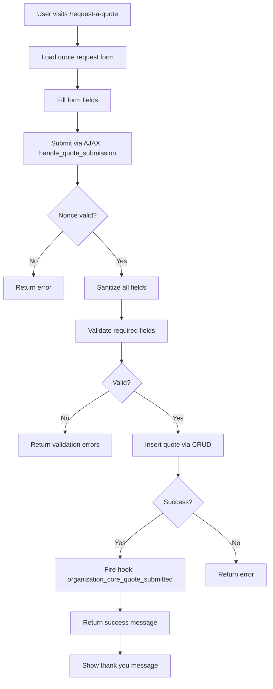
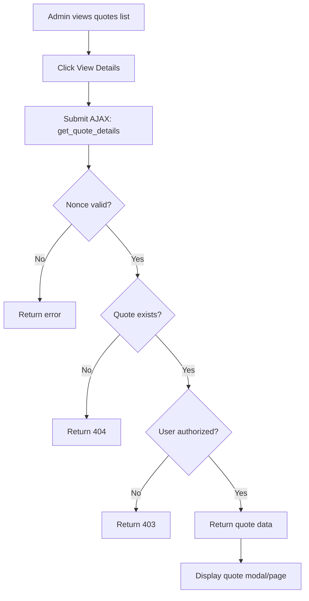
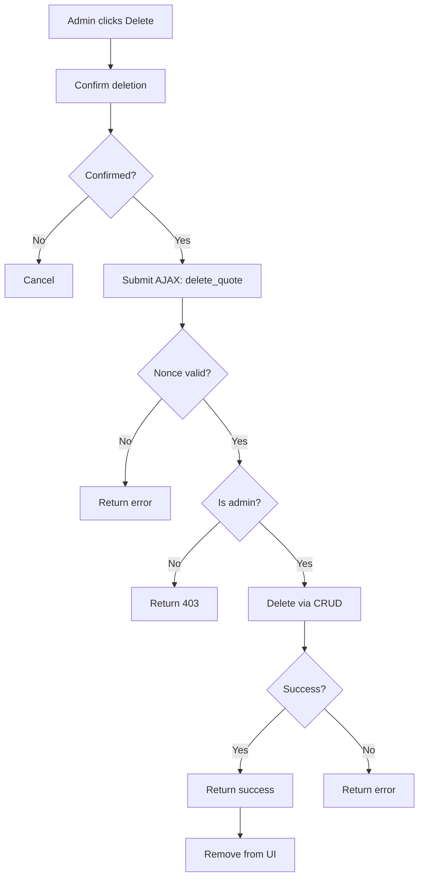

# Quotes Module - Complete Technical Guide

> **Module ID:** `quotes`  
> **Version:** 1.0.0  
> **Status:** Required Module (Network Only)  
> **Dependencies:** None

---

## Table of Contents

1. [Overview](#overview)
2. [File Structure](#file-structure)
3. [Core Components](#core-components)
4. [Database Schema](#database-schema)
5. [AJAX Actions](#ajax-actions)
6. [CRUD Operations](#crud-operations)
7. [Rewrite Rules](#rewrite-rules)
8. [Workflow & Processes](#workflow--processes)
9. [Module Dependencies](#module-dependencies)
10. [Notification & Email Summary](#notification--email-summary)
11. [Future Considerations](#future-considerations)

---

## Overview

The **Quotes Module** manages quote requests from educators, providing both admin and public interfaces for submitting, viewing, and managing quote requests for festival destinations.

### Key Features

✅ **Admin + Public Interfaces** - Full quote management  
✅ **AJAX-Driven** - 3 AJAX endpoints for seamless UX  
✅ **Database Table** - Dedicated `wp_quotes` table  
✅ **Rewrite Rules** - 3 custom URLs  
✅ **Destination Integration** - Links to destination pages  
✅ **Network-Only** - Runs on network level  
✅ **Required Module** - Must be enabled  
✅ **JSON Storage** - Stores full form data in JSON field  
✅ **Search Functionality** - Search by educator, email, school

---

## File Structure

```
quotes/
├── class-quotes.php                   # Main module orchestrator
├── config.php                         # Module configuration
├── activator.php                      # Activation (table + rewrite)
├── deactivator.php                    # Deactivation logic
├── crud.php                           # Database operations (9 methods)
├── ajax.php                           # AJAX handlers (3 endpoints)
├── cpt.php                            # Custom post type (placeholder)
├── quotes-table.php                   # Table helper (placeholder)
├── index.php                          # Directory index protection
│
├── admin/
│   └── class-quotes-admin.php         # Admin interface
│
├── public/
│   └── class-quotes-public.php        # Public interface
│
├── templates/
│   ├── admin/
│   │   └── class-quotes-table.php     # Admin quotes list table
│   └── public/
│       ├── page-request-a-quote.php   # Quote request form
│       └── page-quotes-list.php       # User's quotes list
│
└── assets/
    ├── css/
    │   └── quotes-public.css          # Public styles
    └── js/
        └── quotes-public.js           # Public JavaScript
```

**Total Files:** 24 files

---

## Core Components

### 1. `class-quotes.php`

**Purpose:** Main module orchestrator

**Key Methods:**
- `init()` - Initialize module components
- `load_dependencies()` - Load CRUD, admin, public, AJAX classes
- `init_admin()` - Initialize admin interface
- `init_public()` - Initialize public interface
- `init_ajax()` - Initialize AJAX handlers
- `dependency_notice()` - Show dependency error notice

---

### 2. `config.php`

**Configuration:**
```php
return array(
    'id'                => 'quotes',
    'name'              => 'Quotes System',
    'description'       => 'Manage and display quotes',
    'version'           => '1.0.0',
    'author'            => 'OwlthTech',
    'default_enabled'   => true,    // Enabled by default
    'network_only'      => true,    // Network-level only
    'required'          => true,    // Required module
    'dependencies'      => array(), // No dependencies
    'supports'          => array('templates'),
    'class'             => 'class-quotes.php'
);
```

---

### 3. `activator.php`

**Activation Tasks:**
1. Create `wp_quotes` table
2. Register 3 rewrite rules
3. Flush rewrite rules

**Important:** Rewrite rules are registered on EVERY page load via `init` hook (line 117)

---

## Database Schema

### `wp_quotes` Table

**Table Name:** `{$wpdb->base_prefix}quotes`

**Schema:**
```sql
CREATE TABLE wp_quotes (
    id BIGINT(20) NOT NULL AUTO_INCREMENT,
    blog_id BIGINT(20) NOT NULL,
    user_id BIGINT(20) NOT NULL DEFAULT 0,
    
    -- Educator Information
    educator_name VARCHAR(255) NOT NULL,
    school_name VARCHAR(255) NOT NULL,
    school_address TEXT NOT NULL,
    position VARCHAR(100) DEFAULT NULL,
    email VARCHAR(100) NOT NULL,
    school_phone VARCHAR(20) DEFAULT NULL,
    cell_phone VARCHAR(20) DEFAULT NULL,
    best_time_to_reach VARCHAR(50) DEFAULT NULL,
    
    -- Destination Information
    destination_id BIGINT(20) DEFAULT NULL,
    destination_name VARCHAR(255) DEFAULT NULL,
    destination_slug VARCHAR(255) DEFAULT NULL,
    
    -- Additional Information
    hear_about_us VARCHAR(100) DEFAULT NULL,
    meal_quote TINYINT(1) DEFAULT 0,
    transportation_quote TINYINT(1) DEFAULT 0,
    special_requests LONGTEXT DEFAULT NULL,
    
    -- System Fields
    quote_data JSON DEFAULT NULL,
    status VARCHAR(50) NOT NULL DEFAULT 'pending',
    notes LONGTEXT DEFAULT NULL,
    admin_notes LONGTEXT DEFAULT NULL,
    created_at DATETIME NOT NULL DEFAULT CURRENT_TIMESTAMP,
    updated_at DATETIME NOT NULL DEFAULT CURRENT_TIMESTAMP ON UPDATE CURRENT_TIMESTAMP,
    
    PRIMARY KEY (id),
    KEY blog_id (blog_id),
    KEY user_id (user_id),
    KEY destination_id (destination_id),
    KEY destination_slug (destination_slug),
    KEY status (status),
    KEY email (email),
    KEY created_at (created_at)
) ENGINE=InnoDB DEFAULT CHARSET=utf8mb4;
```

**Total Columns:** 24  
**Indexes:** 7 indexes for optimized queries

**Notable Fields:**
- `quote_data` - JSON field storing complete form data
- `status` - Quote status (pending, contacted, converted, etc.)
- `meal_quote` - Boolean for meal quote request
- `transportation_quote` - Boolean for transportation quote request

---

## AJAX Actions

### Public Actions

| Action | Handler | Auth | Purpose |
|--------|---------|------|---------|
| `handle_quote_submission` | `handle_quote_submission()` | Public + Logged-in | Submit quote request |

### Admin Actions

| Action | Handler | Auth | Purpose |
|--------|---------|------|---------|
| `get_quote_details` | `get_quote_details()` | Admin or Owner | Get quote details |
| `delete_quote` | `delete_quote()` | Admin only | Delete quote |

**Total:** 3 AJAX endpoints

---

### AJAX Request/Response Formats

#### 1. Submit Quote

**Request:**
```javascript
{
    action: 'handle_quote_submission',
    request_quote_nonce: '...',
    educator_name: 'John Smith',
    school_name: 'Lincoln High School',
    school_address: '123 Main St, Springfield, IL 62701',
    position: 'Band Director',
    email: 'jsmith@lincolnhs.edu',
    school_phone: '217-555-1234',
    cell_phone: '217-555-5678',
    best_time_to_reach: 'Afternoons',
    destination_id: 123,
    destination_name: 'Disney World',
    destination_slug: 'disney-world',
    hear_about_us: 'Google Search',
    meal_quote: 1,
    transportation_quote: 1,
    special_requests: 'Need wheelchair accessible rooms'
}
```

**Success Response:**
```javascript
{
    success: true,
    data: {
        message: 'Thank you! Your quote request has been submitted successfully. Our team will contact you within 24 hours.',
        quote_id: 123
    }
}
```

---

#### 2. Get Quote Details

**Request:**
```javascript
{
    action: 'get_quote_details',
    nonce: '...',
    quote_id: 123
}
```

**Success Response:**
```javascript
{
    success: true,
    data: {
        quote: {
            id: 123,
            educator_name: 'John Smith',
            school_name: 'Lincoln High School',
            // ... all quote fields
        }
    }
}
```

---

#### 3. Delete Quote

**Request:**
```javascript
{
    action: 'delete_quote',
    nonce: '...',
    quote_id: 123
}
```

**Success Response:**
```javascript
{
    success: true,
    data: {
        message: 'Quote deleted successfully.'
    }
}
```

---

## CRUD Operations

### Key Methods

**Create:**
- `insert_quote($data)` - Create new quote, returns quote ID

**Read:**
- `get_quote($quote_id)` - Get single quote by ID
- `get_all_quotes()` - Get all quotes (limit 100)
- `get_quotes($args)` - Get quotes with filters
- `get_user_quotes($user_id)` - Get user's quotes
- `get_quote_count($args)` - Count quotes with filters

**Delete:**
- `delete_quote($quote_id)` - Delete quote

**Utilities:**
- `get_table_name()` - Get table name (private)

**Total:** 9 CRUD methods

---

### Get Quotes Filters

**Available Filters:**
```php
$args = array(
    'blog_id'        => get_current_blog_id(),
    'user_id'        => '',           // Filter by user
    'search'         => '',           // Search educator, email, school
    'destination_id' => '',           // Filter by destination
    'orderby'        => 'created_at', // id, created_at, educator_name
    'order'          => 'DESC',       // ASC or DESC
    'limit'          => -1,           // -1 for no limit
    'offset'         => 0,            // Pagination offset
);
```

---

## Rewrite Rules

### Custom URLs

**Registered Rules:**

1. **General Quote Request**
   - Pattern: `^request-a-quote/?$`
   - Rewrite: `index.php?quote_page_type=request-a-quote`
   - Example: `/request-a-quote`

2. **Destination-Specific Quote Request**
   - Pattern: `^destination/([^/]+)/request-a-quote/?$`
   - Rewrite: `index.php?quote_page_type=request-a-quote&destination_slug=$matches[1]`
   - Example: `/destination/disney-world/request-a-quote`

3. **User's Quotes List**
   - Pattern: `^my-account/quotes/?$`
   - Rewrite: `index.php?account_page=quotes`
   - Example: `/my-account/quotes`

**Registration:** Rules are registered on EVERY page load via `init` hook (activator.php line 117)

---

## Workflow & Processes

### Submit Quote Flow



---

### Admin View Quote Flow



---

### Delete Quote Flow



---

## Module Dependencies

### Dependencies ON Other Modules

**None** - The quotes module is completely independent.

---

### Modules That Depend ON Quotes

**None** - No other modules depend on quotes.

**Note:** Quotes module is self-contained and doesn't integrate with other modules.

---

## Notification & Email Summary

### Current Implementation

**Email Templates:** ❌ **NONE**

**Email Trigger:** ❌ **NOT IMPLEMENTED**

**Email Handler:** ❌ **NOT IMPLEMENTED**

**Status:** The quotes module currently has **no email or notification functionality**. All quote submissions happen silently without any notifications.

---

### Required Notifications (Not Yet Implemented)

**Critical (Implement First):**
1. **Quote Submitted** → User + Admin
   - Trigger: After successful quote submission
   - User: Confirmation email with quote details
   - Admin: New quote notification

2. **Quote Status Changed** → User
   - Trigger: Admin changes quote status
   - Content: Status update (pending → contacted → converted)

3. **Quote Responded** → User
   - Trigger: Admin adds response/notes
   - Content: Admin response with next steps

**Important (Implement Soon):**
4. **Quote Follow-up** → User
   - Trigger: 48 hours after submission, no response
   - Content: Follow-up reminder

5. **Quote Reminder** → Admin
   - Trigger: 24 hours after submission, status still pending
   - Content: Reminder to respond to quote

6. **Quote Expired** → User + Admin
   - Trigger: 30 days after submission, no conversion
   - Content: Quote expiration notice

**Nice to Have:**
7. **Quote Converted to Booking** → User + Admin
8. **Quote Declined** → User
9. **Quote Updated** → User + Admin

---

### Implementation Plan

**Step 1: Create Email Handler Class**
```php
// File: class-quotes-email.php
class OC_Quotes_Email {
    public static function init() {
        add_action('organization_core_quote_submitted', [__CLASS__, 'send_quote_submitted'], 10, 2);
    }
    
    public static function send_quote_submitted($quote_id, $quote_data) {
        // Send confirmation to user
        // Send notification to admin
    }
}
```

**Step 2: Create Email Templates**
- `templates/emails/quote-submitted-user.php`
- `templates/emails/quote-submitted-admin.php`

**Step 3: Load Email Handler**
- Load in `class-quotes.php`
- Initialize in `init()` method

**Step 4: SMTP Configuration**
- Use existing SMTP from Authentication module

---

## Future Considerations

### 1. Email Notifications (HIGH PRIORITY)

**Tasks:**
- [ ] Add quote submitted email (user + admin)
- [ ] Add quote status changed email
- [ ] Add quote responded email
- [ ] Add follow-up reminders
- [ ] Add admin reminder emails
- [ ] Create email template builder

---

### 2. Quote Status Management (HIGH PRIORITY)

**Tasks:**
- [ ] Add status workflow (pending → contacted → quoted → converted/declined)
- [ ] Add status change UI in admin
- [ ] Add status history tracking
- [ ] Add status-based filtering
- [ ] Add status dashboard widget

---

### 3. Admin Features (MEDIUM PRIORITY)

**Tasks:**
- [ ] Add WP_List_Table for quotes admin
- [ ] Add bulk actions (delete, change status)
- [ ] Add advanced filters (date range, destination, status)
- [ ] Add export to CSV
- [ ] Add quote notes/comments system
- [ ] Add quote assignment to staff

---

### 4. Integration Enhancements (MEDIUM PRIORITY)

**Tasks:**
- [ ] Link quotes to bookings module
- [ ] Auto-convert quote to booking
- [ ] Link to CRM systems
- [ ] Add calendar integration
- [ ] Add automated follow-ups

---

### 5. User Experience (LOW PRIORITY)

**Tasks:**
- [ ] Add quote request wizard
- [ ] Add save draft functionality
- [ ] Add quote comparison tool
- [ ] Add quote sharing
- [ ] Add print-friendly quote view

---

### 6. Reporting & Analytics (LOW PRIORITY)

**Tasks:**
- [ ] Add quote conversion rate reports
- [ ] Add response time analytics
- [ ] Add destination popularity reports
- [ ] Add educator engagement metrics
- [ ] Add export to PDF

---

## Comparison with Other Modules

| Feature | Quotes | Schools | Hotels | Bookings | Rooming List |
|---------|--------|---------|--------|----------|--------------|
| **Admin Interface** | ✅ Full | ❌ No | ✅ Full | ✅ Full | ✅ Full |
| **Public Interface** | ✅ Yes | ✅ Yes | ❌ No | ✅ Yes | ✅ Yes |
| **AJAX Actions** | ✅ 3 | ✅ 3 | ❌ None | ✅ 17 | ✅ 5 |
| **Database Table** | ✅ wp_quotes | ✅ wp_schools | ✅ wp_hotels | ✅ wp_bookings | ✅ wp_rooming_list |
| **Rewrite Rules** | ✅ 3 rules | ✅ 2 rules | ❌ None | ✅ 2 rules | ✅ 1 rule |
| **Email System** | ❌ None | ❌ None | ❌ None | ✅ 2 templates | ❌ None |
| **Dependencies** | ❌ None | ❌ None | ❌ None | ⚠️ Soft | ✅ Bookings, Hotels |
| **Required** | ✅ Yes | ❌ No | ❌ No | ❌ No | ❌ No |
| **Network Only** | ✅ Yes | ❌ No | ❌ No | ❌ No | ❌ No |
| **Default Enabled** | ✅ Yes | ❌ No | ❌ No | ❌ No | ✅ Yes |

---

## Conclusion

The **Quotes Module** is a foundational module that provides:

- ✅ Quote request submission system
- ✅ Admin quote management
- ✅ Destination integration
- ✅ AJAX-driven for seamless UX
- ✅ JSON storage for flexibility
- ✅ Search and filtering
- ✅ Network-level operation
- ✅ Required module status

**Key Strengths:**
- Simple and focused
- Network-only for centralized management
- Required module ensures availability
- JSON storage for future flexibility
- Clean CRUD architecture
- Destination integration ready

**Areas for Improvement:**
- Add email notification system
- Add status workflow management
- Add admin list table interface
- Add quote-to-booking conversion
- Add reporting and analytics
- Add CRM integration

---

**Last Updated:** 2024-12-10  
**Module Version:** 1.0.0  
**Documentation Version:** 1.0.0
