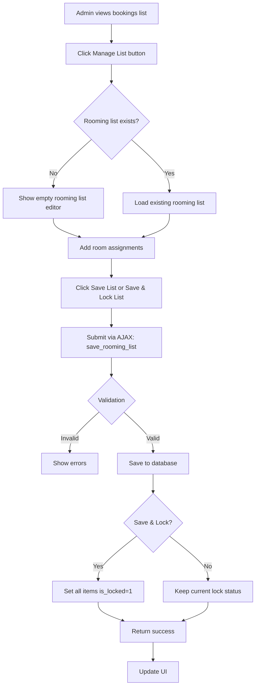
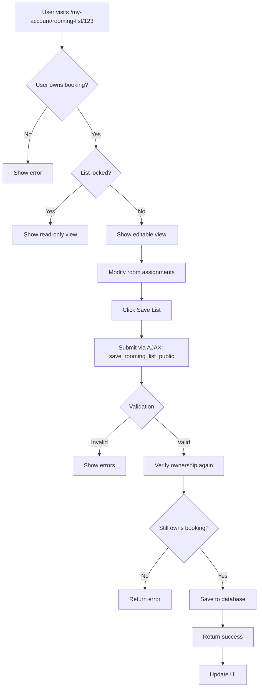
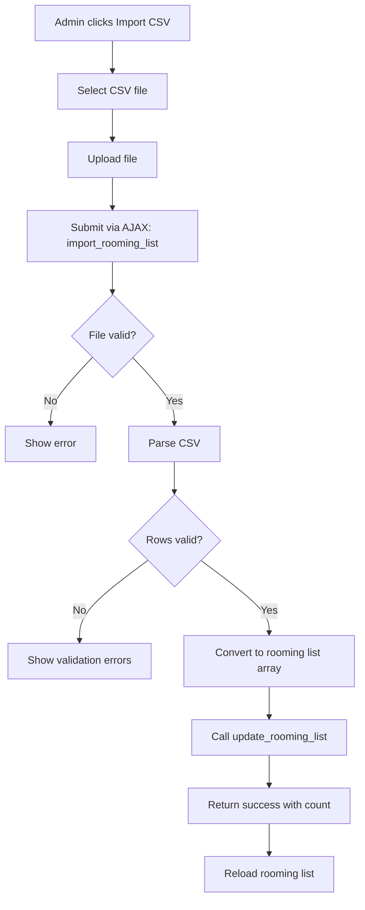
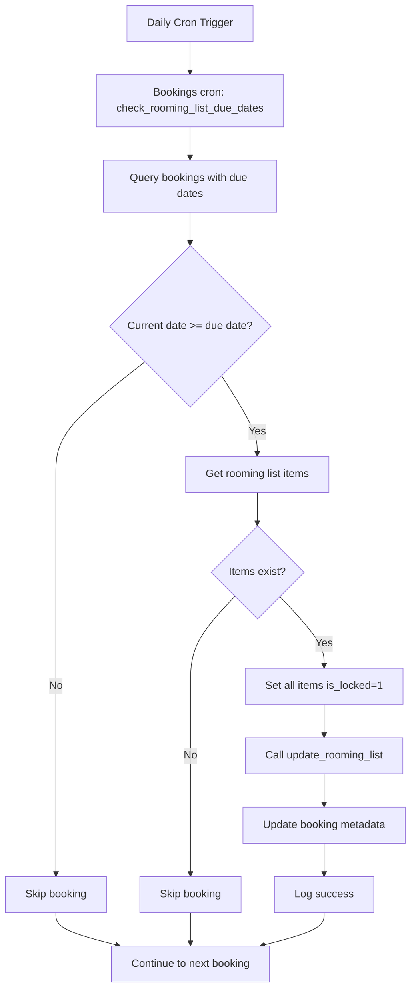

# Rooming List Module - Complete Technical Guide

> **Module ID:** `rooming-list`  
> **Version:** 1.0.0  
> **Status:** Default Enabled  
> **Dependencies:** Bookings, Hotels

---

## Table of Contents

1. [Overview](#overview)
2. [File Structure](#file-structure)
3. [Core Components](#core-components)
4. [Database Schema](#database-schema)
5. [AJAX Actions](#ajax-actions)
6. [CRUD Operations](#crud-operations)
7. [Rewrite Rules](#rewrite-rules)
8. [CSV Import/Export](#csv-importexport)
9. [Lock Functionality](#lock-functionality)
10. [Workflow & Processes](#workflow--processes)
11. [Module Dependencies](#module-dependencies)
12. [Email & Notification Requirements](#email--notification-requirements)
13. [Future Considerations](#future-considerations)

---

## Overview

The **Rooming List Module** manages room assignments for bookings, providing both admin and public interfaces for creating, editing, and locking rooming lists. It integrates with the Bookings and Hotels modules to provide comprehensive room management.

### Key Features

✅ **Admin + Public Interfaces** - Full management capabilities  
✅ **CSV Import/Export** - Bulk room assignment management  
✅ **Lock Functionality** - Prevent changes after due date  
✅ **Auto-Lock Integration** - Works with bookings cron system  
✅ **AJAX-Driven** - 5 AJAX endpoints for seamless UX  
✅ **Database Table** - Dedicated `wp_rooming_list` table  
✅ **Rewrite Rules** - Custom URLs (`/my-account/rooming-list/{id}`)  
✅ **Ownership Verification** - Users can only edit their own lists  
✅ **Sample CSV** - Template file for easy import

---

## File Structure

```
rooming-list/
├── class-rooming-list.php             # Main module orchestrator
├── config.php                         # Module configuration
├── activator.php                      # Activation (table + rewrite)
├── crud.php                           # Database operations (4 methods)
├── ajax.php                           # AJAX handlers (5 endpoints)
│
├── admin/
│   └── class-rooming-list-admin.php   # Admin interface
│
├── public/
│   └── class-rooming-list-public.php  # Public interface
│
├── templates/
│   ├── admin/
│   │   ├── list-rooming-list.php      # Bookings list with rooming list button
│   │   └── edit-rooming-list.php      # Edit rooming list interface
│   └── public/
│       └── page-rooming-list.php      # Public rooming list page
│
└── assets/
    ├── css/
    │   ├── admin-rooming-list.css     # Admin styles
    │   └── rooming-list-public.css    # Public styles
    ├── js/
    │   ├── admin-rooming-list.js      # Admin JavaScript
    │   ├── rooming-list-core.js       # Core functionality
    │   └── rooming-list-public.js     # Public JavaScript
    └── sample-rooming-list.csv        # Sample CSV template
```

**Total Files:** 24 files

---

## Core Components

### 1. `class-rooming-list.php`

**Purpose:** Main module orchestrator

**Key Methods:**
- `init()` - Initialize module components
- `load_dependencies()` - Load CRUD, admin, public, AJAX classes
- `init_admin()` - Initialize admin interface
- `init_public()` - Initialize public interface
- `init_ajax()` - Initialize AJAX handlers

**Characteristics:**
- Both admin and public interfaces
- AJAX support for seamless UX
- Dependency validation (requires bookings + hotels)

---

### 2. `config.php`

**Configuration:**
```php
return array(
    'id'                => 'rooming-list',
    'name'              => 'Rooming List Management',
    'description'       => 'Manage room assignments for bookings',
    'version'           => '1.0.0',
    'author'            => 'OwlthTech',
    'default_enabled'   => true,   // Enabled by default
    'network_only'      => false,
    'required'          => false,
    'dependencies'      => array(
        'bookings',  // Needs booking data
        'hotels'     // Needs hotel limits
    ),
    'supports'          => array(
        'ajax',       // AJAX functionality
        'templates'   // Template overrides
    ),
    'template_paths'    => array(
        'admin'  => 'templates/admin/',
    ),
    'assets'            => array(),
    'class'             => 'class-rooming-list.php'
);
```

---

### 3. `activator.php`

**Activation Tasks:**
1. Create `wp_rooming_list` table
2. Register rewrite rules
3. Flush rewrite rules

**Important:** Rewrite rules are registered on EVERY page load via `init` hook (line 66)

---

## Database Schema

### `wp_rooming_list` Table

**Table Name:** `{$wpdb->base_prefix}rooming_list`

**Schema:**
```sql
CREATE TABLE wp_rooming_list (
    id BIGINT(20) NOT NULL AUTO_INCREMENT,
    booking_id BIGINT(20) NOT NULL,
    room_number VARCHAR(50) NOT NULL,
    occupant_name VARCHAR(255) NOT NULL,
    occupant_type VARCHAR(50) DEFAULT 'Student',
    is_locked TINYINT(1) DEFAULT 0,
    created_at DATETIME NOT NULL DEFAULT CURRENT_TIMESTAMP,
    modified_at DATETIME NOT NULL DEFAULT CURRENT_TIMESTAMP ON UPDATE CURRENT_TIMESTAMP,
    PRIMARY KEY (id),
    KEY booking_id (booking_id)
) ENGINE=InnoDB DEFAULT CHARSET=utf8mb4;
```

**Column Details:**

| Column | Type | Null | Default | Description |
|--------|------|------|---------|-------------|
| `id` | BIGINT(20) | NO | AUTO_INCREMENT | Primary key |
| `booking_id` | BIGINT(20) | NO | - | Foreign key to wp_bookings |
| `room_number` | VARCHAR(50) | NO | - | Room number/identifier |
| `occupant_name` | VARCHAR(255) | NO | - | Name of occupant |
| `occupant_type` | VARCHAR(50) | YES | 'Student' | Student/Chaperone/Staff |
| `is_locked` | TINYINT(1) | YES | 0 | Lock status (0=unlocked, 1=locked) |
| `created_at` | DATETIME | NO | CURRENT_TIMESTAMP | Creation timestamp |
| `modified_at` | DATETIME | NO | CURRENT_TIMESTAMP | Last modified timestamp |

**Indexes:** 1 index on `booking_id` for optimized queries

**Relationship:** Each rooming list item belongs to one booking

---

## AJAX Actions

### Admin Actions (Login Required)

| Action | Handler | Purpose |
|--------|---------|---------|
| `save_rooming_list` | `handle_save_rooming_list()` | Save rooming list (admin) |
| `lock_rooming_list_item` | `handle_lock_rooming_list_item()` | Lock/unlock individual item |
| `export_rooming_list` | `handle_export_rooming_list()` | Export to CSV |
| `import_rooming_list` | `handle_import_rooming_list()` | Import from CSV |

### Public Actions (Login Required)

| Action | Handler | Purpose |
|--------|---------|---------|
| `save_rooming_list_public` | `handle_save_rooming_list_public()` | Save rooming list (public) |

**Total:** 5 AJAX endpoints

---

### AJAX Request/Response Formats

#### 1. Save Rooming List (Admin)

**Request:**
```javascript
{
    action: 'save_rooming_list',
    nonce: '...',
    booking_id: 123,
    rooming_list: [
        {
            id: 1,  // Optional, for updates
            room_number: '101',
            occupant_name: 'John Doe',
            occupant_type: 'Student',
            is_locked: 0
        },
        {
            room_number: '101',
            occupant_name: 'Jane Smith',
            occupant_type: 'Student',
            is_locked: 0
        }
    ]
}
```

**Success Response:**
```javascript
{
    success: true,
    data: {
        message: 'Rooming list saved successfully'
    }
}
```

---

#### 2. Lock/Unlock Item

**Request:**
```javascript
{
    action: 'lock_rooming_list_item',
    nonce: '...',
    item_id: 123,
    is_locked: 1  // 1=lock, 0=unlock
}
```

**Success Response:**
```javascript
{
    success: true,
    data: {
        message: 'Item locked successfully'
    }
}
```

---

#### 3. Export Rooming List

**Request:**
```javascript
{
    action: 'export_rooming_list',
    nonce: '...',
    booking_id: 123
}
```

**Response:** CSV file download

**CSV Format:**
```csv
Room Number,Occupant Name,Occupant Type,Locked
101,John Doe,Student,No
101,Jane Smith,Student,No
102,Bob Johnson,Chaperone,No
```

---

#### 4. Import Rooming List

**Request:** FormData with CSV file
```javascript
{
    action: 'import_rooming_list',
    nonce: '...',
    booking_id: 123,
    csv_file: File
}
```

**Success Response:**
```javascript
{
    success: true,
    data: {
        message: 'Imported 25 rows successfully',
        imported_count: 25
    }
}
```

---

#### 5. Save Rooming List (Public)

**Request:** Same as admin save

**Additional Validation:**
- Verifies user owns the booking
- Checks if list is locked

---

## CRUD Operations

### Key Methods

**Read:**
- `get_table_name()` - Get rooming list table name
- `get_rooming_list($booking_id)` - Get all rooming list items for a booking

**Update:**
- `update_rooming_list($booking_id, $rooming_list)` - Sync rooming list (insert/update/delete)
- `toggle_lock_rooming_list_item($item_id, $is_locked)` - Lock/unlock individual item

**Total:** 4 CRUD methods

---

### Update Rooming List Logic

**Sync Strategy:**
1. Get existing items from database
2. Loop through submitted items:
   - If item has ID and exists → UPDATE
   - If item has no ID or doesn't exist → INSERT
3. Delete items that were removed (not in submitted list)

**Code Example:**
```php
$rooming_list = [
    ['id' => 1, 'room_number' => '101', 'occupant_name' => 'John Doe', 'occupant_type' => 'Student', 'is_locked' => 0],
    ['room_number' => '102', 'occupant_name' => 'Jane Smith', 'occupant_type' => 'Student', 'is_locked' => 0]
];

OC_Rooming_List_CRUD::update_rooming_list($booking_id, $rooming_list);
```

---

## Rewrite Rules

### Custom URLs

**Registered Rules:**

1. **Public Rooming List Page**
   - Pattern: `^my-account/rooming-list/([0-9]+)/?$`
   - Rewrite: `index.php?account_page=rooming-list&booking_id=$matches[1]`
   - Example: `/my-account/rooming-list/123`

**Registration:** Rules are registered on EVERY page load via `init` hook (activator.php line 66)

**Flush:** Run `flush_rewrite_rules()` after activation or when rules change

---

## CSV Import/Export

### Export Functionality

**Trigger:** Admin clicks "Export CSV" button

**Process:**
1. Fetch rooming list for booking
2. Generate CSV with headers
3. Convert locked status to Yes/No
4. Set download headers
5. Output CSV content

**CSV Headers:**
- Room Number
- Occupant Name
- Occupant Type
- Locked

---

### Import Functionality

**Trigger:** Admin uploads CSV file

**Process:**
1. Validate file upload
2. Parse CSV file
3. Validate each row:
   - Required fields present
   - Valid occupant type
4. Convert "Yes"/"No" to 1/0 for locked status
5. Save to database via `update_rooming_list()`

**Validation Rules:**
- Room Number: Required
- Occupant Name: Required
- Occupant Type: Optional (defaults to "Student")
- Locked: Optional (Yes/No, defaults to No)

---

### Sample CSV Template

**File:** `assets/sample-rooming-list.csv`

**Content:**
```csv
Room Number,Occupant Name,Occupant Type,Locked
101,John Doe,Student,No
101,Jane Smith,Student,No
102,Bob Johnson,Chaperone,No
102,Mary Williams,Chaperone,No
103,Tom Brown,Student,No
```

**Usage:** Users can download this template, fill it out, and import

---

## Lock Functionality

### Individual Item Lock

**Purpose:** Lock specific rooming list items to prevent changes

**How It Works:**
1. Admin/User clicks lock icon on item
2. AJAX request to `lock_rooming_list_item`
3. Updates `is_locked` field in database
4. UI updates to show locked state

**Locked Items:**
- Cannot be edited
- Cannot be deleted
- Shown with lock icon
- Grayed out in UI

---

### Bulk Lock (Save & Lock List)

**Purpose:** Lock all items in rooming list at once

**How It Works:**
1. Admin clicks "Save & Lock List" button
2. All items in list have `is_locked` set to 1
3. Saves to database
4. Entire list becomes read-only

**Use Case:** Lock list after due date to prevent further changes

---

### Auto-Lock via Cron

**Integration:** Works with Bookings module cron system

**Process:**
1. Bookings cron checks due dates daily
2. If current date >= due date:
   - Fetches rooming list for booking
   - Sets all items to `is_locked = 1`
   - Updates booking metadata

**Status:** Implemented in bookings module, ready to use

**See:** `bookings/class-bookings-cron.php` for implementation details

---

## Workflow & Processes

### Create Rooming List Flow (Admin)



---

### Edit Rooming List Flow (Public)



---

### CSV Import Flow



---

### Auto-Lock Flow (Cron)



---

## Module Dependencies

### Dependencies ON Other Modules

**Required Dependencies:**

1. **Bookings Module**
   - **Reason:** Rooming lists belong to bookings
   - **Integration:** Uses `booking_id` foreign key
   - **Impact if Missing:** Module cannot function

2. **Hotels Module**
   - **Reason:** Room capacity limits
   - **Integration:** May reference hotel data
   - **Impact if Missing:** No capacity validation

---

### Modules That Depend ON Rooming List

**None** - No other modules depend on rooming list

---

## Notification & Email Summary

### Current Implementation

**Email Templates:** ❌ **NONE**

**Email Trigger:** ❌ **NOT IMPLEMENTED**

**Email Handler:** ❌ **NOT IMPLEMENTED**

**Status:** The rooming-list module currently has **no email or notification functionality**. All rooming list operations (save, lock, import) happen silently without any notifications.

---

### Required Notifications (Not Yet Implemented)

**Critical (Implement First):**
1. Rooming list created → User
2. Rooming list locked → User + Admin
3. Rooming list auto-locked → User + Admin

**Important (Implement Soon):**
4. Rooming list updated → User
5. Rooming list due date reminder (3 days before) → User
6. Rooming list incomplete warning (1 day before) → User

**Nice to Have:**
7. CSV imported → User + Admin
8. CSV exported → User
9. Room assignment changed → User
10. Rooming list unlocked → User + Admin

---

## Future Considerations

### 1. Email Notifications (HIGH PRIORITY)

**Tasks:**
- [ ] Add rooming list created email
- [ ] Add rooming list updated email
- [ ] Add rooming list locked email
- [ ] Add rooming list auto-locked email
- [ ] Add due date reminder emails (3 days, 1 day)
- [ ] Add incomplete warning email
- [ ] Add CSV import confirmation email
- [ ] Create email template builder
- [ ] Add email preferences for users

---

### 2. Enhanced Validation (HIGH PRIORITY)

**Tasks:**
- [ ] Add hotel capacity validation
- [ ] Add room number validation (must exist in hotel)
- [ ] Add duplicate detection (same person in multiple rooms)
- [ ] Add gender-based room assignment rules
- [ ] Add age-based room assignment rules
- [ ] Add chaperone ratio validation

---

### 3. Advanced Features (MEDIUM PRIORITY)

**Tasks:**
- [ ] Add room preferences (roommate requests)
- [ ] Add special needs accommodations
- [ ] Add room type selection (single, double, suite)
- [ ] Add bed type selection
- [ ] Add floor preference
- [ ] Add accessibility requirements

---

### 4. Reporting & Analytics (MEDIUM PRIORITY)

**Tasks:**
- [ ] Add rooming list completion report
- [ ] Add occupancy statistics
- [ ] Add room utilization report
- [ ] Add chaperone ratio report
- [ ] Add export to PDF
- [ ] Add printable rooming list

---

### 5. User Experience (MEDIUM PRIORITY)

**Tasks:**
- [ ] Add drag-and-drop room assignment
- [ ] Add auto-assign functionality
- [ ] Add room swap functionality
- [ ] Add bulk edit capabilities
- [ ] Add search/filter in rooming list
- [ ] Add room visualization (floor plan)

---

### 6. Integration Enhancements (LOW PRIORITY)

**Tasks:**
- [ ] Add integration with hotel booking systems
- [ ] Add integration with payment systems
- [ ] Add QR code for room assignments
- [ ] Add mobile app support
- [ ] Add SMS notifications

---

### 7. Security & Performance (ONGOING)

**Tasks:**
- [ ] Add rate limiting for AJAX requests
- [ ] Add audit logging for all changes
- [ ] Add version history for rooming lists
- [ ] Add undo/redo functionality
- [ ] Add database query optimization
- [ ] Add caching for frequently accessed lists

---

## Comparison with Other Modules

| Feature | Rooming List | Schools | Hotels | Bookings |
|---------|--------------|---------|--------|----------|
| **Admin Interface** | ✅ Full | ❌ No | ✅ Full | ✅ Full |
| **Public Interface** | ✅ Yes | ✅ Yes | ❌ No | ✅ Yes |
| **AJAX Actions** | ✅ 5 | ✅ 3 | ❌ None | ✅ 17 |
| **Database Table** | ✅ wp_rooming_list | ✅ wp_schools | ✅ wp_hotels | ✅ wp_bookings |
| **Rewrite Rules** | ✅ 1 rule | ✅ 2 rules | ❌ None | ✅ 2 rules |
| **Email System** | ❌ None | ❌ None | ❌ None | ✅ 2 templates |
| **Cron System** | ⚠️ Uses bookings | ❌ None | ❌ None | ✅ Auto-lock |
| **CSV Import/Export** | ✅ Yes | ❌ None | ❌ None | ❌ None |
| **Lock Functionality** | ✅ Yes | ❌ None | ❌ None | ❌ None |
| **Dependencies** | ✅ Bookings, Hotels | ❌ None | ❌ None | ⚠️ Soft |
| **Required** | ❌ No | ❌ No | ❌ No | ❌ No |
| **Default Enabled** | ✅ Yes | ❌ No | ❌ No | ❌ No |

---

## Conclusion

The **Rooming List Module** is a specialized module that provides:

- ✅ Comprehensive room assignment management
- ✅ Both admin and public interfaces
- ✅ CSV import/export functionality
- ✅ Individual and bulk lock capabilities
- ✅ Auto-lock integration with bookings cron
- ✅ AJAX-driven for seamless UX
- ✅ Ownership verification for security
- ✅ Sample CSV template for easy import

**Key Strengths:**
- Focused functionality
- CSV support for bulk operations
- Lock system prevents unauthorized changes
- Integrates with bookings cron for auto-lock
- Both admin and user-facing
- Clean CRUD architecture

**Areas for Improvement:**
- Add email notification system
- Add hotel capacity validation
- Add advanced room assignment features
- Add reporting and analytics
- Add room visualization
- Add mobile optimization

---

**Last Updated:** 2024-12-10  
**Module Version:** 1.0.0  
**Documentation Version:** 1.0.0
