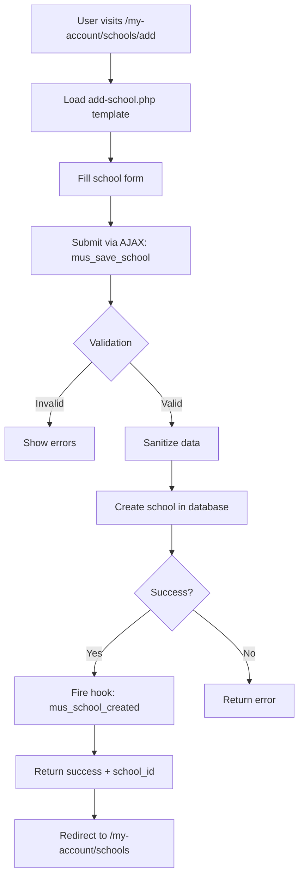
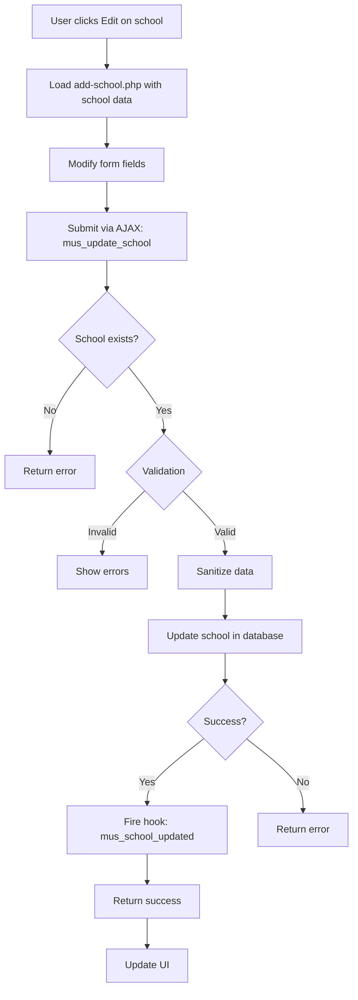
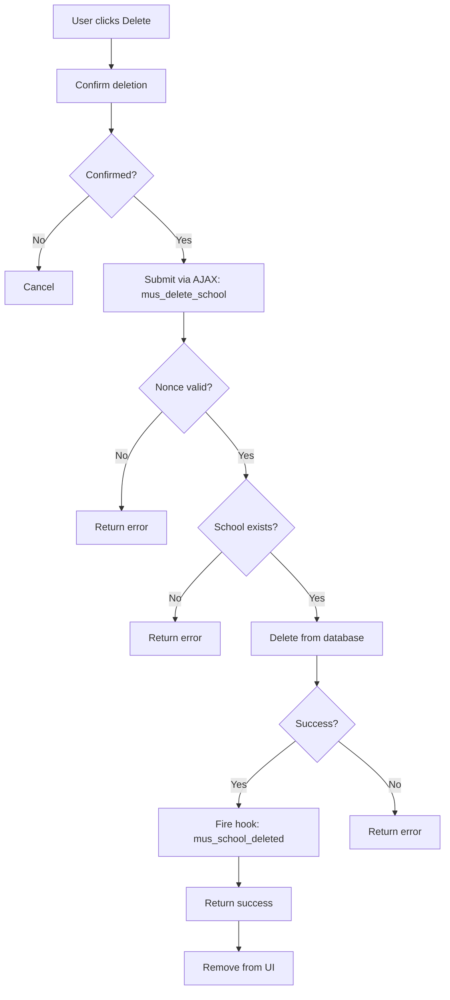
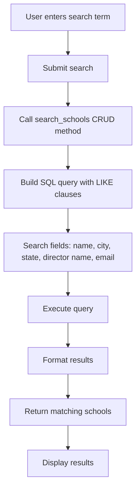

# Schools Module - Complete Technical Guide

> **Module ID:** `schools`  
> **Version:** 1.0.0  
> **Status:** Optional Module  
> **Dependencies:** None

---

## Table of Contents

1. [Overview](#overview)
2. [File Structure](#file-structure)
3. [Core Components](#core-components)
4. [Database Schema](#database-schema)
5. [AJAX Actions](#ajax-actions)
6. [CRUD Operations](#crud-operations)
7. [Rewrite Rules](#rewrite-rules)
8. [Workflow & Processes](#workflow--processes)
9. [Module Dependencies](#module-dependencies)
10. [Future Considerations](#future-considerations)

---

## Overview

The **Schools Module** provides comprehensive school profile management for users. It is a **public-facing module** with no admin interface, allowing users to create and manage multiple school profiles with detailed administrative and principal information.

### Key Features

✅ **Public Interface Only** - User-facing school management  
✅ **Multi-School Support** - Users can manage multiple schools  
✅ **Comprehensive Data** - School + Director + Principal information  
✅ **AJAX-Driven** - 3 AJAX endpoints for CRUD operations  
✅ **Database Table** - Dedicated `wp_schools` table  
✅ **Rewrite Rules** - Custom URLs (`/my-account/schools`)  
✅ **Multisite Compatible** - blog_id field for site-specific data  
✅ **Validation & Sanitization** - Comprehensive data validation  
✅ **Search Functionality** - Search schools by multiple fields  
✅ **Pagination Support** - Paginated school lists

---

## File Structure

```
schools/
├── class-schools.php                  # Main module orchestrator
├── config.php                         # Module configuration
├── activator.php                      # Activation (table + rewrite)
├── deactivator.php                    # Deactivation logic
├── crud.php                           # Database operations (16 methods)
├── ajax.php                           # AJAX handlers (3 endpoints)
│
├── public/
│   └── class-schools-public.php       # Public interface
│
├── templates/
│   └── public/
│       ├── page-schools-list.php      # Schools list page
│       └── page-add-school.php        # Add/Edit school form
│
└── assets/
    ├── css/
    │   └── schools-public.css         # Public styles
    └── js/
        ├── school-form.js             # Form handling
        └── schools-list.js            # List interactions
```

**Total Files:** 18 files

---

## Core Components

### 1. `class-schools.php`

**Purpose:** Main module orchestrator

**Key Methods:**
- `init()` - Initialize module components
- `load_dependencies()` - Load CRUD, AJAX, public classes
- `init_public()` - Initialize public interface
- `init_ajax()` - Initialize AJAX handlers

**Characteristics:**
- No admin interface
- Public-only module
- AJAX support for seamless UX

---

### 2. `config.php`

**Configuration:**
```php
return array(
    'id'                => 'schools',
    'name'              => 'Schools Management',
    'description'       => 'Comprehensive schools management system for multisite networks',
    'version'           => '1.0.0',
    'author'            => 'Your Organization',
    'default_enabled'   => false,  // Optional module
    'network_only'      => false,
    'required'          => false,
    'dependencies'      => array(),
    'supports'          => array(
        'templates',     // Template overrides
        'ajax',          // AJAX functionality
        'cpt',           // Custom post types
        'shortcodes'     // Shortcodes
    ),
    'template_paths'    => array(
        'admin'  => 'templates/admin/',
        'public' => 'templates/public/',
    ),
    'assets'            => array(
        'admin_css'  => array('assets/css/schools-admin.css'),
        'admin_js'   => array('assets/js/schools-admin.js'),
        'public_css' => array('assets/css/schools-public.css'),
        'public_js'  => array('assets/js/schools-public.js'),
    ),
    'class'             => 'class-schools.php'
);
```

---

### 3. `activator.php`

**Activation Tasks:**
1. Create `wp_schools` table
2. Register rewrite rules
3. Flush rewrite rules

**Important:** Rewrite rules are registered on EVERY page load via `init` hook (line 94)

---

## Database Schema

### `wp_schools` Table

**Table Name:** `{$wpdb->base_prefix}schools`

**Schema:**
```sql
CREATE TABLE wp_schools (
    id BIGINT(20) NOT NULL AUTO_INCREMENT,
    blog_id BIGINT(20) NOT NULL,
    user_id BIGINT(20) NOT NULL,
    school_name VARCHAR(100) NOT NULL,
    school_address VARCHAR(150) NOT NULL,
    school_address_2 VARCHAR(150) DEFAULT NULL,
    school_city VARCHAR(80) NOT NULL,
    school_state VARCHAR(50) NOT NULL,
    school_zip VARCHAR(20) NOT NULL,
    school_country VARCHAR(50) NOT NULL,
    school_phone VARCHAR(20) NOT NULL,
    school_website VARCHAR(200) DEFAULT NULL,
    school_enrollment INT(11) DEFAULT 0,
    school_notes LONGTEXT DEFAULT NULL,
    director_prefix VARCHAR(10) DEFAULT NULL,
    director_first_name VARCHAR(80) NOT NULL,
    director_last_name VARCHAR(80) NOT NULL,
    director_email VARCHAR(100) NOT NULL,
    director_cell_phone VARCHAR(20) DEFAULT NULL,
    principal_prefix VARCHAR(10) DEFAULT NULL,
    principal_first_name VARCHAR(80) DEFAULT NULL,
    principal_last_name VARCHAR(80) DEFAULT NULL,
    status VARCHAR(20) NOT NULL DEFAULT 'active',
    created_at DATETIME NOT NULL DEFAULT CURRENT_TIMESTAMP,
    modified_at DATETIME NOT NULL DEFAULT CURRENT_TIMESTAMP ON UPDATE CURRENT_TIMESTAMP,
    PRIMARY KEY (id),
    KEY blog_id (blog_id),
    KEY user_id (user_id),
    KEY school_name (school_name),
    KEY director_email (director_email),
    KEY status (status),
    KEY created_at (created_at),
    KEY user_blog (user_id, blog_id),
    UNIQUE KEY user_school (user_id, school_name(50), blog_id)
) ENGINE=InnoDB DEFAULT CHARSET=utf8mb4;
```

**Column Details:**

| Column | Type | Null | Default | Description |
|--------|------|------|---------|-------------|
| `id` | BIGINT(20) | NO | AUTO_INCREMENT | Primary key |
| `blog_id` | BIGINT(20) | NO | - | Site ID (multisite) |
| `user_id` | BIGINT(20) | NO | - | User who owns school |
| `school_name` | VARCHAR(100) | NO | - | School name |
| `school_address` | VARCHAR(150) | NO | - | Street address |
| `school_address_2` | VARCHAR(150) | YES | NULL | Address line 2 |
| `school_city` | VARCHAR(80) | NO | - | City |
| `school_state` | VARCHAR(50) | NO | - | State/Province |
| `school_zip` | VARCHAR(20) | NO | - | Postal code |
| `school_country` | VARCHAR(50) | NO | - | Country |
| `school_phone` | VARCHAR(20) | NO | - | School phone |
| `school_website` | VARCHAR(200) | YES | NULL | School website URL |
| `school_enrollment` | INT(11) | YES | 0 | Student enrollment count |
| `school_notes` | LONGTEXT | YES | NULL | Additional notes |
| `director_prefix` | VARCHAR(10) | YES | NULL | Director title (Mr./Mrs./Dr.) |
| `director_first_name` | VARCHAR(80) | NO | - | Director first name |
| `director_last_name` | VARCHAR(80) | NO | - | Director last name |
| `director_email` | VARCHAR(100) | NO | - | Director email |
| `director_cell_phone` | VARCHAR(20) | YES | NULL | Director cell phone |
| `principal_prefix` | VARCHAR(10) | YES | NULL | Principal title |
| `principal_first_name` | VARCHAR(80) | YES | NULL | Principal first name |
| `principal_last_name` | VARCHAR(80) | YES | NULL | Principal last name |
| `status` | VARCHAR(20) | NO | 'active' | School status |
| `created_at` | DATETIME | NO | CURRENT_TIMESTAMP | Creation timestamp |
| `modified_at` | DATETIME | NO | CURRENT_TIMESTAMP | Last modified timestamp |

**Indexes:** 8 indexes for optimized queries

**Unique Constraint:** `user_school` - Prevents duplicate school names per user per site

---

## AJAX Actions

### Public Actions (Login Required)

| Action | Handler | Purpose |
|--------|---------|---------|
| `mus_save_school` | `handle_save_school()` | Create new school |
| `mus_update_school` | `handle_update_school()` | Update existing school |
| `mus_delete_school` | `handle_delete_school()` | Delete school |

**Note:** All actions have both `wp_ajax` and `wp_ajax_nopriv` hooks registered

**Total:** 3 AJAX endpoints

---

### AJAX Request/Response Formats

#### 1. Save School

**Request:**
```javascript
{
    action: 'mus_save_school',
    nonce: '...',
    school_name: 'Lincoln High School',
    school_address: '123 Main St',
    school_address_2: 'Suite 100',
    school_city: 'Springfield',
    school_state: 'IL',
    school_zip: '62701',
    school_country: 'USA',
    school_phone: '217-555-1234',
    school_website: 'https://lincolnhs.edu',
    school_enrollment: 1200,
    school_notes: 'Additional information...',
    director_prefix: 'Dr.',
    director_first_name: 'John',
    director_last_name: 'Smith',
    director_email: 'jsmith@lincolnhs.edu',
    director_cell_phone: '217-555-5678',
    principal_prefix: 'Mrs.',
    principal_first_name: 'Jane',
    principal_last_name: 'Doe'
}
```

**Success Response:**
```javascript
{
    success: true,
    data: {
        school_id: 123,
        message: 'School created successfully',
        redirect: '/my-account/schools'
    }
}
```

**Error Response:**
```javascript
{
    success: false,
    data: {
        errors: [
            'School name is required',
            'Director email is invalid'
        ]
    }
}
```

---

#### 2. Update School

**Request:**
```javascript
{
    action: 'mus_update_school',
    nonce: '...',
    school_id: 123,
    // ... same fields as save_school
}
```

**Success Response:**
```javascript
{
    success: true,
    data: {
        school_id: 123,
        message: 'School updated successfully'
    }
}
```

---

#### 3. Delete School

**Request:**
```javascript
{
    action: 'mus_delete_school',
    nonce: '...',
    school_id: 123
}
```

**Success Response:**
```javascript
{
    success: true,
    data: {
        message: 'School deleted successfully!',
        school_id: 123
    }
}
```

---

## CRUD Operations

### Key Methods

**Create:**
- `create_school($user_id, $school_data)` - Create new school, returns school ID

**Read:**
- `get_school($school_id, $user_id)` - Get single school by ID
- `get_user_schools($user_id)` - Get all schools for user
- `get_user_schools_paginated($user_id, $page, $per_page)` - Get paginated schools
- `search_schools($user_id, $search)` - Search schools by multiple fields

**Update:**
- `update_school($school_id, $user_id, $school_data)` - Update school

**Delete:**
- `delete_school($school_id, $user_id)` - Delete single school
- `delete_all_user_schools($user_id)` - Delete all user schools

**Statistics:**
- `count_user_schools($user_id)` - Count user's schools
- `school_exists($school_id, $user_id)` - Check if school exists

**Validation:**
- `validate_school_data($data)` - Validate school data

**Utilities:**
- `sanitize_school_data($data)` - Sanitize school data (private)
- `format_school($school)` - Format school for display (private)
- `build_full_address($school)` - Build full address string (private)
- `build_name($school, $type)` - Build full name string (private)

**Total:** 16 CRUD methods

---

### Global Helper Functions

```php
// Convenience functions for easy access
get_user_schools_for_display($user_id)
get_user_school($user_id, $school_id)
create_user_school($user_id, $data)
update_user_school($user_id, $school_id, $data)
delete_user_school($user_id, $school_id)
```

---

## Rewrite Rules

### Custom URLs

**Registered Rules:**

1. **Add School Page**
   - Pattern: `^my-account/schools/add/?$`
   - Rewrite: `index.php?account_page=schools&school_action=add`
   - Example: `/my-account/schools/add`

2. **Schools List Page**
   - Pattern: `^my-account/schools/?$`
   - Rewrite: `index.php?account_page=schools`
   - Example: `/my-account/schools`

**Registration:** Rules are registered on EVERY page load via `init` hook (activator.php line 94)

**Flush:** Run `flush_rewrite_rules()` after activation or when rules change

---

## Workflow & Processes

### Create School Flow



---

### Update School Flow



---

### Delete School Flow



---

### Search Schools Flow



---

## Module Dependencies

### Dependencies ON Other Modules

**None** - The schools module is completely independent.

---

### Modules That Depend ON Schools

The following modules **depend on** the schools module:

1. **Bookings Module** - Uses schools for booking form (step 5)
2. **Authentication Module** - May display schools in my-account page

**Integration Points:**
- Bookings module queries `wp_schools` table
- School selection in booking form
- School information in email templates

---

## Validation & Security

### Data Validation

**Required Fields:**
- School name
- School address
- City
- State
- Zip code
- Country
- Phone
- Director first name
- Director last name
- Director email

**Email Validation:**
- Director email must be valid email format

**Validation Method:**
```php
$validation = OC_Schools_CRUD::validate_school_data($data);
if (!$validation['valid']) {
    // Handle errors
    $errors = $validation['errors'];
}
```

---

### Data Sanitization

**Sanitization Functions:**
- `sanitize_text_field()` - Text fields
- `sanitize_email()` - Email addresses
- `esc_url_raw()` - Website URLs
- `sanitize_textarea_field()` - Notes field
- `intval()` - Numeric values

**All data is sanitized before database insertion**

---

### Security Measures

**Nonce Verification:**
```php
if (!oc_verify_ajax_nonce('mus_nonce', 'nonce')) {
    wp_send_json_error(['message' => 'Security check failed']);
}
```

**Authentication Check:**
```php
if (!is_user_logged_in()) {
    wp_send_json_error(['message' => 'You must be logged in']);
}
```

**Ownership Verification:**
- All CRUD operations verify user_id matches
- Prevents users from modifying other users' schools

**SQL Injection Prevention:**
- All queries use `$wpdb->prepare()`
- Parameterized queries throughout

---

## Action Hooks

### Available Hooks

**Create:**
```php
do_action('mus_school_created', $user_id, $school_id, $insert_data);
```

**Update:**
```php
do_action('mus_school_updated', $user_id, $school_id, $update_data);
```

**Delete:**
```php
do_action('mus_school_deleted', $user_id, $school_id);
do_action('mus_all_schools_deleted', $user_id);
```

**Usage Example:**
```php
add_action('mus_school_created', function($user_id, $school_id, $data) {
    // Send notification email
    // Log activity
    // Update statistics
}, 10, 3);
```

---

## Code Examples

### Example 1: Get User Schools

```php
// Get all schools for current user
$user_id = get_current_user_id();
$schools = OC_Schools_CRUD::get_user_schools($user_id);

foreach ($schools as $school_id => $school) {
    echo $school['school_name'] . '<br>';
    echo $school['full_address'] . '<br>';
    echo $school['director_name'] . '<br>';
}
```

---

### Example 2: Create School

```php
$user_id = get_current_user_id();

$school_data = array(
    'school_name' => 'Lincoln High School',
    'school_address' => '123 Main St',
    'school_city' => 'Springfield',
    'school_state' => 'IL',
    'school_zip' => '62701',
    'school_country' => 'USA',
    'school_phone' => '217-555-1234',
    'director_first_name' => 'John',
    'director_last_name' => 'Smith',
    'director_email' => 'jsmith@lincolnhs.edu'
);

$school_id = OC_Schools_CRUD::create_school($user_id, $school_data);

if ($school_id) {
    echo 'School created with ID: ' . $school_id;
}
```

---

### Example 3: Search Schools

```php
$user_id = get_current_user_id();
$search_term = 'Lincoln';

$results = OC_Schools_CRUD::search_schools($user_id, $search_term);

echo 'Found ' . count($results) . ' schools matching "' . $search_term . '"';

foreach ($results as $school) {
    echo $school['school_name'] . '<br>';
}
```

---

### Example 4: Paginated Schools

```php
$user_id = get_current_user_id();
$page = 1;
$per_page = 10;

$result = OC_Schools_CRUD::get_user_schools_paginated($user_id, $page, $per_page);

echo 'Total schools: ' . $result['total'] . '<br>';
echo 'Total pages: ' . $result['pages'] . '<br>';
echo 'Current page: ' . $result['current_page'] . '<br>';

foreach ($result['items'] as $school) {
    echo $school['school_name'] . '<br>';
}
```

---

## Future Considerations

### 1. Admin Interface (MEDIUM PRIORITY)

**Tasks:**
- [ ] Add admin menu for schools management
- [ ] Add WP_List_Table for all schools
- [ ] Add bulk actions (delete, export)
- [ ] Add school filtering and search
- [ ] Add school statistics dashboard

---

### 2. Enhanced Data (HIGH PRIORITY)

**Tasks:**
- [ ] Add school logo/image upload
- [ ] Add school type (public/private/charter)
- [ ] Add grade levels (K-12, etc.)
- [ ] Add school district information
- [ ] Add accreditation details
- [ ] Add school calendar/schedule
- [ ] Add contact persons (multiple)

---

### 3. Import/Export (MEDIUM PRIORITY)

**Tasks:**
- [ ] Add CSV import functionality
- [ ] Add CSV export functionality
- [ ] Add bulk school creation
- [ ] Add school templates
- [ ] Add duplicate school feature

---

### 4. Verification System (HIGH PRIORITY)

**Tasks:**
- [ ] Add school verification workflow
- [ ] Add admin approval process
- [ ] Add verification badges
- [ ] Add verification email notifications
- [ ] Add verification status tracking

---

### 5. Integration Enhancements (MEDIUM PRIORITY)

**Tasks:**
- [ ] Add Google Maps integration for addresses
- [ ] Add address autocomplete
- [ ] Add school district lookup
- [ ] Add NCES (National Center for Education Statistics) integration
- [ ] Add state education department integration

---

### 6. User Experience (LOW PRIORITY)

**Tasks:**
- [ ] Add school selection wizard
- [ ] Add school comparison feature
- [ ] Add favorite schools
- [ ] Add school notes/tags
- [ ] Add school sharing (between users)
- [ ] Add school history/changelog

---

### 7. Reporting & Analytics (LOW PRIORITY)

**Tasks:**
- [ ] Add school statistics
- [ ] Add user school count reports
- [ ] Add school activity logs
- [ ] Add school usage analytics
- [ ] Add export to PDF

---

### 8. Mobile Optimization (MEDIUM PRIORITY)

**Tasks:**
- [ ] Add responsive design improvements
- [ ] Add mobile-specific forms
- [ ] Add touch-friendly interactions
- [ ] Add mobile app integration

---

### 9. Multisite Enhancements (LOW PRIORITY)

**Tasks:**
- [ ] Add network-wide school search
- [ ] Add school sharing across sites
- [ ] Add centralized school database
- [ ] Add school synchronization

---

### 10. Security & Performance (ONGOING)

**Tasks:**
- [ ] Add rate limiting for AJAX requests
- [ ] Add CAPTCHA for school creation
- [ ] Add spam detection
- [ ] Add database query optimization
- [ ] Add caching for frequently accessed schools
- [ ] Add audit logging


---

## Email & Notification Requirements

### Current State

**Status:** ❌ **NO EMAIL/NOTIFICATION SYSTEM IMPLEMENTED**

The schools module currently has **no email or notification functionality**. All school operations (create, update, delete) happen silently without any notifications.

---

### Required Notifications (NOT YET IMPLEMENTED)

#### Critical (Implement First)

1. **School Created Confirmation** → User
   - **Trigger:** After successful school creation
   - **Recipients:** User who created the school
   - **Template:** `school-created-confirmation.php` (to be created)
   - **Content:**
     - School name and details
     - Confirmation message
     - Link to view/edit school
     - Next steps (use in bookings, etc.)

2. **School Verification Request** → Admin
   - **Trigger:** After school creation (if verification enabled)
   - **Recipients:** Site admin
   - **Template:** `school-verification-request.php` (to be created)
   - **Content:**
     - School details
     - Director information
     - Link to approve/reject
     - Verification checklist

3. **School Verified** → User
   - **Trigger:** Admin approves school
   - **Recipients:** User who owns the school
   - **Template:** `school-verified.php` (to be created)
   - **Content:**
     - Verification confirmation
     - Verified badge notification
     - Benefits of verification

---

#### Important (Implement Soon)

4. **School Updated** → User
   - **Trigger:** After successful school update
   - **Recipients:** User who owns the school
   - **Template:** `school-updated.php` (to be created)
   - **Content:**
     - Updated fields summary
     - Confirmation message
     - Link to view school

5. **School Deleted** → User
   - **Trigger:** After successful school deletion
   - **Recipients:** User who owns the school
   - **Template:** `school-deleted.php` (to be created)
   - **Content:**
     - Deleted school name
     - Confirmation message
     - Option to undo (if soft delete)

6. **School Used in Booking** → User
   - **Trigger:** School is selected in a booking
   - **Recipients:** User who owns the school
   - **Template:** `school-used-in-booking.php` (to be created)
   - **Content:**
     - Booking details
     - School information
     - Link to view booking

---

#### Nice to Have

7. **School Expiring** → User
   - **Trigger:** School data is old (1 year+)
   - **Recipients:** User who owns the school
   - **Template:** `school-expiring.php` (to be created)
   - **Content:**
     - Request to verify/update information
     - Link to update school

8. **Multiple Schools Reminder** → User
   - **Trigger:** User has 5+ schools
   - **Recipients:** User
   - **Template:** `multiple-schools-reminder.php` (to be created)
   - **Content:**
     - List of schools
     - Suggestion to archive unused schools

9. **School Shared** → User
   - **Trigger:** Admin shares school with another user
   - **Recipients:** Both users
   - **Template:** `school-shared.php` (to be created)
   - **Content:**
     - School details
     - Sharing permissions

---

### Implementation Plan

**Step 1: Create Email Handler Class**
```php
// File: class-schools-email.php
class OC_Schools_Email {
    public static function init() {
        add_action('mus_school_created', [__CLASS__, 'send_school_created'], 10, 3);
        add_action('mus_school_updated', [__CLASS__, 'send_school_updated'], 10, 3);
        add_action('mus_school_deleted', [__CLASS__, 'send_school_deleted'], 10, 2);
    }
    
    public static function send_school_created($user_id, $school_id, $data) {
        // Send confirmation email
    }
    
    public static function send_school_updated($user_id, $school_id, $data) {
        // Send update notification
    }
    
    public static function send_school_deleted($user_id, $school_id) {
        // Send deletion confirmation
    }
}
```

**Step 2: Create Email Templates**
- Create `templates/emails/` directory
- Add email templates for each notification type
- Use same HTML structure as bookings module

**Step 3: Hook Integration**
- Email handler already has action hooks in place
- Just need to initialize email handler in module init

**Step 4: SMTP Configuration**
- Use existing SMTP configuration from Authentication module
- No additional setup needed

---

### Email Template Variables

All email templates should receive `$email_data` array with:

```php
$email_data = array(
    'school_id'              => int,
    'school_name'            => string,
    'school_address'         => string,
    'school_city'            => string,
    'school_state'           => string,
    'school_zip'             => string,
    'school_country'         => string,
    'school_phone'           => string,
    'school_website'         => string,
    'school_enrollment'      => int,
    'director_name'          => string,
    'director_email'         => string,
    'director_cell_phone'    => string,
    'principal_name'         => string,
    'user_email'             => string,
    'user_name'              => string,
    'created_at'             => string,
    'modified_at'            => string
);
```

---

### Notification Best Practices

1. **Keep emails concise** - School confirmations should be brief
2. **Include school details** - Always show school name and key info
3. **Provide action links** - Link to view/edit school
4. **Use branded templates** - Match bookings email design
5. **Log all sends** - Track email delivery
6. **Allow opt-out** - User preferences for notifications
7. **Mobile-friendly** - Responsive email templates
8. **Test thoroughly** - Verify all email triggers

---

### Integration with Existing Hooks

The schools module already has action hooks in place:

```php
// In crud.php
do_action('mus_school_created', $user_id, $school_id, $insert_data);
do_action('mus_school_updated', $user_id, $school_id, $update_data);
do_action('mus_school_deleted', $user_id, $school_id);
```

**To enable emails:**
1. Create `class-schools-email.php`
2. Load in `class-schools.php` dependencies
3. Initialize in `init()` method
4. Create email templates
5. Test all triggers

---

## Comparison with Other Modules

| Feature | Schools | Authentication | Hotels | Bookings |
|---------|---------|----------------|--------|----------|
| **Admin Interface** | ❌ No | ⚠️ Minimal | ✅ Full | ✅ Full |
| **Public Interface** | ✅ Yes | ✅ Yes | ❌ No | ✅ Yes |
| **AJAX Actions** | ✅ 3 | ✅ 14 | ❌ None | ✅ 17 |
| **Database Table** | ✅ wp_schools | ❌ Uses existing | ✅ wp_hotels | ✅ wp_bookings |
| **Rewrite Rules** | ✅ 2 rules | ❌ None | ❌ None | ✅ 2 rules |
| **Email System** | ❌ None | ✅ SMTP | ❌ None | ✅ 2 templates |
| **Cron System** | ❌ None | ❌ None | ❌ None | ✅ Auto-lock |
| **Dependencies** | ❌ None | ❌ None | ❌ None | ⚠️ Soft |
| **Required** | ❌ No | ✅ Yes | ❌ No | ❌ No |
| **Default Enabled** | ❌ No | ✅ Yes | ❌ No | ❌ No |

---

## Conclusion

The **Schools Module** is a focused, user-facing module that provides:

- ✅ Comprehensive school profile management
- ✅ Multi-school support per user
- ✅ Detailed school, director, and principal information
- ✅ AJAX-driven CRUD operations
- ✅ Dedicated database table with multisite support
- ✅ Custom URLs via rewrite rules
- ✅ Robust validation and security
- ✅ Search and pagination functionality

**Key Strengths:**
- Simple and focused
- Public-facing (no admin complexity)
- Clean CRUD architecture
- Multisite compatible
- Extensible via action hooks
- Well-validated and sanitized

**Areas for Improvement:**
- Add admin interface for oversight
- Add school verification system
- Add import/export functionality
- Add enhanced school data fields
- Add integration with education databases
- Add mobile optimization

---

**Last Updated:** 2024-12-10  
**Module Version:** 1.0.0  
**Documentation Version:** 1.0.0
