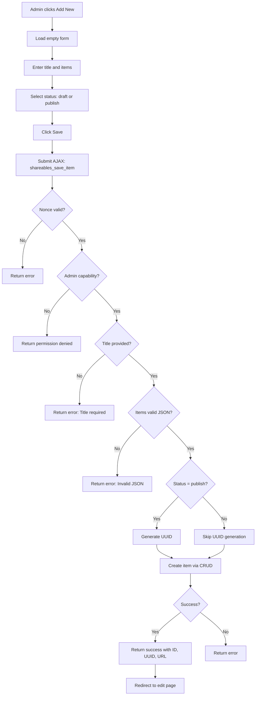
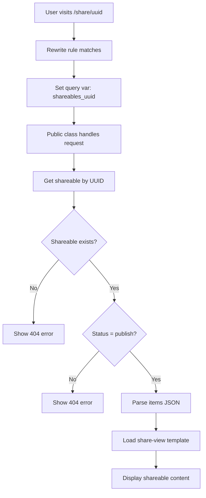
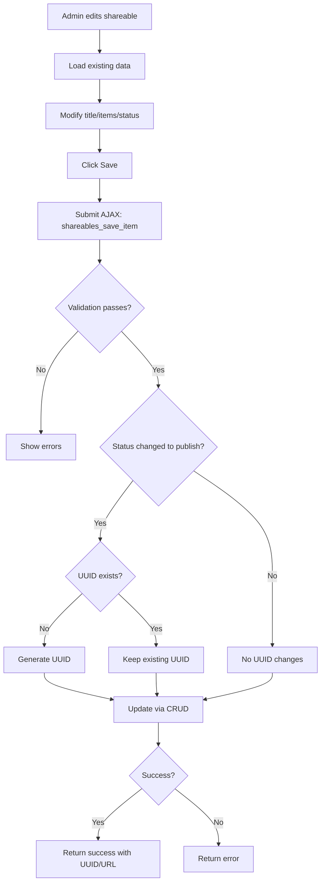

# Shareables Module - Complete Technical Guide

> **Module ID:** `shareables`  
> **Version:** 1.0.0  
> **Status:** Default Enabled  
> **Dependencies:** None

---

## Table of Contents

1. [Overview](#overview)
2. [File Structure](#file-structure)
3. [Core Components](#core-components)
4. [Database Schema](#database-schema)
5. [AJAX Actions](#ajax-actions)
6. [CRUD Operations](#crud-operations)
7. [Rewrite Rules](#rewrite-rules)
8. [UUID System](#uuid-system)
9. [Workflow & Processes](#workflow--processes)
10. [Module Dependencies](#module-dependencies)
11. [Notification & Email Summary](#notification--email-summary)
12. [Future Considerations](#future-considerations)

---

## Overview

The **Shareables Module** creates and manages shareable items with unique URLs. It allows admins to create collections of items (stored as JSON) and share them via UUID-based public URLs.

### Key Features

✅ **Admin + Public Interfaces** - Create and view shareables  
✅ **UUID-Based Sharing** - Unique shareable URLs  
✅ **AJAX-Driven** - 1 AJAX endpoint for seamless UX  
✅ **Database Table** - Dedicated `wp_shareables` table  
✅ **Rewrite Rules** - Custom URLs (`/share/{uuid}`)  
✅ **JSON Storage** - Flexible item storage  
✅ **Draft/Publish Workflow** - Status management  
✅ **Search Functionality** - Search by title  
✅ **Smart UUID Generation** - Only on publish

---

## File Structure

```
shareables/
├── class-shareables.php               # Main module orchestrator
├── config.php                         # Module configuration
├── activator.php                      # Activation (table + rewrite)
├── deactivator.php                    # Deactivation logic
├── crud.php                           # Database operations (9 methods)
├── ajax.php                           # AJAX handlers (1 endpoint)
│
├── admin/
│   └── class-shareables-admin.php     # Admin interface
│
├── public/
│   └── class-shareables-public.php    # Public interface
│
├── templates/
│   ├── admin/
│   │   ├── shareables-list-wrapper.php    # Admin list page
│   │   ├── shareables-single.php          # Edit shareable page
│   │   └── shareables-table.php           # WP_List_Table
│   └── public/
│       └── share-view.php                 # Public share view
│
└── assets/
    ├── admin/
    │   ├── css/
    │   │   └── shareables-admin.css   # Admin styles
    │   └── js/
    │       └── shareables-admin.js    # Admin JavaScript
    └── public/
        ├── css/
        │   └── shareables.css         # Public styles
        └── js/
            └── shareables.js          # Public JavaScript
```

**Total Files:** 28 files

---

## Core Components

### 1. `class-shareables.php`

**Purpose:** Main module orchestrator

**Key Methods:**
- `init()` - Initialize module components
- `load_dependencies()` - Load CRUD, admin, public, AJAX classes
- `init_admin()` - Initialize admin interface
- `init_public()` - Initialize public interface
- `init_ajax()` - Initialize AJAX handlers

**Characteristics:**
- Both admin and public interfaces
- AJAX support for seamless UX
- No dependencies on other modules

---

### 2. `config.php`

**Configuration:**
```php
return array(
    'id'                => 'shareables',
    'name'              => 'Shareables Management',
    'description'       => 'Create and manage shareable items with unique URLs.',
    'version'           => '1.0.0',
    'author'            => 'OwlthTech',
    'default_enabled'   => true,    // Enabled by default
    'network_only'      => false,
    'required'          => false,
    'dependencies'      => array(), // No dependencies
    'supports'          => array(
        'templates',  // Template overrides
        'ajax',       // AJAX functionality
    ),
    'template_paths'    => array(
        'admin'  => 'templates/admin/',
        'public' => 'templates/public/',
    ),
    'assets'            => array(
        'admin_js'   => array('assets/admin/js/shareables-admin.js'),
        'admin_css'  => array('assets/admin/css/shareables-admin.css'),
        'public_js'  => array('assets/public/js/shareables.js'),
        'public_css' => array('assets/public/css/shareables.css'),
    ),
    'class'             => 'class-shareables.php'
);
```

---

### 3. `activator.php`

**Activation Tasks:**
1. Create `wp_shareables` table
2. Register rewrite rules
3. Flush rewrite rules

**Important:** Rewrite rules are registered on EVERY page load via `init` hook (line 57)

---

## Database Schema

### `wp_shareables` Table

**Table Name:** `{$wpdb->base_prefix}shareables`

**Schema:**
```sql
CREATE TABLE wp_shareables (
    id mediumint(9) NOT NULL AUTO_INCREMENT,
    blog_id bigint(20) NOT NULL,
    uuid varchar(64) DEFAULT NULL,
    title varchar(255) NOT NULL,
    items longtext NOT NULL,
    status varchar(20) NOT NULL DEFAULT 'draft',
    created_at datetime DEFAULT CURRENT_TIMESTAMP,
    updated_at datetime DEFAULT CURRENT_TIMESTAMP ON UPDATE CURRENT_TIMESTAMP,
    PRIMARY KEY (id),
    KEY blog_id (blog_id),
    KEY uuid (uuid)
) ENGINE=InnoDB DEFAULT CHARSET=utf8mb4;
```

**Column Details:**

| Column | Type | Null | Default | Description |
|--------|------|------|---------|-------------|
| `id` | MEDIUMINT(9) | NO | AUTO_INCREMENT | Primary key |
| `blog_id` | BIGINT(20) | NO | - | Multisite blog ID |
| `uuid` | VARCHAR(64) | YES | NULL | Unique shareable identifier |
| `title` | VARCHAR(255) | NO | - | Shareable title |
| `items` | LONGTEXT | NO | - | JSON array of items |
| `status` | VARCHAR(20) | NO | 'draft' | draft or publish |
| `created_at` | DATETIME | YES | CURRENT_TIMESTAMP | Creation timestamp |
| `updated_at` | DATETIME | YES | CURRENT_TIMESTAMP | Last modified timestamp |

**Total Columns:** 8  
**Indexes:** 2 indexes (blog_id, uuid)

**Notable Fields:**
- `uuid` - NULL for drafts, generated on publish
- `items` - JSON storage for flexible data structure
- `status` - Draft/publish workflow

---

## AJAX Actions

### Admin Actions (Login Required)

| Action | Handler | Auth | Purpose |
|--------|---------|------|---------|
| `shareables_save_item` | `handle_save_item()` | Admin only | Create/update shareable |

**Total:** 1 AJAX endpoint

---

### AJAX Request/Response Formats

#### Save Shareable

**Request:**
```javascript
{
    action: 'shareables_save_item',
    nonce: '...',
    id: 0,  // 0 for new, ID for update
    title: 'My Shareable Collection',
    items: '[{"name":"Item 1","value":"Value 1"},{"name":"Item 2","value":"Value 2"}]',  // JSON string
    status: 'publish'  // 'draft' or 'publish'
}
```

**Success Response (New):**
```javascript
{
    success: true,
    data: {
        id: 123,
        uuid: 'a1b2c3d4-e5f6-7890-abcd-ef1234567890',
        public_url: 'https://example.com/share/a1b2c3d4-e5f6-7890-abcd-ef1234567890',
        redirect: 'admin.php?page=shareables&action=edit&id=123',
        message: 'Shareable created successfully.'
    }
}
```

**Success Response (Update):**
```javascript
{
    success: true,
    data: {
        id: 123,
        uuid: 'a1b2c3d4-e5f6-7890-abcd-ef1234567890',
        public_url: 'https://example.com/share/a1b2c3d4-e5f6-7890-abcd-ef1234567890',
        message: 'Shareable updated successfully.'
    }
}
```

**Error Response:**
```javascript
{
    success: false,
    data: 'Title is required.'
}
```

---

## CRUD Operations

### Key Methods

**Create:**
- `create_item($data)` - Create new shareable, returns ID

**Read:**
- `get_item($id)` - Get single shareable by ID
- `get_item_by_uuid($uuid)` - Get single shareable by UUID
- `get_items($limit, $offset, $search)` - Get shareables with pagination
- `get_total_count($search)` - Count shareables

**Update:**
- `update_item($id, $data)` - Update shareable

**Delete:**
- `delete_item($id)` - Delete shareable

**Utilities:**
- `get_table_name()` - Get table name

**Total:** 9 CRUD methods

---

### Get Items Filters

**Available Parameters:**
```php
$shareables = OC_Shareables_CRUD::get_items(
    $limit  = 20,      // Results per page
    $offset = 0,       // Pagination offset
    $search = ''       // Search by title
);
```

---

## Rewrite Rules

### Custom URLs

**Registered Rules:**

1. **Public Share View**
   - Pattern: `^share/([^/]+)/?$`
   - Rewrite: `index.php?shareables_uuid=$matches[1]`
   - Example: `/share/a1b2c3d4-e5f6-7890-abcd-ef1234567890`

**Registration:** Rules are registered on EVERY page load via `init` hook (activator.php line 57)

**Flush:** Run `flush_rewrite_rules()` after activation or when rules change

---

## UUID System

### Smart UUID Generation

**Strategy:** UUIDs are only generated when a shareable is published, not for drafts.

**Logic:**
1. **New Draft:** No UUID generated (remains NULL)
2. **New Published:** UUID generated immediately
3. **Draft → Published:** UUID generated on first publish
4. **Published → Updated:** UUID preserved (not regenerated)

**Benefits:**
- Drafts don't consume UUIDs
- Published items get permanent URLs
- URLs never change once published

**Implementation:**
```php
if ($status === 'publish') {
    if ($id > 0) {
        $existing = OC_Shareables_CRUD::get_item($id);
        if ($existing && empty($existing->uuid)) {
            // Draft being published - generate UUID
            $data['uuid'] = wp_generate_uuid4();
        }
    } else {
        // New item being published - generate UUID
        $data['uuid'] = wp_generate_uuid4();
    }
}
```

---

## Workflow & Processes

### Create Shareable Flow



---

### View Shareable Flow (Public)



---

### Update Shareable Flow



---

## Module Dependencies

### Dependencies ON Other Modules

**None** - The shareables module is completely independent.

---

### Modules That Depend ON Shareables

**None** - No other modules depend on shareables.

**Note:** Shareables module is self-contained and doesn't integrate with other modules.

---

## Notification & Email Summary

### Current Implementation

**Email Templates:** ❌ **NONE**

**Email Trigger:** ❌ **NOT IMPLEMENTED**

**Email Handler:** ❌ **NOT IMPLEMENTED**

**Status:** The shareables module currently has **no email or notification functionality**. All shareable operations (create, update, publish) happen silently without any notifications.

---

### Required Notifications (Not Yet Implemented)

**Critical (Implement First):**
1. Shareable published → Admin
2. Shareable shared (first view) → Admin
3. Shareable accessed → Admin (daily digest)

**Important (Implement Soon):**
4. Shareable created (draft) → Admin
5. Shareable updated → Admin
6. Shareable deleted → Admin

**Nice to Have:**
7. Share link copied → Admin
8. Shareable expired (if expiration added) → Admin
9. Shareable view count milestone → Admin

---

## Future Considerations

### 1. Email Notifications (HIGH PRIORITY)

**Tasks:**
- [ ] Add shareable published email (admin)
- [ ] Add shareable first view notification (admin)
- [ ] Add daily access digest (admin)
- [ ] Add shareable created email (admin)
- [ ] Add shareable updated email (admin)
- [ ] Create email template builder

---

### 2. Enhanced Sharing Features (HIGH PRIORITY)

**Tasks:**
- [ ] Add expiration dates for shareables
- [ ] Add password protection
- [ ] Add view count tracking
- [ ] Add access analytics (views, unique visitors)
- [ ] Add share link copy button
- [ ] Add QR code generation
- [ ] Add social media sharing buttons

---

### 3. Advanced Item Management (MEDIUM PRIORITY)

**Tasks:**
- [ ] Add rich text editor for items
- [ ] Add file attachments to items
- [ ] Add image uploads
- [ ] Add item categories/tags
- [ ] Add item reordering (drag-and-drop)
- [ ] Add bulk item import (CSV)
- [ ] Add item templates

---

### 4. Access Control (MEDIUM PRIORITY)

**Tasks:**
- [ ] Add access restrictions (logged-in only)
- [ ] Add role-based access
- [ ] Add IP whitelisting
- [ ] Add time-based access (available from-to)
- [ ] Add download limits
- [ ] Add access logs

---

### 5. Integration Enhancements (LOW PRIORITY)

**Tasks:**
- [ ] Link shareables to bookings
- [ ] Link shareables to schools
- [ ] Add shareable embedding (iframe)
- [ ] Add API endpoints for external access
- [ ] Add webhook notifications
- [ ] Add third-party integrations (Zapier, etc.)

---

### 6. User Experience (LOW PRIORITY)

**Tasks:**
- [ ] Add shareable preview mode
- [ ] Add print-friendly view
- [ ] Add PDF export
- [ ] Add shareable duplication
- [ ] Add shareable archiving
- [ ] Add shareable search filters
- [ ] Add bulk actions (delete, publish, archive)

---

### 7. Reporting & Analytics (LOW PRIORITY)

**Tasks:**
- [ ] Add view statistics dashboard
- [ ] Add geographic analytics
- [ ] Add device/browser analytics
- [ ] Add referrer tracking
- [ ] Add conversion tracking
- [ ] Add export analytics to CSV

---

## Comparison with Other Modules

| Feature | Shareables | Quotes | Schools | Hotels | Bookings | Rooming List |
|---------|------------|--------|---------|--------|----------|--------------|
| **Admin Interface** | ✅ Full | ✅ Full | ❌ No | ✅ Full | ✅ Full | ✅ Full |
| **Public Interface** | ✅ Yes | ✅ Yes | ✅ Yes | ❌ No | ✅ Yes | ✅ Yes |
| **AJAX Actions** | ✅ 1 | ✅ 3 | ✅ 3 | ❌ None | ✅ 17 | ✅ 5 |
| **Database Table** | ✅ wp_shareables | ✅ wp_quotes | ✅ wp_schools | ✅ wp_hotels | ✅ wp_bookings | ✅ wp_rooming_list |
| **Rewrite Rules** | ✅ 1 rule | ✅ 3 rules | ✅ 2 rules | ❌ None | ✅ 2 rules | ✅ 1 rule |
| **Email System** | ❌ None | ❌ None | ❌ None | ❌ None | ✅ 2 templates | ❌ None |
| **Unique Feature** | UUID sharing | Network-only | Multisite | Admin-only | Cron system | CSV import |
| **Dependencies** | ❌ None | ❌ None | ❌ None | ❌ None | ⚠️ Soft | ✅ Bookings, Hotels |
| **Required** | ❌ No | ✅ Yes | ❌ No | ❌ No | ❌ No | ❌ No |
| **Default Enabled** | ✅ Yes | ✅ Yes | ❌ No | ❌ No | ❌ No | ✅ Yes |

---

## Conclusion

The **Shareables Module** is a flexible sharing system that provides:

- ✅ UUID-based shareable URLs
- ✅ Admin interface for management
- ✅ Public interface for viewing
- ✅ JSON storage for flexibility
- ✅ Draft/publish workflow
- ✅ Smart UUID generation
- ✅ Search functionality
- ✅ WP_List_Table integration

**Key Strengths:**
- Simple and focused
- UUID-based security
- Flexible JSON storage
- Draft/publish workflow
- No dependencies
- Clean CRUD architecture
- Rewrite rule integration

**Areas for Improvement:**
- Add email notification system
- Add expiration dates
- Add password protection
- Add view count tracking
- Add access analytics
- Add file attachments
- Add access control

---

**Last Updated:** 2024-12-11  
**Module Version:** 1.0.0  
**Documentation Version:** 1.0.0
